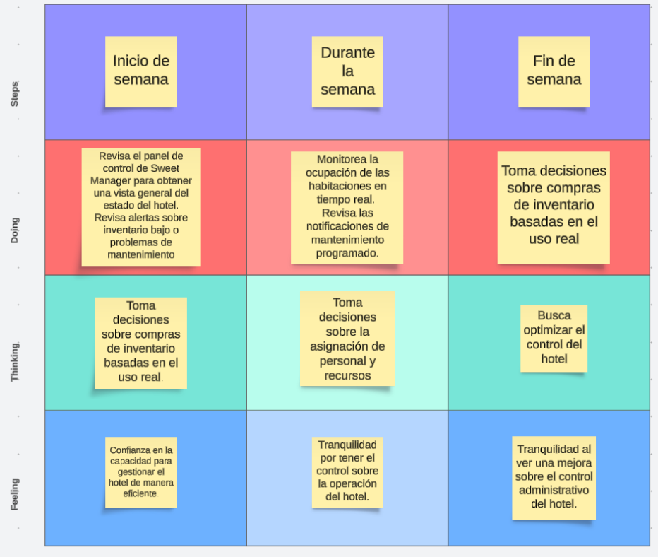
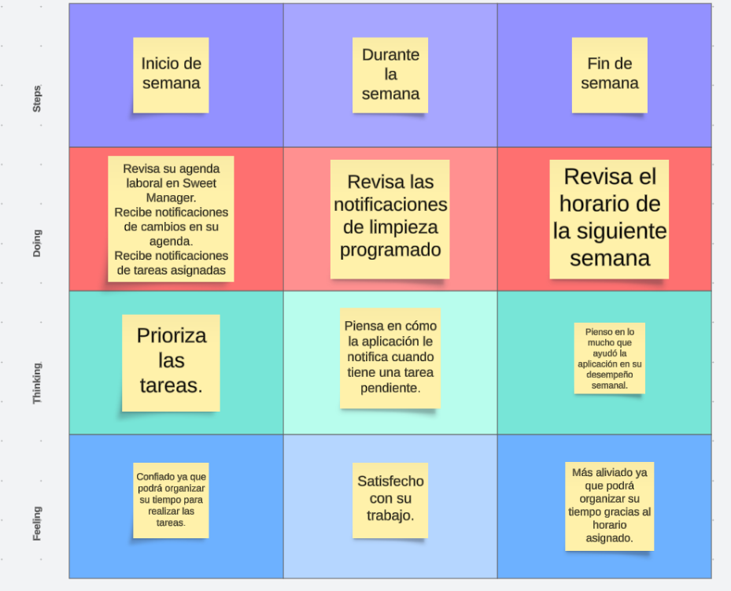

<hr>

# <center>COURSE PROJECT</center>

<p align="center">
    <strong>Universidad Peruana de Ciencias Aplicadas</strong><br>
    </img><br>
    <strong>Ingeniería de Software</strong><br>
    <strong>Aplicaciones Web - WX55</strong><br>
    <strong>Profesor: Angel Augusto Velasquez Nuñez </strong><br>
    <br>INFORME
</p>


<center>

#### Startup: **Sweet Manager**

#### Product: **Sweet Manager**

</center>

# Team  Members:

<div align="center">

|               Member                |    Code    |
| :---------------------------------: | :--------: |
| Mauricio Abraham Rivo Rojas Sánchez | U202211572 |
|      Aaron Elías Acuña Alarcón      | U202211552 |
|   Piero Fernando Periche Quiroga    | U202210192 |
|    Alex Ramon Alberto Avila Asto    | u20221a322 |
| Leonardo Félix Jesús Linares Tejada | U202211168 |


</div>

# Registro de Versiones del Informe

<table>
    <thead>
    <tr>
        <th>Version</th>
        <th>Fecha</th>
        <th>Participantes</th>
        <th>Observaciones</th>
    </tr>
    </thead>
    <tbody>
    <tr>
        <td rowspan="1000">TB1</td>
    </tr>
    <tr>
        <td rowspan="1000">29/03/2024</td>
    </tr>
    <tr>
        <td>Mauricio Abraham Rivo Rojas Sánchez</td>
        <td>
        <ul>
        <li> Software Configuration Management </li>
        <li> Landing Page, Services & Applications Implementation  </li>
        </ul>
        </td>
    </tr>
    <tr>
        <td>Aaron Elías Acuña Alarcón </td>
        <td>
        <ul>
        <li> Competidores</li>
        <li> Entrevistas</li>
        <li> Needfinding </li>
        <li> Ubiquitous Language</li>
        </ul>
        </td>
    </tr>
    <tr>
        <td>Leonardo Félix Jesús Linares Tejada</td>
        <td>
        <ul>
        <li> StartUp Profile</li>
        <li> Solution Profile </li>
        <li> Segmento Objetivo </li>
        </ul>
        </td>
    </tr>
    <tr>
        <td>Piero Fernando Periche Quiroga</td>
        <td>
        <ul>
        <li> Style Guidelines</li>
        <li> Information Architecture </li>
        <li> Landing Page UI Design </li>
        <li> Web Applications UX/UI Design </li>
        <li> Web Application Prototyping</li>
        </ul>
        </td>
    </tr>
    <tr>
        <td>Alex Ramon Alberto Avila Asto</td>
        <td>
        <ul>
        <li> To-be Scenario Mapping </li>
        <li> User Stories </li>
        <li> Impact Mapping </li>
        <li> Product Backlog</li>
        </ul>
        </td>
    </tr>
    </tbody>
</table>

# Project Report Collaboration Insights

[URL del repositorio](https://www.example.com)

(Imagenes de los commits cada entrega)

# Contenido

[Registro de Versiones del Informe](#registro-de-versiones-del-informe)

[Project Report Collaboration Insights](#project-report-collaboration-insights)

[Student Outcome](#student-outcome)

[Capítulo I: Introducción](#capítulo-i-introducción)

[1.1 Startup Profile](#11-startup-profile)  
[1.1.1. Descripción de la Startup](#111-descripción-de-la-startup)  
[1.1.2. Perfiles de integrantes del equipo](#112-perfiles-de-integrantes-del-equipo)

[1.2. Solution Profile](#12-solution-profile)  
[1.2.1 Antecedentes y problemática](#121-antecedentes-y-problemática)  
[1.2.2 Lean UX Process.](#122-lean-ux-process)  
[1.2.2.1. Lean UX Problem Statements.](#1221-lean-ux-problem-statements)  
[1.2.2.2. Lean UX Assumptions.](#1222-lean-ux-assumptions)  
[1.2.2.3. Lean UX Hypothesis Statements.](#1223-lean-ux-hypothesis-statements)  
[1.2.2.4. Lean UX Canvas.](#1224-lean-ux-canvas)

[1.3. Segmentos objetivo.](#13-segmentos-objetivo)

[Capítulo II: Requirements Elicitation & Analysis](#capítulo-ii-requirements-elicitation--analysis)

[2.1. Competidores](#21-competidores)  
[2.1.1. Análisis competitivo]()  
[2.1.2. Estrategias y tácticas frente a competidores](#211-análisis-competitivo)

[2.2. Entrevistas](#22-entrevistas)  
[2.2.1. Diseño de entrevistas](#221-diseño-de-entrevistas)    
[2.2.3. Análisis de entrevistas](#223-análisis-de-entrevistas)

[2.3. Needfinding](#23-needfinding)  
[2.3.1. User Personas](#231-user-personas)  
[2.3.2. User Task Matrix](#232-user-task-matrix)  
[2.3.3. User Journey Mapping](#233-user-journey-mapping)  
[2.3.4. Empathy Mapping](#234-empathy-mapping)  
[2.3.5. As-is Scenario Mapping](#235-as-is-scenario-mapping)

[2.4. Ubiquitous Language](#24-ubiquitous-language)

[Capítulo III: Requirements Specificatio](#capítulo-iii-requirements-specification)

[3.1. To-Be Scenario Mapping](#31-to-be-scenario-mapping)

[3.2. User Stories](#32-user-stories)

[3.3. Impact Mapping](#33-impact-mapping)

[3.4. Product Backlog](#34-product-backlog)

[Capítulo IV: Product Desig](#capítulo-iv-product-design)

[4.1. Style Guidelines](#41-style-guidelines)  
[4.1.1. General Style Guidelines](#411-general-style-guidelines)  
[4.1.2. Web Style Guidelines](#412-web-style-guidelines)

[4.2. Information Architecture](#42-information-architecture)  
[4.2.1. Organization Systems](#421-organization-systems)  
[4.2.2. Labeling Systems](#422-labeling-systems)  
[4.2.3. SEO Tags and Meta Tag](#423-seo-tags-and-meta-tags)  
[4.2.4. Searching Systems](#424-searching-systems)   
[4.2.5. Navigation Systems](#425-navigation-systems)

[4.3. Landing Page UI Design](#43-landing-page-ui-design)   
[4.3.1. Landing Page Wireframe](#431-landing-page-wireframe)  
[4.3.2. Landing Page Mock-up](#432-landing-page-mock-up)

[4.4. Web Applications UX/UI Design](#44-web-applications-uxui-design)  
[4.4.1. Web Applications Wireframes](#441-web-applications-wireframes)  
[4.4.2. Web Applications Wireflow Diagrams](#442-web-applications-wireflow-diagrams)  
[4.4.2. Web Applications Mock-ups](#442-web-applications-mock-ups)   
[4.4.3. Web Applications User Flow Diagrams](#443-web-applications-user-flow-diagrams)

[4.5. Web Applications Prototyping](#45-web-applications-prototyping)

[4.6. Domain-Driven Software Architecture](#46-domain-driven-software-architecture)  
[4.6.1. Software Architecture Context Diagram](#461-software-architecture-context-diagram)  
[4.6.2. Software Architecture Container Diagrams](#462-software-architecture-container-diagrams)  
[4.6.3. Software Architecture Components Diagrams](#463-software-architecture-components-diagrams)

[4.7. Software Object-Oriented Design](#47-software-object-oriented-design)  
[4.7.1. Class Diagrams](#471-class-diagrams)  
[4.7.2. Class Dictionary](#472-class-dictionary)

[4.8. Database Design](#48-database-design)  
[4.8.1. Database Diagram](#481-database-diagram)

[Capítulo V: Product Implementation, Validation & Deploymen](#capítulo-v-product-implementation-validation--deployment)

[5.1. Software Configuration Management](#51-software-configuration-management)  
[5.1.1. Software Development Environment Configuration](#511-software-development-environment-configuration)  
[5.1.2. Source Code Management](#512-source-code-management)  
[5.1.3. Source Code Style Guide & Conventions](#513-source-code-style-guide--conventions)  
[5.1.4. Software Deployment Configuration](#514-software-deployment-configuration)

[5.2. Landing Page, Services & Applications Implementation](#52-landing-page-services--applications-implementation)  
[5.2.X. Sprint ](#52x-sprint-n)  
[5.2.X.1. Sprint Planning n](#52x1-sprint-planning-n)  
[5.2.X.2. Sprint Backlog n](#52x2-sprint-backlog-n)  
[5.2.X.3. Development Evidence for Sprint Review](#52x3-development-evidence-for-sprint-review)  
[5.2.X.4. Testing Suite Evidence for Sprint Review](#52x4-testing-suite-evidence-for-sprint-review)  
[5.2.X.5. Execution Evidence for Sprint Review](#52x5-execution-evidence-for-sprint-review)  
[5.2.X.6. Services Documentation Evidence for Sprint Review](#52x6-services-documentation-evidence-for-sprint-review)  
[5.2.X.7. Software Deployment Evidence for Sprint Review](#52x7-software-deployment-evidence-for-sprint-review)  
[5.2.X.8. Team Collaboration Insights during Sprint](#52x8-team-collaboration-insights-during-sprint)

[5.3. Validation Interviews](#53-validation-interviews)  
[5.3.1. Diseño de Entrevistas](#531-diseño-de-entrevistas)  
[5.3.2. Registro de Entrevistas](#532-registro-de-entrevistas)  
[5.3.3. Evaluaciones según heurísticas](#533-evaluaciones-según-heurísticas)

[5.4. Video About-the-Product](#54-video-about-the-product)

[Conclusiones](#conclusiones)

[Conclusiones y recomendaciones](#conclusiones-y-recomendaciones)

[Video About-the-Team](#video-about-the-team)

[Bibliografía](#bibliografía)

[Anexos](#anexos)

# Student Outcome

| Criterio Especifico                                                                                                                                  | Acciones Realizadas                                     | Conclusiones           |
| ---------------------------------------------------------------------------------------------------------------------------------------------------- | ------------------------------------------------------- | ---------------------- |
| Participa en equipos multidisciplinarios con eficacia, eficiencia y objetividad, en el marco de un proyecto en soluciones de ingeniería de software. | Compañero1:<br> *TB1:*  Su texto *TB2:* texto etc..     | Su texto de conclusion |
| Conoce al menos un sector empresarial o dominio de aplicación de soluciones de software.                                                             | Compañero1:<br> *TB1:*  Su texto<br> *TB2:* texto etc.. | Su texto de conclusion |

# Capítulo I: Introducción

## 1.1. Startup Profile

La gestión eficiente de un hotel es fundamental para garantizar una experiencia excepcional para los huéspedes y maximizar los ingresos. Con este fin, presentamos “Sweet Manager”, una aplicación de gestión de procesos hoteleros diseñada para simplificar y optimizar todas las operaciones relacionadas con la administración de un hotel de tal manera que se puede brindar una estancia cómoda y de calidad a los clientes que frecuentan el hotel.

### 1.1.1. Descripción de la Startup

Sweet Manager es una solución integral que abarca desde el seguimiento de ingresos y gastos hasta la gestión de proveedores, inventarios e incluso recursos humanos. Con una interfaz intuitiva y fácil de usar, nuestra aplicación permite a los gerentes y propietarios de hoteles tener un control total sobre todas las facetas de su negocio, desde cualquier lugar y en cualquier momento.

Destacamos las siguientes características:
- Gestión de Ingresos y Gastos: Sweet Manager ofrece un seguimiento detallado de todos los ingresos y gastos del hotel, proporcionando informes en tiempo real para una toma de decisiones informada.
- Control de Inventarios: Con nuestra aplicación, los hoteles pueden gestionar eficientemente sus inventarios de alimentos, bebidas, artículos de tocador y más, evitando escasez y desperdicios.
- Gestión de Proveedores: Facilitamos la comunicación y la gestión de relaciones con los proveedores, permitiendo realizar pedidos de forma rápida y eficiente.
- Gestión de Clientes: Mejoramos la organización y control de los clientes que reserven su estancia en el hotel implementando calendarios y agendas para una mejor gestión.

#### 1.1.2. Perfiles de integrantes del equipo

| Miembros del equipo                             | Codigo Estudiante | Carrera                | Conocimientos / Habilidades |
| ----------------------------------------------- | ----------------- | ---------------------- | --------------------------- |
| Mauricio Abraham Rivo Rojas Sánchez	 | U202211572            | Ingenieria de software | C++, C#, javascript y java            |
| Aaron Elías Acuña Alarcón 	 | U202211552            | Ingenieria de software | C++, C#, html, SQL server, etc.             |
| Leonardo Félix Jesús Linares Tejada 	 | U202211168            | Ingenieria de software | C++, C#, html, css, etc.             |
| Alex Ramon Alberto Avila Asto 	 | U20221A322            | Ingenieria de software | C++, java, Kotlin, Go, Spring Boot .etc             |
| Piero Fernando Periche Quiroga 	 | U202210192            | Ingenieria de software | C++, javascript, html, .etc             |

## 1.2. Solution Profile

Como se mencionó anteriormente, el objetivo de Sweet Manager es ser una aplicación que ayuda en la gestión de procesos hoteleros, específicamente, el seguimiento de ingresos, los proveedores del hotel, los insumos y los recursos disponibles.

Pero, para poder prosperar y ser exitosos, necesitamos reconocer el ambiente competitivo que rodea nuestra aplicación. Por lo tanto, reconoceremos nuestros objetivos y restricciones con las siguientes secciones.

### 1.2.1 Antecedentes y problemática

Para poder competir con nuestros competidores, debemos reconocer los antecedentes y la problemática a solucionar.

En la industria hotelera, la gestión eficiente de procesos es fundamental para garantizar la rentabilidad y la satisfacción del cliente. La falta de herramientas adecuadas puede llevar a pérdidas económicas y a una experiencia deficiente para los huéspedes.

**What:** Sweet Manager es una solución integral diseñada para abordar estas complejidades al proporcionar una plataforma única para la gestión de todos los aspectos de un hotel, desde las finanzas hasta los recursos humanos.

**Who:** Los hoteles y establecimientos de alojamiento en todo el mundo se enfrentan a desafíos constantes en la gestión de sus operaciones diarias. Desde el seguimiento de ingresos hasta la administración de inventarios y la coordinación del personal, la gestión hotelera puede ser compleja y consumir mucho tiempo.

**When:** La problemática puede surgir en cualquier momento dado, puede ser un problema diario, ya sea con problemas en la gestión del personal o administración de inventarios, o un problema que se encuentra a último segundo, como una falta de recursos de comida o agua o luz, etc.

**Where:** La necesidad de una gestión eficiente se extiende a hoteles y establecimientos de alojamiento en todas partes, desde pequeñas posadas hasta grandes cadenas hoteleras, tanto en entornos urbanos como en destinos turísticos.

**Why:** La gestión ineficiente puede llevar a pérdidas financieras, escasez de inventario, falta de coordinación del personal y, en última instancia, a una experiencia insatisfactoria para los huéspedes, lo que afecta la reputación y la rentabilidad del hotel.

**How:** Sweet Manager aborda esta problemática al proporcionar una plataforma centralizada y fácil de usar que permite a los hoteles gestionar todos los aspectos de su negocio de manera eficiente y efectiva.

**How much:** A partir de un modelo de suscripción, Sweet Manager puede llegar a ser una mera herramienta para momentos puntuales, o una herramienta que prácticamente se vuelve esencial para la sobrevivencia y prospección de un hotel.

### 1.2.2 Lean UX Process.

El proceso Lean UX aborda la visión del modelo de negocio que respalda nuestro proyecto, siendo el producto principal nuestro software. A lo largo de este documento y en este capítulo, exploramos varios elementos clave de este proceso.

Comenzamos con los "Problem Statements", que abarcan aspectos como el dominio, los segmentos de clientes, los puntos de dolor, las brechas, la visión/estrategia y el segmento inicial. Siguiendo la metodología Lean UX, también consideramos las "Assumptions Statements" y las "Hypothesis Statements".

#### 1.2.2.1. Lean UX Problem Statements.

**Problem Statement:**

La gestión eficiente de hoteles presenta desafíos significativos, incluyendo la falta de herramientas integradas que aborden todas las facetas del negocio. Los propietarios y gerentes se enfrentan a dificultades para gestionar ingresos, inventarios, proveedores y recursos humanos de manera eficaz, lo que puede resultar en pérdida de ingresos, desperdicio de recursos y experiencias insatisfactorias para los huéspedes.

**Dominio:**

La industria hotelera, tanto a nivel local como internacional.

**Segmentos de Gerentes:**

Propietarios y gerentes de hoteles de todos los tamaños, desde pequeñas posadas hasta grandes cadenas hoteleras.

**Puntos de Dolor:**

- Dificultad para realizar un seguimiento preciso de los ingresos y gastos del hotel.
- Desafíos en la gestión de inventarios y relaciones con proveedores.
- Complejidades en la gestión del personal y los recursos humanos.

**Visión/Estrategia:**

Proporcionar una solución integral y fácil de usar que aborde todas las necesidades de gestión de un hotel, desde las finanzas hasta los recursos humanos, mejorando la eficiencia operativa y la experiencia del cliente.

**Segmento Inicial:**

Hoteles independientes y pequeñas cadenas hoteleras que buscan soluciones accesibles y eficientes para optimizar sus operaciones.


#### 1.2.2.2. Lean UX Assumptions.

| Business Assumptions | User Assumptions |
| -------------------- | ---------------- |
| Aumento en la eficiencia operativa de los hoteles.|Acceso conveniente a una plataforma que simplifica todas las tareas de gestión hotelera.|
|Mejora en la rentabilidad a través de una gestión más efectiva de ingresos y recursos.|Mejora en la toma de decisiones basada en datos en tiempo real.|
|Mayor satisfacción del cliente al ofrecer experiencias más fluidas y personalizadas.|Reducción del estrés y la carga de trabajo asociados con la gestión manual de procesos.|

**Users:**
- Propietarios y gerentes de hoteles que buscan soluciones tecnológicas para optimizar la gestión de sus establecimientos.
- Personal de Trabajo encargado de tareas específicas dentro del hotel, como contabilidad, compras o recursos humanos.

**Features:**
- Sistema de seguimiento de ingresos y gastos en tiempo real.
- Herramientas para la gestión de inventarios y relaciones con proveedores.
- Módulos para la gestión de personal, incluyendo horarios, nóminas y evaluaciones de desempeño.
- Interfaz intuitiva y personalizable para adaptarse a las necesidades específicas de cada hotel.
- Integración con sistemas de gestión hotelera existentes para una experiencia sin fisuras.

#### 1.2.2.3. Lean UX Hypothesis Statements.

Creemos que al ofrecer una plataforma integral y fácil de usar para la gestión hotelera, aumentará la eficiencia operativa y la rentabilidad de los hoteles al simplificar las tareas de seguimiento de ingresos, gestión de inventarios y recursos humanos. Al proporcionar herramientas de análisis en tiempo real, los propietarios y gerentes podrán tomar decisiones informadas que mejoren la experiencia del cliente y optimicen los procesos internos. Nuestra hipótesis se basa en la premisa de que estas mejoras conducirán a una mayor satisfacción del cliente y una mayor eficiencia en la gestión hotelera.

#### 1.2.2.4. Lean UX Canvas.


## 1.3. Segmentos objetivo.

**Usuarios:**

- **Propietarios y Gerentes de Hoteles:** El objetivo principal de nuestra aplicación es asegurar que aquellos que se encargan de dirigir la dirección del hotel, tengan todas las herramientas disponibles que ofrecemos para el cuidado de sus hoteles, en cualquier momento
- **Personal de Trabajo:** Aunque no sean aquellos que dirigen la empresa, siguen siendo igual de importantes, al ser aquellos que se encargan del cuidado y atendimiento diario del hotel.

---

# Capítulo II: Requirements Elicitation & Analysis

## 2.1. Competidores.

Facebook (Indirecto): <br>
En Facebook, los usuarios pueden crear perfiles personales, agregar amigos, publicar actualizaciones de estado, compartir fotos y videos, unirse a grupos y páginas, enviar mensajes privados, participar en eventos, jugar juegos y muchas otras actividades. La plataforma se ha expandido enormemente con el tiempo, integrando funciones como Facebook Marketplace (un mercado en línea), Facebook Watch (una plataforma de vídeo), y Facebook Messenger (una aplicación de mensajería instantánea). Lo cual implica que los gerentes de hoteles busquen empresas que brinden soluciones por medio de publicaciones en dicha plataforma.

Mercado Libre (Indirecto): <br>
Siendo la plataforma líder de comercio electrónico de América Latina, Mercado libre ofrece la compra y venta de artículos a precio fijo. La gestión hotelera también entra en la lista puesto que se promocionan venta de sistemas y código fuente que ayudan y facilitan a buen precio la gestión hotelera.

Xafiro (Directo): <br>
Xafiro es un software hotelero, que ahorra tiempo y optimiza la gestión de las operaciones diarias como registro de clientes, reservas, checkin y checkout de habitaciones, venta de productos, entre otros. Dicha empresa es competencia directa porque brinda la solución que ofrecemos como empresa.

Binz 360 (Directo): <br>
Binz 360 es una empresa que se encarga de la gestión de los recursos hoteleros, control de clientes y reportes de ingresos a un buen precio. Dicha empresa es competencia directa porque brinda la solución que planteamos a un precio económico.


### 2.1.1. Análisis competitivo.

| ¿Por qué llevar a cabo este análisis? | Nosotros | Cloudbeds | SiteMinder | estr 1 | sets2 |
|---------------------------------------|----------|-----------|------------|------------|------------|
| **Overview**                          | Sweet Manager es una aplicación integral de gestión hotelera diseñada para simplificar y optimizar todas las operaciones relacionadas con la administración de un hotel | Plataforma de redes sociales utilizada para la promoción y publicidad de empresas hoteleras. Ofrece una amplia gama de herramientas de marketing y publicidad para llegar a una amplia audiencia. | Plataforma líder de comercio electrónico que ofrece sistemas y códigos fuente relacionados con la gestión hotelera. Proporciona opciones para la compra de productos y servicios que pueden mejorar la eficiencia en la gestión hotelera. | Solución de software hotelero que ahorra tiempo y optimiza la gestión de operaciones diarias. Ofrece características similares a Sweet Manager, como registro de clientes, reservas y gestión de inventarios. | Empresa especializada en la gestión de recursos hoteleros y control de clientes. Ofrece una solución competitiva en términos de gestión hotelera a un precio económico. |
| **Ventaja Competitiva**               | Ofrece una solución integral para la gestión hotelera, desde seguimiento de ingresos y gastos hasta gestión de proveedores y clientes. Flexibilidad y accesibilidad, permitiendo a los administradores gestionar correctamente su negocio desde cualquier lugar y en cualquier momento. | Alcance masivo y capacidad de segmentación precisa del público objetivo. | Amplia variedad de productos y servicios disponibles. | Enfoque específico en la eficiencia de las operaciones diarias del hotel | Precio asequible para hoteles pequeños y medianos |
| **Mercado Objetivo**                  | Gerentes y propietarios de hoteles de todos los tamaños buscan una solución eficiente y completa para la gestión de su negocio. | Hoteles de todos los tamaños que buscan aumentar su visibilidad en línea. | Propietarios de hoteles y gerentes que buscan soluciones de gestión. | Hoteles de mediano a gran tamaño que buscan una solución completa y eficiente. | Hoteles independientes y pequeñas cadenas hoteleras. |
| **Estrategias de marketing**               | Campañas dirigidas en redes sociales y plataformas de anuncios digitales para llegar a la audiencia objetivo. Colaboraciones con asociaciones hoteleras y participación en eventos de la industria para aumentar la visibilidad y credibilidad de la marca. | Publicidad segmentada. Uso de contenido visual para atraer a los usuarios. | Promoción de productos relacionados con la gestión hotelera. Publicidad dirigida a profesionales de la industria hotelera. | Colaboración con asociaciones hoteleras en redes sociales. Campañas en redes sociales dirigidas a gerentes hoteleros. | Enfoque en el ahorro de costos y eficiencia operativa. Uso de marketing de contenidos para educar sobre la importancia de la gestión hotelera. |
| **Productos & Servicios**               | Sweet Manager ofrece una gama de características, incluyendo seguimiento de ingresos y gastos, control de inventarios, gestión de proveedores y clientes. | Plataforma de redes sociales con diversas opciones de publicidad y promoción. Herramientas de análisis para medir el rendimiento de las campañas | Variedad de sistemas y códigos fuente relacionados con la gestión hotelera disponibles para la compra. Opciones de precio variadas para adaptarse a diferentes presupuestos | Ofrece una variedad de características para la gestión hotelera. Precios competitivos y opciones de personalización | Solución completa para la gestión hotelera con énfasis en la relación calidad-precio. Modelo de precios simple y transparente |
| **Precios & Costos**                           | Ofrecido como servicio de suscripción mensual o anual con planes escalables según el tamaño y las necesidades del hotel. | No ofrece un costo. | No ofrece un costo. | Ofrece un precio bastante accesible y competitivo en el mercado. | Ofrece un precio cómodo para las pequeñas y medianas empresas. |
| **Canales de distribución (Web o móvil)**                           | La aplicación está disponible tanto en versiones web como móviles para una mayor accesibilidad. | Principalmente a través de la plataforma de Facebook y sus herramientas de publicidad | Principalmente a través de la plataforma de Mercado Libre. | Principalmente ventas directas y demostraciones en línea | Principalmente ventas directas y a través de socios de distribución. |
| **Fortalezas**                           | Solución eficaz, sencilla y rápida para la gestión hotelera. Interfaz intuitiva y fácil de usar. | Alcance masivo y herramientas de segmentación. | Amplia variedad de productos y servicios. | Solución especializada en operaciones diarias de hoteles. | Precio competitivo. |
| **Debilidades**                           | Posible competencia de grandes empresas en el mercado de gestión hotelera | Menos especialización en la industria hotelera. | Menos enfoque en soluciones específicas para la industria hotelera. | Menos reconocimiento de marca que competidores establecidos. | Menos funcionalidades avanzadas en comparación con competidores más establecidos. |
| **Oportunidades**                           | Crecimiento en la industria hotelera y demanda de soluciones eficientes de gestión. | Uso de datos para personalizar la publicidad. | Expansión a nuevos mercados verticales. | Expansión internacional. | Expansión a nuevos mercados. |
| **Amenazas**                           | Competencia directa de otras empresas de software de gestión hotelera | Posible cambio en algoritmos de redes sociales que afecten la visibilidad de las empresas. | Posible competencia de otros mercados en línea. | Competencia directa de otros proveedores de software. | Posible competencia de proveedores de software con precios aún más bajos |

### 2.1.2. Estrategias y tácticas frente a competidores.

Luego de realizar los análisis respectivos, las principales estrategias contra competidores son:

A) Diferenciación de Servicios:<br>
Estrategia: Identificar y desarrollar características únicas que hagan que Sweet Manager se destaque de otras soluciones en el mercado.<br>
Tácticas:<br>
Realizar investigaciones de mercado para comprender las necesidades y deseos no satisfechos de los clientes en la gestión hotelera.<br>
Desarrollar nuevas funciones o servicios innovadores que aborden estas necesidades de manera efectiva.<br>
Promover activamente estas características diferenciadoras a través de campañas de marketing y comunicación.

B) Calidad Consistente:<br>
Estrategia: Garantizar altos estándares de calidad en todos los aspectos de la aplicación y su servicio.<br>
Tácticas:<br>
Implementar rigurosos controles de calidad durante el desarrollo y la implementación de la aplicación.<br>
Ofrecer capacitación y soporte continuo a los clientes para garantizar un uso óptimo de Sweet Manager.<br>
Recopilar y analizar regularmente retroalimentación de los clientes para identificar áreas de mejora en la calidad y tomar medidas correctivas.

C) Precios Competitivos:<br>
Estrategia: Ofrecer una propuesta de valor atractiva que justifique el precio de Sweet Manager en comparación con otras soluciones en el mercado.<br>
Tácticas:<br>
Realizar análisis de precios comparativos para asegurarse de que los precios de Sweet Manager sean competitivos pero también rentables.<br>
Ofrecer opciones de precios flexibles y personalizadas para adaptarse a las necesidades y presupuestos de diferentes tipos de hoteles.<br>
Destacar el retorno de la inversión (ROI) y los beneficios adicionales que ofrece Sweet Manager para justificar su precio.

D) Atención al Cliente de Calidad:<br>
Estrategia: Priorizar la satisfacción del cliente y establecer relaciones sólidas con los usuarios de Sweet Manager.<br>
Tácticas:<br>
Ofrecer un servicio de atención al cliente receptivo y accesible, con tiempos de respuesta rápidos y soluciones efectivas.<br>
Implementar programas de fidelización y recompensas para premiar la lealtad de los clientes. Fomentar una cultura interna centrada en el cliente y capacitar al equipo para entender y satisfacer las necesidades de los usuarios.

E) Marketing y Publicidad Inteligente:<br>
Estrategia: Utilizar estratégicamente los canales de marketing y publicidad para aumentar la visibilidad y la demanda de Sweet Manager.<br>
Tácticas:<br>
Segmentar el mercado y dirigir las campañas de marketing a los segmentos de clientes más relevantes y receptivos.<br>
Utilizar tácticas de marketing digital como SEO, publicidad en redes sociales y marketing de contenidos para llegar a una audiencia más amplia.<br>
Colaborar con influencers y líderes de opinión en la industria hotelera para respaldar y promocionar Sweet Manager.

F) Alianzas Estratégicas:<br>
Estrategia: Establecer asociaciones con otras empresas o proveedores complementarios para expandir el alcance y la funcionalidad de Sweet Manager.<br>
Tácticas:<br>
Identificar y establecer relaciones con empresas que ofrezcan servicios o productos que puedan integrarse con Sweet Manager de manera sinérgica.<br>
Colaborar en eventos de la industria y programas de co-marketing para aumentar la visibilidad de la aplicación y sus socios.<br>
Negociar acuerdos mutuamente beneficiosos que agreguen valor tanto para Sweet Manager como para sus socios.

G) Innovación Continua:<br>
Estrategia: Mantenerse a la vanguardia de la innovación en tecnología y gestión hotelera para ofrecer constantemente nuevas soluciones y mejoras.<br>
Tácticas:<br>
Establecer un equipo de investigación y desarrollo dedicado a la exploración de nuevas tecnologías y tendencias en la industria hotelera.<br>
Fomentar una cultura de innovación dentro de la empresa, donde se valoren las ideas y se promueva la experimentación.<br>
Mantenerse en contacto cercano con los clientes y la retroalimentación del mercado para identificar oportunidades de mejora y áreas de necesidad no satisfechas.

H) Recopilación de Comentarios y Mejora Continua:<br>
Estrategia: Utilizar comentarios de los clientes y datos analíticos para impulsar mejoras continuas en Sweet Manager.<br>
Tácticas:<br>
Implementar sistemas de retroalimentación y encuestas para recopilar comentarios de los usuarios de manera regular.<br>
Analizar datos y métricas clave para identificar tendencias y áreas de oportunidad para la mejora.<br>
Priorizar y ejecutar cambios basados en la retroalimentación del cliente y las necesidades del mercado, manteniendo un enfoque en la evolución constante de la aplicación.

## 2.2. Entrevistas.

### 2.2.1. Diseño de entrevistas.

**Entrevistas usuario segmento 1: Gerentes**

¿Cuáles son los principales desafíos que enfrentan en la gestión diaria de su hotel?<br>
¿Qué características o funcionalidades consideraría más útiles para mejorar la eficiencia de su hotel?<br>
¿Cómo gestionan actualmente las reservas de habitaciones y el seguimiento de ingresos y gastos en su hotel?<br>
¿Qué herramientas o software utilizan actualmente para la gestión hotelera y qué aspectos les gustaría mejorar de esas herramientas?<br>
¿Cuál es su opinión sobre la importancia de la movilidad y la accesibilidad en las soluciones de gestión hotelera?<br>
¿Qué aspectos valoran más al evaluar nuevas soluciones de software para su hotel?<br>
¿Cómo creen que podríamos mejorar la comunicación y la colaboración entre el personal del hotel y los gerentes?<br>
¿Qué desafíos enfrentan al gestionar proveedores y controlar los inventarios en su hotel?<br>
¿Cómo gestionan actualmente la satisfacción y las preferencias de los clientes en su hotel?<br>
¿Cómo ve conveniente un sistema hotelero dedicado a la gestión de recursos, comunicación con proveedores, seguimiento de ganancias, etc?


**Entrevistas usuario segmento 2: Trabajdores**

¿Cuáles son las tareas o procesos diarios que considera más tediosos o que consumen más tiempo en su trabajo?<br>
¿Qué herramientas o sistemas utilizan actualmente para realizar su trabajo y qué aspectos les resultan más difíciles o menos eficientes?<br>
¿Cómo describiría la interacción y la comunicación entre los diferentes departamentos y miembros del personal del hotel?<br>
¿Qué características adicionales le gustaría ver en un sistema de gestión hotelera para facilitar su trabajo diario?<br>
¿Cómo se sienten acerca de la adopción de nuevas tecnologías en el lugar de trabajo y cómo creen que podría mejorar su experiencia laboral?<br>
¿Qué desafíos enfrenta al gestionar las solicitudes de los huéspedes y asegurarse de que se cumplan sus expectativas durante su estancia?<br>
¿Cómo manejan actualmente la capacitación y el desarrollo profesional en su hotel?<br>
¿Qué medidas tomarían para mejorar la eficiencia y la colaboración dentro del equipo de trabajo?<br>
¿Cómo creen que podríamos simplificar los procesos de registro de huéspedes y check-in/check-out en su hotel?<br>
¿Qué herramientas o recursos adicionales les ayudarán a ofrecer un mejor servicio a los huéspedes y mejorar su experiencia general en el hotel?


### 2.2.2. Registro de entrevistas.

**Entrevista 1 (Gerentes)**  
Nombre: Carlo Rebagliati<br>
Edad: 45<br>
Residencia: Pueblo Libre, Lima<br><br>
<br>  
En resumen, Carlo Rebagliati es un gerente de hotel con un largo camino de experiencia. Nos relata que los principales desafíos que tiene su hotel es el llamado a los turistas desde provincia, ya que la mayoría de clientela que tiene son turistas. Adicionalmente, mencionó que tienen una plataforma web donde los clientes realizan sus reservas, también tienen un área contable y administrativa para el seguimiento de ganancia y recursos. Finalmente, cree necesario una aplicación o software que se concentre en la gestión de un hotel, tanto para la comunicación, administración, gestión y seguimiento de recursos.

**Entrevista 2 (Gerentes)**  
Nombre: Mathias Jave<br>
Edad: 22<br>
Residencia: San Isidro, Lima<br><br>
<br>  
En resumen, Carlo Rebagliati es un gerente de hotel con un largo camino de experiencia. Nos relata que los principales desafíos que tiene su hotel es el llamado a los turistas desde provincia, ya que la mayoría de clientela que tiene son turistas. Adicionalmente, mencionó que tienen una plataforma web donde los clientes realizan sus reservas, también tienen un área contable y administrativa para el seguimiento de ganancia y recursos. Finalmente, cree necesario una aplicación o software que se concentre en la gestión de un hotel, tanto para la comunicación, administración, gestión y seguimiento de recursos.

**Entrevista 3 (Gerentes)**  
Nombre: Ariana Valdivia Alarcón<br>
Edad: 25<br>
Residencia: La molina, Lima<br><br> 
<br>  
En resumen, Carlo Rebagliati es un gerente de hotel con un largo camino de experiencia. Nos relata que los principales desafíos que tiene su hotel es el llamado a los turistas desde provincia, ya que la mayoría de clientela que tiene son turistas. Adicionalmente, mencionó que tienen una plataforma web donde los clientes realizan sus reservas, también tienen un área contable y administrativa para el seguimiento de ganancia y recursos. Finalmente, cree necesario una aplicación o software que se concentre en la gestión de un hotel, tanto para la comunicación, administración, gestión y seguimiento de recursos.

**Entrevista 1 (Empleados)**  
Nombre: Juan Guarnizo<br>
Edad: 22<br>
Lugar donde Vive: Breña, Lima<br>  
<br>
<br>En resumen, Juan Guarnizo es un trabajador del Hotel Los Delfines con un amateur camino de experiencia. Nos relata que los principales desafíos o complejidades al trabajar en los hoteles es la administración y actividades sencillas pero repetitivas; adicionalmente, nos cuenta que la mejor solución ante ello es la automatización de los procesos repetitivos fáciles de hacer. Finalmente, sí considera vital la creación de un sistema de gestión hotelero que ayude con estas tareas y organización del hotel.

**Entrevista 2 (Empleados)**  
Nombre: Juan Guarnizo<br>
Edad: 22<br>
Lugar donde Vive: Breña, Lima<br>  
<br>
<br>En resumen, Mariacarmen Tejada es una empleada del hotel con experiencia en gestión y operaciones diarias. Destaca que sus tareas más difíciles son la limpieza de los baños y la cocina, así como la dificultad para mantener el stock de utensilios de limpieza y cocina. Está abierta a la posibilidad de nuevas tecnologías para mejorar la eficiencia laboral y la experiencia del cliente, especialmente a través de sistemas de gestión hotelera más avanzados. Además, promueve una comunicación más directa con la administración para mejorar la eficiencia y la colaboración del equipo. También, la implementación de sistemas de registro en línea y dispositivos móviles para simplificar el proceso de registro y check-in/check-out de los huéspedes. Por último, destaca la necesidad de herramientas adicionales, como sistemas de seguimiento de solicitudes de huéspedes y acceso a información local para mejorar la experiencia general en el hotel.

**Entrevista 3 (Empleados)**  
Nombre: Juan Guarnizo<br>
Edad: 22<br>
Lugar donde Vive: Breña, Lima<br>  
<br>
<br>En resumen, Catalina Bustamante, quien trabaja en el Hotel Royal Inca en Cuzco, menciona que las tareas más desafiantes incluyen la limpieza y mantener el orden debido a la constante afluencia de huéspedes. Destaca también la dificultad en la gestión de check-in y check-out, especialmente con horarios variados de llegada y salida. Identifica la falta de comunicación eficiente entre departamentos como un obstáculo para resolver problemas de manera efectiva.
Propone mejoras en el sistema de gestión hotelera para facilitar la comunicación y el acceso a la información entre el personal. Además comentó una capacitación continua para mejorar las habilidades del equipo. Sugiere la automatización de procesos de registro de huéspedes para ahorrar tiempo y evitar errores, así como la implementación de herramientas adicionales, como sistemas de seguimiento de solicitudes de huéspedes, para mejorar la experiencia general en el hotel.


### 2.2.3. Análisis de entrevistas.

**Segmento de gerentes**  
<br>
<br>
**Segmento de trabajadores**<br>
<br>


## 2.3. Needfinding.

Para tener una mejor idea de cómo será la experiencia del usuario con nuestro producto, utilizaremos las herramientas de User Persona, User Task Matrix, User Journey Mapping, Empathy Mapping y As-is Scenario Mapping.

### 2.3.1. User Personas.

**Segmento de gerentes:**  


**Segmento de trabajadores:**  


### 2.3.2. User Task Matrix.

| Tarea                                  | Gerente (Frecuencia / Importancia) | Empleado (Frecuencia / Importancia) |
|----------------------------------------|------------------------------------|-------------------------------------|
| Crear una cuenta                      | Alta - Alta                        | Alta - Alta                         |
| Seguimiento de ingresos y gastos      | Media - Alta                       | Baja - Media                        |
| Gestión de inventarios                | Media - Alta                       | Alta - Alta                         |
| Coordinación con proveedores          | Alta - Alta                        | Baja - Baja                         |
| Capacitación del personal             | Alta - Alta                        | Media - Alta                        |
| Evaluación de desempeño del personal | Alta - Alta                        | Alta - Alta                         |
| Preparación de informes y análisis de datos | Media - Alta              | Alta - Alta                         |
| Recibir notificaciones de baja en el inventario | Alta - Alta             | Baja - Media                        |
| Asignar tareas a empleados            | Alta - Alta                        | Alta - Alta                         |
| Visualizar la ocupación de habitaciones en tiempo real | Alta - Alta          | Media - Media                       |
| Administrar permisos de los empleados | Alta - Alta                        | Baja - Alta                         |
| Programar turnos de trabajo           | Alta - Alta                        | Alta - Alta                         |
| Notificaciones de cambio de agenda    | Media - Alta                       | Baja - Baja                         |
| Reportar problemas a la gerencia      | Alta - Alta                        | Media - Alta                        |
| Registrar el check-in y check-out del huésped | Alta - Alta                  | Alta - Alta                         |
| Notificaciones de comentarios         | Media - Alta                       | Baja - Alta                         |

Tareas con mayor frecuencia e importancia:<br><br>
Crear una cuenta: Esta tarea es crucial tanto para el gerente como para el empleado, ya que implica establecer una identidad en el sistema y acceso a las herramientas.<br><br>
Seguimiento de ingresos y gastos: Esta tarea es de alta importancia para el gerente, ya que implica la supervisión de la salud financiera del hotel y la toma de decisiones informadas. Para el empleado, aunque puede no estar directamente involucrado en esta tarea a diario, entender los ingresos y gastos del hotel puede ayudar en la planificación y ejecución de sus responsabilidades.<br><br>
Gestión de inventarios: Tanto el gerente como el empleado realizan esta tarea con alta frecuencia e importancia, ya que asegura que el hotel tenga los suministros necesarios para operar sin problemas. La falta de inventario puede afectar negativamente la experiencia del cliente y la eficiencia del hotel.<br><br>
Coordinación con proveedores: Esta tarea es de alta importancia para el gerente, ya que garantiza la disponibilidad oportuna de suministros esenciales. Aunque para el empleado puede tener una frecuencia menor, sigue siendo crucial para mantener la continuidad operativa.<br><br>
Asignar tareas a empleados: Esta tarea es fundamental para ambos usuarios, ya que garantiza que el trabajo se distribuya de manera eficiente y que todas las actividades necesarias para el funcionamiento del hotel se completen a tiempo.<br><br>
Programar turnos de trabajo: La programación de turnos es esencial para garantizar una cobertura adecuada en todas las áreas del hotel, lo que contribuye a la satisfacción del cliente y al funcionamiento fluido del negocio.<br><br>
Registrar el check-in y el check-out del huésped: Estas tareas son cruciales para ambos usuarios, ya que afectan directamente la experiencia del cliente y la gestión de la ocupación de las habitaciones del hotel.<br><br>
Principales diferencias y coincidencias entre lo realizado por los User Personas:<br><br>
Diferencias:<br>
La coordinación con proveedores es una tarea de alta importancia para el gerente pero de baja importancia para el empleado. Esto refleja el nivel de responsabilidad y la naturaleza estratégica de las decisiones que el gerente toma en comparación con las tareas más operativas del empleado.<br><br>
La capacitación del personal es una tarea de alta importancia para el gerente, ya que influye en la calidad del servicio y la satisfacción del cliente, pero es de media importancia para el empleado, que puede recibir la capacitación pero no necesariamente esté involucrado en su planificación y ejecución.<br><br>
Coincidencias:<br>
Tanto el gerente como el empleado participan en la evaluación del desempeño del personal, lo que destaca la importancia compartida de garantizar un equipo bien capacitado y motivado para brindar un servicio de calidad.<br><br>
La preparación de informes y análisis de datos es una tarea de alta importancia para ambos roles, lo que resalta la necesidad de tomar decisiones basadas en datos para mejorar la eficiencia operativa y la experiencia del cliente.

### 2.3.3. User Journey Mapping.

User Journey Map - Carlos Rebagliati - Gerente (As-Is):<br><br>
Inicio del día: El gerente comienza el día revisando los informes financieros y preparando la agenda para el día. Se siente estresado por la cantidad de tareas pendientes y la presión para garantizar que todo funcione sin problemas.<br><br>
Gestión de inventarios: El gerente se enfrenta a la tarea de revisar el inventario y hacer pedidos a los proveedores según sea necesario. Se siente frustrado por la falta de un sistema integrado que facilite esta tarea, y aburrido por la tarea en sí.<br><br>
Coordinación del personal: El gerente asigna tareas al personal y revisa los horarios. Se siente abrumado por la cantidad de comunicación necesaria para coordinar a todos los empleados.<br><br>
Comunicación con proveedores: El gerente se comunica con los proveedores para hacer seguimiento de los pedidos y resolver cualquier problema de entrega. Se siente frustrado por la falta de eficiencia en la comunicación.<br><br>
Análisis de datos y toma de decisiones: El gerente revisa los informes y datos disponibles para tomar decisiones informadas para el hotel. Se siente satisfecho cuando encuentra información útil, pero también preocupado por la falta de herramientas para un análisis más profundo, terminando con una sensación de aceptación por ser la última tarea del día.


User Journey Map - Juan Guarnizo - Empleado (As-Is):<br><br>
Inicio del turno: El empleado comienza su turno revisando los horarios y recibiendo instrucciones del gerente. Se siente preparado para comenzar su jornada laboral.<br><br>
Atención al Cliente: El empleado atiende a los clientes, toma pedidos y proporciona asistencia según sea necesario. Se esfuerza por brindar un servicio amable y eficiente, pero termina sintiéndose aburrido o frustrado.<br><br>
Realización de tareas asignadas: El empleado completa las tareas asignadas, como limpieza de habitaciones, reposición de suministros o preparación de alimentos. Termina furioso cuando no obtiene una idea clara de los suministros y recursos faltantes.<br><br>
Comunicación con el Equipo: El empleado se comunica con otros miembros del equipo para coordinar actividades o resolver problemas. Se esfuerza por mantener una comunicación clara y efectiva con sus colegas, pero se frustra cuando ocurren malentendidos.<br><br>
Final del día: El empleado finaliza su turno, informa al gerente sobre cualquier problema o tarea pendiente, y se prepara para partir. Se siente resignado al terminar, especialmente cuando faltan tareas por completar y es a causa de la mala organización de recursos o suministros.


### 2.3.4. Empathy Mapping.

**Segmento gerente:**


**Segmento trabajador:**


### 2.3.5. As-is Scenario Mapping.

**Segmento gerente:**


**Segmento trabajador:**


## 2.4. Ubiquitous Language.

Sweet Manager :<br>
Definición: La aplicación de gestión de recursos es la herramienta principal utilizada por el hotel para organizar, controlar y optimizar todos los recursos disponibles, incluyendo habitaciones, personal, suministros y servicios.<br><br>
Hotel Manager:<br>
Definición: El gerente de hotel es el responsable general de la operación del hotel y el principal usuario de la aplicación Sweet Manager, encargado de supervisar su implementación y asegurar su eficacia en la gestión diaria.<br><br>
Hotel Worker:<br>
Definición: El trabajador de hotel es cualquier miembro del personal encargado de realizar tareas operativas en el hotel, como limpieza, mantenimiento, recepción, etc., y que utiliza la aplicación Sweet Manager para recibir asignaciones y reportar su progreso.<br><br>
Resource Allocation:<br>
Definición: La asignación de recursos se refiere al proceso de distribuir de manera efectiva los recursos disponibles, como habitaciones, personal y suministros, para cumplir con las necesidades operativas y las expectativas de los huéspedes.<br><br>
Control Panel:<br>
Definición: El panel de control es la interfaz principal de la aplicación Sweet Manager que proporciona una visión general en tiempo real de la disponibilidad de recursos, las tareas pendientes y otros datos relevantes para la operación del hotel.<br><br>
Data Analysis:<br>
Definición: El análisis de datos se refiere al proceso de recopilación, procesamiento y evaluación de datos generados por la aplicación Sweet Manager para identificar tendencias, patrones y oportunidades de mejora en la gestión de recursos del hotel.<br><br>
Process Optimization:<br>
Definición: La optimización de procesos implica la identificación y aplicación de mejoras continuas en los procedimientos y prácticas de gestión de recursos del hotel, utilizando datos y análisis obtenidos a través de la aplicación Sweet Manager para aumentar la eficiencia y la calidad del servicio.

---

# Capítulo III: Requirements Specification

## 3.1. To-Be Scenario Mapping.

Segmento 1:



Segmento 1:



## 3.2. User Stories.

| Epic ID | Título                                  | Descripción                                                                         |
| ------- | --------------------------------------- | ----------------------------------------------------------------------------------- |
| EPIC01  | Gestión de servicios                    | Permitir a los gerentes gestionar los servicios.                                    |
| EPIC02  | Gestión de empleados                    | Permitir a los gerentes administrar a los empleados del hotel.                      |
| EPIC03  | Informes                                | Permitir a los gerentes generar y recibir informes y analizar datos.                |
| EPIC04  | Acciones del Personal                   | Permitir a los empleados gestionar a los clientes e información relacionada a ello. |
| EPIC05  | Recibimiento de información al personal | Permitir a los empleados recibir y reportar información del hotel.                  |

| Story ID | Título | Descripción | Criterios de Aceptación | Epic ID |
| -------- | ------ | ----------- | ----------------------- | ------- |
| HU01 | Actualizar las habitaciones disponibles | Como gerente quiero un sistema que automáticamente cambie el estado de los dormitorios dependiendo si alguien la reservó o no para mantener actualizado su estado. | Give: el sistema tiene información sobre las habitaciones <br> When: un usuario ingresa la información de una nueva habitación o modifica el estado de una habitación existente. <br> Then: El sistema valida la información ingresada y actualiza en la base de datos. | EPIC01 |
| HU02 | Asignar tareas a empleados | Como gerente, quiero poder asignar tareas a los empleados para distribuir eficientemente las responsabilidades y mejorar la productividad. | Give: el sistema tiene información sobre los empleados. <br> When: un gerente selecciona un empleado y le asigna una tarea. <br> Then: El sistema asigna la tarea al empleado y se registra en la base de datos. El sistema envía una notificación al empleado sobre la tarea. | EPIC01 |
| HU03 | Recibir notificaciones de baja en el inventario | Como gerente, quiero recibir notificaciones de baja en el inventario para tomar medidas rápidas en caso de escasez de suministros. | Give: el sistema tiene información del inventario <br> When: el nivel de inventario de un artículo es bajo <br> Then: El sistema envía una notificación al gerente con la información del artículo. | EPIC01 |
| HU04 | Visualizar la ocupación de habitaciones en tiempo real | Como gerente, quiero visualizar la ocupación de habitaciones en tiempo real para gestionar eficazmente la disponibilidad y asignación de habitaciones. | Give: el usuario quiere visualizar el estado de las habitaciones. <br> When: el usuario ingresa a la inversa de habitaciones <br> Then: El sistema muestra una vista en tiempo real de la ocupación de las habitaciones. | EPIC01 |
| HU05 | Recibir alertas de mantenimiento programado | Como gerente, quiero recibir alertas de mantenimiento programado para garantizar que el mantenimiento se realice de manera oportuna y evitar problemas inesperados. | Give: dado que el sistema tiene los mantenimientos <br> When: se acerca la fecha programada <br> Then: el sistema envía la alerta del evento programado. | EPIC01 |
| HU06 | Administrar permisos de los empleados | Como gerente, deseo gestionar el acceso y permisos de los empleados para garantizar la seguridad y la privacidad de la información del negocio. | Give:  <br> When: un gerente accede a la interfaz de administración de permisos. <br> Then: El sistema muestra una lista de empleados con sus roles y permisos actuales para que estos puedan ser editados. | EPIC01 |
| HU07 | Programar turnos de trabajo | Como gerente, deseo programar turnos de trabajo automáticamente para optimizar la asignación de personal y evitar conflictos de horarios. | Give: el sistema información sobre los empleados <br> When: un gerente accede a la interfaz de programación de turnos. <br> Then: El gerente puede seleccionar un empleado y asignarle un turno en un horario disponible. | EPIC02 |
| HU08 | Realizar seguimiento de gastos | Como gerente, deseo poder realizar seguimiento de gastos implementados para controlar los costos y optimizar la rentabilidad del negocio. | Give: el sistema tiene información sobre los gastos realizados. <br> When: el usuario ingresa al panel de gastos. <br> Then: el sistema muestra el seguimientos de los gastos. | EPIC02 |
| HU09 | Gestionar servicios adicionales | Como gerente, deseo gestionar la disponibilidad de servicios adicionales para ofrecer una experiencia personalizada y maximizar la satisfacción del cliente. | Give: cuando el gerente desea gestionar los servicios adicionales. <br> When: cuando se ingresa a la interfaz de servicios adicionales. <br> Then: el sistema actualiza los servicios adicionales. | EPIC01 |
| HU10 | Notificaciones de comentarios | Como gerente, deseo recibir notificaciones de comentarios y opiniones de clientes para responder rápidamente a las necesidades y preocupaciones de los clientes. | Give: el gerente tiene permisos para ver y responder a los comentarios de los clientes. <br> When: el cliente envía un comentario a través del sistema. <br> Then: el sistema envía una notificación al gerente sobre el nuevo comentario. | EPIC02 |
| HU11 | Crear promociones | Como gerente, deseo poder crear promociones y ofertas especiales para atraer a más clientes y aumentar las ventas. | Give: el sistema cuenta con módulo para administrar promociones. <br> When: El gerente accede a la interfaz de creación de promociones. <br> Then: El sistema guarda la promoción en la base de datos. El sistema muestra la promoción en la interfaz de usuario para los clientes. | EPIC01 |
| HU12 | Registro de proveedores | Como gerente, deseo mantener un registro de los proveedores para gestionar eficientemente las relaciones comerciales y los suministros. | Give: El sistema tiene un módulo para gestionar el registro de proveedores. <br> When: El gerente accede a la interfaz de registro de proveedores. <br> Then: El sistema permite al gerente ingresar la información del proveedor | EPIC01 |
| HU13 | Seguimiento del cliente | Como gerente, deseo poder realizar seguimiento de la satisfacción del cliente para identificar áreas de mejora y garantizar una experiencia de calidad. | Give: El sistema tiene información sobre las reservas de los clientes y sus experiencias en el hotel.Un cliente se hospeda en el hotel. <br> When:  <br> Then: El sistema permite al gerente acceder a la información del cliente, incluyendo su historial de reservas, comentarios y solicitudes. | EPIC03 |
| HU14 | Administrar facturas de servicios | Como gerente, deseo poder generar facturas para los servicios adicionales para facturar los servicios adicionales proporcionados a los clientes y registrar los ingresos correspondientes. | Give: El sistema tiene información sobre los servicios adicionales consumidos por los huéspedes. <br> When: El huésped realiza el check-out. <br> Then: El sistema genera una factura de servicios para el huésped, incluyendo la descripción del servicio, el precio y el total. | EPIC01 |
| HU15 | Notificaciones de cambio de agenda | Como empleado, deseo recibir notificaciones de cambios en mi agenda laboral para estar al tanto de los cambios en mi horario de trabajo y planificar en consecuencia. | Give: El sistema tiene información sobre los turnos de trabajo de los empleados. <br> When: El gerente modifica un turno de trabajo asignado a un empleado. <br> Then: El sistema envía una notificación al empleado sobre el cambio de turno. | EPIC05 |
| HU16 | Estado de las habitaciones | Como empleado, deseo poder registrar el estado de limpieza de las habitaciones | Give: Los empleados de limpieza tienen permisos para registrar el estado de las habitaciones. <br> When: Un empleado limpia una habitación. <br> Then: El sistema actualiza el estado de la habitación en la base de datos. | EPIC04 |
| HU17 | Información de procedimientos según el caso | Como empleado, deseo poder acceder a manuales de procedimientos | Give: El sistema tiene una biblioteca de manuales de procedimientos. <br> When: Un empleado accede a la biblioteca de procedimientos. <br> Then: El sistema muestra una lista de manuales de procedimientos disponibles. | EPIC05 |
| HU18 | Registrar el estado de suministros | Como empleado, deseo poder registrar el estado de los suministros para mantener un control preciso del inventario | Give: El sistema tiene información sobre el nivel de inventario de los suministros. <br> When: Un empleado utiliza un suministro. <br> Then: El sistema permite al empleado registrar la cantidad de suministro utilizada. El sistema actualiza el nivel de inventario del suministro en la base de datos. | EPIC04 |
| HU19 | Reportar problemas a la gerencia | Como empleado, deseo poder reportar problemas para comunicar a los gerentes del problema. | Give: El sistema tiene un módulo para reportar problemas. <br> When: Un empleado observa un problema en el hotel. <br> Then: El sistema guarda el reporte del problema en la base de datos. | EPIC05 |
| HU20 | Registrar el check-in del huésped. | Como empleado deseo registrar el check-in del huésped para registrar y confirmar su estadía en el hotel. | Give: El sistema tiene información sobre las reservas de los huéspedes. <br> When: Un cliente hace check-in <br> Then: El sistema valida la reserva | EPIC04 |
| HU21 | Registrar el check-out del huésped. | Como empleado deseo registrar el check-out del huésped para registrar y confirmar su salida del hotel. | Give: El sistema tiene información sobre las reservas de los huéspedes y los cargos pendientes. <br> When: Un huésped desea realizar el check-out del hotel. <br> Then: El sistema libera la habitación para que sea asignada a otro huésped. El sistema imprime una factura final para el huésped. | EPIC04 |


## 3.3. Impact Mapping.


## 3.4. Product Backlog.

| #Orden | User Story ID | Título | Descripción | Story Points |
| ----- | ------------- | ------ | ----------- | ------------ |
| 1 | HU01 | Actualizar las habitaciones disponibles | Como gerente quiero un sistema que automáticamente cambie el estado de los dormitorios dependiendo si alguien la reservó o no para mantener actualizado su estado. | 8 |
| 2 | HU02 | Asignar tareas a empleados | Como gerente, quiero poder asignar tareas a los empleados para distribuir eficientemente las responsabilidades y mejorar la productividad. | 8 |
| 3 | HU03 | Recibir notificaciones de baja en el inventario | Como gerente, quiero recibir notificaciones de baja en el inventario para tomar medidas rápidas en caso de escasez de suministros. | 5 |
| 4 | HU04 | Visualizar la ocupación de habitaciones en tiempo real | Como gerente, quiero visualizar la ocupación de habitaciones en tiempo real para gestionar eficazmente la disponibilidad y asignación de habitaciones. | 8 |
| 5 | HU05 | Recibir alertas de mantenimiento programado | Como gerente, quiero recibir alertas de mantenimiento programado para garantizar que el mantenimiento se realice de manera oportuna y evitar problemas inesperados. | 5 |
| 6 | HU06 | Administrar permisos de los empleados | Como gerente, deseo gestionar el acceso y permisos de los empleados para garantizar la seguridad y la privacidad de la información del negocio. | 8 |
| 7 | HU07 | Programar turnos de trabajo | Como gerente, deseo programar turnos de trabajo automáticamente para optimizar la asignación de personal y evitar conflictos de horarios. | 2 |
| 8 | HU08 | Realizar seguimiento de gastos | Como gerente, deseo poder realizar seguimiento de gastos implementados para controlar los costos y optimizar la rentabilidad del negocio. | 5 |
| 9 | HU09 | Gestionar servicios adicionales | Como gerente, deseo gestionar la disponibilidad de servicios adicionales para ofrecer una experiencia personalizada y maximizar la satisfacción del cliente. | 3 |
| 10 | HU10 | Notificaciones de comentarios | Como gerente, deseo recibir notificaciones de comentarios y opiniones de clientes para responder rápidamente a las necesidades y preocupaciones de los clientes. | 2 |
| 11 | HU11 | Crear promociones | Como gerente, deseo poder crear promociones y ofertas especiales para atraer a más clientes y aumentar las ventas. | 5 |
| 12 | HU12 | Registro de proveedores | Como gerente, deseo mantener un registro de los proveedores para gestionar eficientemente las relaciones comerciales y los suministros. | 5 |
| 13 | HU13 | Seguimiento del cliente | Como gerente, deseo poder realizar seguimiento de la satisfacción del cliente para identificar áreas de mejora y garantizar una experiencia de calidad. | 5 |
| 14 | HU14 | Administrar facturas de servicios | Como gerente, deseo poder generar facturas para los servicios adicionales para facturar los servicios adicionales proporcionados a los clientes y registrar los ingresos correspondientes. | 5 |
| 15 | HU15 | Notificaciones de cambio de agenda | Como empleado, deseo recibir notificaciones de cambios en mi agenda laboral para estar al tanto de los cambios en mi horario de trabajo y planificar en consecuencia. | 8 |
| 16 | HU16 | Estado de las habitaciones | Como empleado, deseo poder registrar el estado de limpieza de las habitaciones para mantener actualizado el mismo. | 8 |
| 17 | HU17 | Información de procedimientos según el caso | Como empleado, deseo poder acceder a manuales de procedimientos para saber cómo actuar dependiendo del caso que se presente. | 5 |
| 18 | HU18 | Registrar el estado de suministros | Como empleado, deseo poder registrar el estado de los suministros para mantener un control preciso del inventario | 2 |
| 19 | HU19 | Reportar problemas a la gerencia | Como empleado, deseo poder reportar problemas para comunicar a los gerentes del problema. | 5 |
| 20 | HU20 | Registrar el check-in del huésped. | Como empleado deseo registrar el check-in del huésped para registrar y confirmar su estadía en el hotel. | 5 |
| 21 | HU21 | Registrar el check-out del huésped. | Como empleado deseo registrar el check-out del huésped para registrar y confirmar su salida del hotel. | 5 |


# Capítulo IV: Product Design

## 4.1. Style Guidelines.
|Aspecto|Directrices|
|----|----|
|Nombre de la aplicación|Sweet Manager|
|Identidad Visual|Colores suaves para representar confianza y fiabilidad en nuestra aplicación.|
|Diseño de la Interfaz|La aplicación será fácil de navegar para usuarios de todas las edades y niveles de experiencia tecnológica. Utiliza una estructura de menú lógica y una navegación clara. Se agrupan las funciones relacionadas para simplificar la experiencia del usuario.|
|Diseño de Usuario|Se prioriza la navegación clara. -Estructura lógica y concisa del menú|
|Contenido|- Información precisa y actualizad. -Control de inventario sobre los insumos y recursos utilizados en el hotel.|
|Funcionalidad|-Seguimiento de ingresos. -Control de insumos y recursos con información actualizada y precisa para evitar errores y pérdidas en la empresa.
|Comunicación|-Funciones de chat y correo electrónico. -Formulario de contacto para comentarios|
|Diseño Responsivo|-Compatibilidad con dispositivos móviles|
|Seguridad y Privacidad| -Protección de datos sensibles. -Cumplimiento de regulaciones de privacidad|
|Actualizaciones y Mantenimiento|-Actualizaciones regulares de las bases de datos principales.  -Respuestas oportunas a problemas informados|
|Promoción|-Estrategias de marketing digital (publicidades en redes sociales).  -Colaboraciones con organizaciones hoteleras|


                                                                    
### 4.1.1. General Style Guidelines.

|Aspecto|Directrices|
|----|----|
|Tipografía| Se optara por fuentes fáciles de leer y que den un aspecto profesional. Se priorizará la legibilidad del texto antes de que sea llamativo.Debería optarse por una fuente Sans Serif|
|Colores|Los colores deben ser suaves y reconfortantes. |
|Espaciado y diseño|Mantendremos un diseño limpio y agradable a la vista. Para crear una sensación de confiabilidad, se usarán espacios uniformes. Usaremos márgenes amplios para evitar un aspecto amontonado. El espaciado que se utilizará debe ser entre 1.5 y 2 veces el tamaño de la fuente.


### 4.1.2. Web Style Guidelines.

|Aspecto|Directrices|
|----|----| 
|Menú de navegación|El menú de navegación, estará desarrollado para ser adaptado a cualquier tamaño de pantalla, aprovechando cada espacio para mostrar información de manera más visible.|
|Interacción del Ratón|Consideraremos el uso del ratón al desarrollar los elementos interactivos de la web, como menús desplegables, botones, animaciones, para lograr que el usuario tenga una buena experiencia y pueda interactuar de manera agradable con la web.|
|Uso de imágenes|Se usarán imágenes con buena calidad para los distintos tamaños de pantalla, manteniendo la velocidad de carga. Esto ayudará en la experiencia visual del usuario.|
|Cumplimiento de WCAG|Cumpliremos las pautas de accesibilidad al contenido web (WCAG), así el contenido será más accesible para todas las personas, se garantizará que todos puedan entender y utilizar la información que se encuentra en nuestra web.|
|Tipo de letra|El tipo de letra seleccionado fue “Nunito” en estilos. Medium y Normal para mayor legibilidad.|


## 4.2. Information Architecture.
La arquitectura de información que se emplea en Sweet Manager, permitirá a los dueños de hoteles poder organizar los procesos dentro de su empresa. Brinda un seguimiento de ingresos, proveedores, insumos y recursos que hay en un hotel, todo esto con la finalidad de poder facilitar la gestión interna del hotel.
Estará enfocada a las personas involucradas en el sector hotelero.
Luego del registro, las empresas pagarán una suscripción para poder acceder al servicio, en el cual podrán tener un control y seguimiento de los recursos e insumos utilizados, así como también con información actualizada de los proveedores.

### 4.2.1. Organization Systems.

Organización visual de contenidos
Se desarrollará una organización visual del contenido de forma jerárquica en el Landing Page y en las secciones principales de la web para resaltar la información importante, como pueden ser la información y control de los recursos, insumos e información actualizada de los proveedores.

Categorización de contenido
Lista de proveedores: Se organiza alfabéticamente por nombre de la empresa, así se podrá ubicar a un proveedor de una manera más rápida y eficaz.
Insumos: Se creará una lista de los insumos y se hará un control de inventario para poder ver las necesidades de la empresa.
Recursos: Seguimiento de los recursos para poder llevar un mejor control de las finanzas dentro de ellos.


### 4.2.2. Labeling Systems.

Claridad y simplicidad: Se emplea términos no muy complicados, los cuales puedan ser confusos para los usuarios. Sin embargo, habrá algunos términos los cuales serán más técnicos, debido a los insumos que se puedan utilizar en el hotel.
Brevedad: Se emplea la menor cantidad de palabras para facilitar la navegación de los usuarios.
Imágenes ilustrativas: Se emplea imágenes las cuales ayudan a la ubicación de opciones.
Uso de iconos y símbolos: Se emplea iconos para ayudar a que los usuarios puedan reconocer una función. Esto se emplea principalmente en la barra de herramientas.


### 4.2.3. SEO Tags and Meta Tags


* Titulo: ```<title> El Control Que Necesitas | Software de Gestión de hoteles/hostales </title> ```
* Descripcion: ```<meta name = "description" content = "Controla tus cuartos, empleados e inventario en un solo lugar, La solucion que buscas para cualquier tamaño"/> ```
* Palabras Clave: ```<meta name = "keyword" content = "Gestion Hotel, Hotel Manager Software, software hotelero, software hoteleros mas utilizados, Controlar tu Hotel/Hostal, Gestion Hostal"/> ```

### 4.2.4. Searching Systems.

En la página principal se incluirá una opción de búsqueda general, en donde permitirá al usuario acceder a todo el contenido de la aplicación.
Como búsqueda avanzada se implementará en la parte proveedores e insumos, debido a que se permitirá hacer una búsqueda más específica por apartado.


### 4.2.5. Navigation Systems.

El usuario será bienvenido con una patnalla para registrar su empresa.
Luego que el usuario inicie sesión se mostrará en la parte inferior de la aplicación una barra de herramientas para que el usuario pueda navegar por toda la aplicación de manera satisfactoria.
Te puedes desplazar y navegar por el panel de control donde podrás ver perfil, ver empresa, ver el control del inventario, ir por la pagina de gestión de proovedores y ver la pagina de gestión de clientes, cada pagina con distintas opciones dependiendo de cada una.


## 4.3. Landing Page UI Design.

### 4.3.1. Landing Page Wireframe.

[Link en Figma]https://www.figma.com/file/ERf7rfFpjceh2VV5VSQBba/Open-Souce-TF?type=design&node-id=0%3A1&mode=design&t=13Ohu9mZPHPvS0iT-1


### 4.3.2. Landing Page Mock-up.

[Link en Figma] https://www.figma.com/file/ERf7rfFpjceh2VV5VSQBba/Open-Souce-TF?type=design&node-id=0%3A1&mode=design&t=13Ohu9mZPHPvS0iT-1


## 4.4. Web Applications UX/UI Design.

### 4.4.1. Web Applications Wireframes.

[Link en Figma] https://www.figma.com/file/ERf7rfFpjceh2VV5VSQBba/Open-Souce-TF?type=design&node-id=0%3A1&mode=design&t=13Ohu9mZPHPvS0iT-1


### 4.4.2. Web Applications Wireflow Diagrams.

[Link en Figma] https://lucid.app/lucidchart/ed4de18f-9ca6-42e9-9013-44066a70608f/edit?viewport_loc=-52639%2C-16147%2C6817%2C3453%2C0_0&invitationId=inv_0619e526-a49e-4732-8a91-a1af4008eb73


### 4.4.2. Web Applications Mock-ups.


### 4.4.3. Web Applications User Flow Diagrams.

[Link en Figma] https://www.figma.com/file/ERf7rfFpjceh2VV5VSQBba/Open-Souce-TF?type=design&node-id=0%3A1&mode=design&t=13Ohu9mZPHPvS0iT-1


### 4.4.4. Web Applications User Flow Diagrams


## 4.5. Web Applications Prototyping.

Para crear los modelos de la interfaz de usuario, se aplicaron una serie de principios importante:
Consistencia en el Diseño: Se mantuvo una coherencia visual en todo el diseño de la interfaz de usuario, utilizando un estilo y una paleta de colores uniformes. Esto ayuda a crear una experiencia unificada y familiar para los usuarios, facilitando la navegación y la comprensión de la aplicación.
Destacar la Información Importante: Se enfocó en mostrar únicamente la información más relevante para los usuarios del segmento objetivo, evitando la saturación de información innecesaria.
Facilidad de Uso y Claridad: Se buscó que la navegación en la aplicación fuera intuitiva y comprensible, de manera que los usuarios puedan entender completamente cómo utilizar las funciones de la aplicación, como en la visualización de reportes estadísticos.


[Link en Figma] (https://www.figma.com/proto/ERf7rfFpjceh2VV5VSQBba/Open-Souce-TF?type=design&node-id=64-3152&t=mjbZzkRUwrqCJRNJ-1&scaling=contain&page-id=64%3A1061&mode=design)


## 4.6. Domain-Driven Software Architecture.

### 4.6.1. Software Architecture Context Diagram.

1. System Context Diagram: Diagrama que muestra la relacion del aplicativo con los usuarios
   se incluyen servicios externos (si hay pocos bounded context se incluyen ahi)

2. Bounded Context Map: Muestra la relacion entre bounded contexts (los bounded context son como una burbuja que
   encapsula palabras clave en los procesos para poder
   diferenciarlos [Ej. Bounded context enfocado en las ventas(ventas), otro en revisar el stock(gestion) y otro enfocado en los proveedores (suministros)])
   Se hace como un brainstorm y se ve en que pueden conectarse o
   comunicarse [se usa un circulo entre conexiones lineales (upstream o downstream) para definir comunicacion, algunos context se pueden integrar para representar por ejemplo un share model por database, tambien se mencionan los (third party context para definir los restful apis)]

### 4.6.2. Software Architecture Container Diagrams.

1. Bounded Context Deployable / Container Diagrams. Sirve para entender como funciona y el proceso, Se especifican DB's,
   indexers, Search engine, las Apis que usen los bounded context y se conectan por flechas, las cuales tienen como
   objetivo explicar la direcion y relacion junto a que se esta enviando/comunicando (TCP)

### 4.6.3. Software Architecture Components Diagrams.

1. Component diagrams: Estos van a mostrar las ordenes, procesos, mensajes y componentes utilizados en el uso del
   aplicativo, claro se deben hacer diferentes de estos para cada bounded o USER GOALS

## 4.7. Software Object-Oriented Design.

### 4.7.1. Class Diagrams.


[Link en LucidChart] https://lucid.app/lucidchart/508e0d8a-92a2-4de3-8626-6b782938b13e/edit?beaconFlowId=47FEEC1E8EBED814&page=0_0&invitationId=inv_fc67e0b3-63d7-49e2-bbf1-50acd5491bd9


### 4.7.2. Class Dictionary.

### Class purchase_request_providers

| Atributo                              | Tipo   | Descripción                                 |
|---------------------------------------|--------|---------------------------------------------|
| id_purchase_request_provider          | int    | ID de la solicitud de compra proveedor      |
| workers_id_worker                     | int    | ID del trabajador asociado                 |
| providers_id_provider                 | int    | ID del proveedor asociado                  |
| name_product_purchase_request_provid  | varchar| Nombre del producto                        |
| price_product_purchase_request_provi  | float  | Precio unitario del producto               |
| quantity_product_purchase_request_pr  | int    | Cantidad del producto                      |
| total_price_purchase_request_provider| float  | Precio total de la solicitud de compra proveedor|

### Class support_request

| Atributo                   | Tipo    | Descripción                              |
|----------------------------|---------|------------------------------------------|
| id_support_request         | int     | ID de la solicitud de soporte            |
| providers_id_provider      | int     | ID del proveedor asociado a la solicitud |
| workers_id_worker          | int     | ID del trabajador asociado a la solicitud|
| date_support_request       | datetime| Fecha y hora de la solicitud de soporte  |
| description_support_req    | varchar | Descripción de la solicitud de soporte   |
| state_support_request      | varchar | Estado actual de la solicitud de soporte |

### Class roles

| Atributo         | Tipo | Descripción        |
|------------------|------|--------------------|
| id_role          | int  | ID único del rol   |
| workers_area_id_worker_a | int  | ID del área de trabajo del trabajador asociado |
| role             | varchar | Nombre del rol    |

### Class assignments_workers

| Atributo                   | Tipo | Descripción         |
|----------------------------|------|---------------------|
| id_assignment_worker       | int  | ID único de la asignación del trabajador |
| roles_id_role             | int  | ID del rol asociado a la asignación |
| workers_id_workers        | int  | ID del trabajador asociado a la asignación |
| start_date_assignment_wo | date | Fecha de inicio de la asignación |
| final_date_assignment_wor | date | Fecha de finalización de la asignación |
| state_assignment_worker   | varchar | Estado de la asignación del trabajador (activo/inactivo) |

### Class products

| Atributo                  | Tipo | Descripción       |
|---------------------------|------|-------------------|
| id_product                | int  | ID único del producto |
| providers_id_provider     | int  | ID del proveedor del producto |
| type_products_id_type_pro| int  | ID del tipo de producto |
| name_product              | varchar | Nombre del producto |
| registration_date_product | date | Fecha de registro del producto |
| due_date_product          | date | Fecha de vencimiento del producto |
| stock_product             | int  | Cantidad en stock del producto |
| price_product             | float | Precio del producto |
| state_product             | varchar | Estado del producto (activo/inactivo) |

### Class type_products

| Atributo           | Tipo | Descripción          |
|--------------------|------|----------------------|
| id_type_produ      | int  | ID único del tipo de producto |
| type_product       | varchar | Tipo de producto    |

### Class providers

| Atributo              | Tipo | Descripción      |
|-----------------------|------|------------------|
| id_provider           | int  | ID único del proveedor |
| companies_id_company | int  | ID de la empresa del proveedor |
| name_provider         | varchar | Nombre del proveedor |
| surname_provider      | varchar | Apellido del proveedor |
| age_provider          | int  | Edad del proveedor |
| genre_provider        | varchar | Género del proveedor |
| phone_provider        | int  | Teléfono del proveedor |
| email_provider        | varchar | Correo electrónico del proveedor |
| state_provider        | varchar | Estado del proveedor |
| type_providers_id_type_prov | int | ID del tipo de proveedor |

### Class type_providers

| Atributo           | Tipo | Descripción         |
|--------------------|------|---------------------|
| id_type_provid     | int  | ID único del tipo de proveedor |
| type_provider      | varchar | Tipo de proveedor  |

### Class workers_area

| Atributo          | Tipo | Descripción          |
|-------------------|------|----------------------|
| id_worker_area    | int  | ID único del área de trabajo del trabajador |
| worker_area       | varchar | Área de trabajo del trabajador |
| state_worker_a    | varchar | Estado del área de trabajo |

### Class workers_access

| Atributo            | Tipo | Descripción          |
|---------------------|------|----------------------|
| workers_id_worker  | int  | ID del trabajador    |
| code_worker_acce   | varchar | Código de acceso del trabajador |
| state_worker_acce  | varchar | Estado del acceso del trabajador |

### Class workers

| Atributo          | Tipo | Descripción         |
|-------------------|------|---------------------|
| id_worker         | int  | ID único del trabajador |
| name_worker       | varchar | Nombre del trabajador |
| surname_work      | varchar | Apellido del trabajador |
| age_worker        | int  | Edad del trabajador |
| genre_worker      | varchar | Género del trabajador |
| address_worker   | varchar | Dirección del trabajador |
| phone_worker      | int  | Teléfono del trabajador |
| email_worker      | varchar | Correo electrónico del trabajador |
| state_worker      | varchar | Estado del trabajador |

### Class workers_contracts

| Atributo                     | Tipo | Descripción          |
|------------------------------|------|----------------------|
| id_worker_contract           | int  | ID único del contrato del trabajador |
| workers_id_worker           | int  | ID del trabajador    |
| start_date_worker_contract  | date | Fecha de inicio del contrato |
| final_date_worker_contract  | date | Fecha de finalización del contrato |
| salary_worker_contract      | float | Salario del trabajador |
| state_worker_contract       | varchar | Estado del contrato del trabajador |

### Class companies

| Atributo                | Tipo | Descripción          |
|-------------------------|------|----------------------|
| id_company              | int  | ID único de la empresa |
| ruc_company             | varchar | RUC de la empresa   |
| commercial_name_compa  | varchar | Nombre comercial de la empresa |
| date_origin_company     | date | Fecha de origen de la empresa |
| address_company         | varchar | Dirección de la empresa |
| state_company           | varchar | Estado de la empresa |

### Class resources

| Atributo                 | Tipo | Descripción          |
|--------------------------|------|----------------------|
| id_resource              | int  | ID único del recurso |
| type_resources_id_type_resou | int | ID del tipo de recurso |
| workers_id_worker        | int  | ID del trabajador responsable |
| name_resource            | varchar | Nombre del recurso  |
| registration_date_resource | date | Fecha de registro del recurso |
| due_date_resource        | date | Fecha de vencimiento del recurso |
| stock_resource           | int  | Cantidad en stock del recurso |
| price_resource           | float | Precio del recurso   |
| state_resource           | varchar | Estado del recurso  |

### Class type_resources

| Atributo               | Tipo | Descripción         |
|------------------------|------|---------------------|
| id_type_resour         | int  | ID único del tipo de recurso |
| type_resource          | varchar | Tipo de recurso    |

### Class bedrooms

| Atributo                  | Tipo | Descripción       |
|---------------------------|------|-------------------|
| id_bedroom                | int  | ID único de la habitación |
| workers_id_worker         | int  | ID del trabajador responsable |
| type_bedreooms_id_type_bedr | int | ID del tipo de habitación |
| total_double_bed_bedrooms | int  | Cantidad total de camas dobles |
| total_beds                | int  | Cantidad total de camas |
| total_bathroom_bedrooms   | int  | Cantidad total de baños en la habitación |
| total_television_bedrooms | int  | Cantidad total de televisores en la habitación |
| state_bedrooms            | varchar | Estado de la habitación |

### Class type_bedrooms

| Atributo              | Tipo | Descripción          |
|-----------------------|------|----------------------|
| id_type_bedroom       | int  | ID único del tipo de habitación |
| type_bedroom          | varchar | Tipo de habitación  |
| description_type_bedro| varchar | Descripción del tipo de habitación |
| price_type_bedroom    | float | Precio del tipo de habitación |
| state_type_bedroom    | varchar | Estado del tipo de habitación |

### Class type_memberships

| Atributo               | Tipo | Descripción          |
|------------------------|------|----------------------|
| id_type_membership     | int  | ID único del tipo de membresía |
| type_membership        | varchar | Tipo de membresía    |
| description_type_members | varchar | Descripción del tipo de membresía |
| price_type_membership | float | Precio del tipo de membresía |

### Class admins_access

| Atributo           | Tipo | Descripción           |
|--------------------|------|-----------------------|
| admins_id_admin    | int  | ID del administrador  |
| code_admin_acce    | varchar | Código de acceso del administrador |
| state_admin_acce   | varchar | Estado del acceso del administrador |

### Class repository_services

| Atributo                   | Tipo | Descripción            |
|----------------------------|------|------------------------|
| id_repository_service      | int  | ID único del servicio de repositorio |
| title_respository_serv     | varchar | Título del servicio de repositorio |
| value_repository_ser       | varchar | Valor del servicio de repositorio |

### Class bookings

| Atributo                | Tipo | Descripción             |
|-------------------------|------|-------------------------|
| id_booking              | int  | ID único de la reserva  |
| clients_id_client       | int  | ID del cliente          |
| bedrooms_id_bedro       | int  | ID de la habitación     |
| start_date_booking      | date | Fecha de inicio de la reserva |
| final_date_booking      | date | Fecha de finalización de la reserva |
| total_price_booking     | float| Precio total de la reserva |
| state_booking           | varchar | Estado de la reserva  |

### Class clients

| Atributo                | Tipo | Descripción             |
|-------------------------|------|-------------------------|
| id_client               | int  | ID único del cliente    |
| name_client             | varchar | Nombre del cliente    |
| surname_clie            | varchar | Apellido del cliente  |
| age_client              | int  | Edad del cliente       |
| genre_client            | varchar | Género del cliente     |
| phone_client            | int  | Teléfono del cliente   |
| email_client            | varchar | Correo electrónico del cliente |
| state_client            | varchar | Estado del cliente     |

### Class memberships_contracts

| Atributo                       | Tipo | Descripción             |
|--------------------------------|------|-------------------------|
| id_membership contract        | int  | ID único del contrato de membresía |
| type_membership_id_type_membe | int  | ID del tipo de membresía |
| admins_id_admin               | int  | ID del administrador    |
| start_date_membership_contract | date | Fecha de inicio del contrato de membresía |
| final_date_membership_contract | date | Fecha de finalización del contrato de membresía |
| state_membership_contract     | varchar | Estado del contrato de membresía |

### Class admins

| Atributo                  | Tipo | Descripción             |
|---------------------------|------|-------------------------|
| id_admin                  | int  | ID único del administrador |
| companies_id_comp         | varchar | ID de la empresa      |
| dni_admin                 | varchar | DNI del administrador |
| document_admin            | float| Documento del administrador |
| name_admin                | varchar | Nombre del administrador |
| surname_admin             | varchar | Apellido del administrador |
| age_admin                 | int  | Edad del administrador |
| genre_admin               | varchar | Género del administrador |
| phone_admin               | int  | Teléfono del administrador |
| email_admin               | varchar | Correo electrónico del administrador |
| state_admin               | varchar | Estado del administrador |

## 4.8. Database Design.

### 4.8.1. Database Diagram.


[Link en vertabelo] (https://my.vertabelo.com/public-model-view/y5cEtJOUeF1ZM1f5dcRPEs18CAgraR1tSS5dKVobixiEcaZPlqGyj7D1GBAxQo6L?x=1371&y=1603&zoom=0.2637)

# Capítulo V: Product Implementation, Validation & Deployment

## 5.1. Software Configuration Management.

Durante el desarrollo del proyecto utilizaremos las siguientes convenciones o reglas para mantener consistencia en todo momento:
| Contexto | Convencion |
|-----------|-----------|
| El nombre de archivos creados en el proyecto | El nombre de los archivos serán en minúscula y también le pondremos el tipo de archivo con un”.”. |
| Convenciones de Nomenclatura | Las propiedades de un objeto se trabajará en PascalCase, el nombre de las funciones será en lowerCamelCase, el nombre de las clases es en PascalCase, el nombre de las variables será en lowerCamelCase. 0 |
| Convenciones de estructura de código  | Agregar distintas carpetas para separar módulos de la aplicación de manera consistente.  |
| Convenciones de estilos de codificación| Seguir las convenciones de codificación de Microsoft C#, es decir usar espacios en blanco para mejorar legibilidad, convenciones de nombre para clases, funciones, constantes; y también usar nombres claros o lógicos para variables.|
|Convenciones de documentación| Utilizar comentarios claros y concisos para explicar el propósito del código, tanto en códigos complejos como en la creación de clases, etc. Adicionalmente, mantener los comentarios actualizados para documentar la evolución del código.|
| Convenciones de control de versiones| Utilizar mensajes de commits muy descriptivos y significativos que expliquen claramente los cambios realizados en cada confirmación. Utilizar un formato consistente para los mensajes de commits como: verbo en presente seguido de frase corta. Utilizar ramas separadas para desarrollar nuevas características, corregir errores y realizar cambios de mantenimiento. Finalmente usar flujo de trabajo Github Flow. |
| Convenciones de gestión de dependencia | En el caso de C# usaremos el administrador de paquetes NuGet. Para el caso de Javascript usaremos Node.JS.|
| Convenciones de prueba | Utilizar comentarios descriptivos y claros para explicar el propósito del test y codigo.|
| Convenciones de seguridad | Encriptar las contraseñas de los usuarios con distintos algoritmos. Implementar sistema de autenticación seguro para proteger el acceso al sistema. Instalar librerías para validar la información ingresada por el usuario en los formularios. |
| Convenciones de colaboración y comunicación | Utilizar Discord como herramienta de colaboración en conjunto para llamadas o reuniones. Reunirnos seguido para mantenernos actualizados de las versiones y del proyecto. Apoyarnos en conjunto, aprender de nuestros errores y dar feedbacks mutuamente. |

### 5.1.1. Software Development Environment Configuration.

| Nombre de Producto | Descripcion | Propósito de Uso | Ruta Descarga o Link |
|-----------|-----------|-----------|-----------|
| Rider JetBrains |Rider es un entorno de desarrollo integrado (IDE) desarrollado por JetBrains, conocido por su enfoque en la productividad y la eficiencia en el desarrollo de software. Está diseñado específicamente para el desarrollo de aplicaciones .NET y .NET Core, incluyendo aplicaciones de escritorio, web y móviles. | Nuestro propósito de uso de Rider gira en torno al desarrollo  de aplicaciones web, específicamente de WebServices, a base de código C#, tecnología .NET. Puesto que .NET es recomendado para el desarrollo de servicios web o backend debido a su rendimiento, escalabilidad, seguridad, productividad y compatibilidad multiplataforma, así como su amplio soporte para diversos tipos de servicios. | Link de descarga: https://www.jetbrains.com/es-es/toolbox-app/. Se descarga Toolbox JetBrains donde se encuentran distintos frameworks de muchos lenguajes, entre ellos Rider.|
| MySql | MySQL es un sistema de gestión de bases de datos relacional (RDBMS) de código abierto y ampliamente utilizado. Desarrollado originalmente por MySQL AB (adquirido por Sun Microsystems y luego por Oracle Corporation), MySQL está disponible bajo una licencia de código abierto dual, lo que significa que se puede utilizar tanto en aplicaciones de código abierto como en aplicaciones comerciales. | Nuestro propósito de uso de MySql es proporcionar una plataforma robusta y confiable para el almacenamiento, gestión y recuperación de datos en aplicaciones de software.| Link de Servicio: [Sql Server](https://www.mysql.com/) Link de Descarga: [Link de Descarga](https://dev.mysql.com/downloads/installer/) . MySql se puede descargar o también se puede usar su servicio en la nube, por lo tanto se puede usar de ambas maneras.|
| WebStorm JetBrains | WebStorm es un entorno de desarrollo integrado (IDE) creado por JetBrains, diseñado específicamente para el desarrollo web front-end y back-end. Es conocido por su robustez, eficiencia y amplia gama de características orientadas al desarrollo web. | Nuestro propósito de uso de WebStorm es porque tiene características o herramientas avanzadas, un entorno eficiente y completo para el desarrollo Web, desde la edición de código hasta la depuración y la gestión de proyectos. | Link de descarga: [Jet Brains](https://www.jetbrains.com/es-es/toolbox-app/) Se descarga Toolbox JetBrains donde se encuentran distintos frameworks de muchos lenguajes, entre ellos WebStorm.|
| Postman | Postman es una plataforma de colaboración para el desarrollo de API (Interfaz de Programación de Aplicaciones) que permite diseñar, probar, documentar y compartir API de manera eficiente.| Nuestro propósito de uso de Postman es simplificar y mejorar el proceso de desarrollo, prueba y documentación de las API. Consideramos que es una herramienta esencial para  desarrollar, probar y colaborar en torno a las APIs. | Link de Descarga: [Link Descarga](https://www.postman.com/downloads/) Link de Servicio: [Link Servicio](https://identity.getpostman.com/login) . Postman es una aplicación de escritorio y también es un Saas. Por lo tanto, se puede descargar para escritorio o se puede ingresar a su página web para su servicio.|
| Git |Git es un sistema de control de versiones distribuido ampliamente utilizado en el desarrollo de software. Fue creado por Linus Torvalds en 2005 para el desarrollo del kernel de Linux y desde entonces se ha convertido en una herramienta fundamental para el control de versiones en proyectos de software de todo tipo y tamaño. |  Nuestro propósito de uso de Git es proporcionar un sistema de control de versiones flexible, confiable y colaborativo para que facilite el desarrollo de software eficiente y la colaboración de  equipos de desarrollo, mediante sus herramientas y funcionalidades avanzadas.| Link de Descarga: [Link Descarga](https://git-scm.com/downloads). Git es un control de versiones local, se instala localmente y puedes administrar tus repositorios locales.|
| Github | GitHub es una plataforma de desarrollo colaborativo de software que utiliza el sistema de control de versiones Git. Permite a los desarrolladores trabajar juntos en proyectos, facilitando la gestión y colaboración en el código fuente. Los usuarios pueden cargar su código, realizar seguimientos de cambios, proponer modificaciones (mediante solicitudes de extracción), realizar revisiones de código, y gestionar problemas y tareas, entre otras funciones. Adicionalmente, también permite alojar documentación.  | Nuestro propósito de uso de Github (Web) es facilitar la colaboración en proyectos de desarrollo de software. Utilizaremos GitHub para mantener un control de versiones efectivo de mi código, lo que nos permite realizar un seguimiento de los cambios a lo largo del tiempo y revertirlos si es necesario. Además, aprovecharemos las funciones de GitHub para trabajar en equipo de manera eficiente, creando ramas para desarrollar nuevas características o corregir errores sin interferir con el código principal. También valoramos la capacidad de revisión de código que ofrece GitHub, ya que me permite colaborar con mis compañeros de equipo, revisar sus cambios y proporcionar retroalimentación para mejorar la calidad del código. | Link de Servicio: [Github link](https://github.com/) Github es un Software de escritorio y Saas. En este caso nosotros no instalaremos el Github Desktop, por lo tanto usaremos su aplicación de la Web.|

### 5.1.2. Source Code Management.

Link Repositorio Web Services Proyecto: [Link Web Services](https://github.com/Los-No-Se-Quienes-y-Los-No-Se-CuantosSweetManager-WebServices)

Link Repositorio Landing Page Proyecto: [Link Landing Page](https://github.com/Los-No-Se-Quienes-y-Los-No-Se-Cuantos/SweetManager-LandingPage)

Link Repositorio Front - End Web Proyecto: [Link Front End](https://github.com/Los-No-Se-Quienes-y-Los-No-Se-Cuantos/SweetManager-FrontEndWeb)

**¿Cómo implementaremos GitFlow?**
Nosotros crearemos una rama para cada capítulo, es decir una rama para Chapter 1, Chapter 2, Chapter 3, Chapter 4 y Chapter 5. Por el cual, consideraremos las siguientes convenciones para el nombre de las features branch: el nombre de las branchs serán en PascalCase. Adicionalmente, daremos una descripción sólida para todos los commits implementados durante el desarrollo de los branchs. No omitiremos la creación de una rama llamada “Development” donde haremos todos los cambios que queramos hacer al main, para posteriormente hacer ‘merg’. Cabe recalcar que también usaremos “FeatureBranches” en donde se desarrollará distintos cambios para posteriormente en el futuro implementarlo a “Development”.


### 5.1.3. Source Code Style Guide & Conventions.

**Lenguaje C#**

| Referencias Adoptadas | Explicación y Convenciones|
|-----------|-----------|
| C# Coding Conventions: [convenctions C#](https://docs.microsoft.com/en-us/dotnet/csharp/fundamentals/coding-style/coding-conventions) | Consideramos en utilizar la documentación de Microsoft  para aprender buenas prácticas y sintaxis de C#, puesto que lo utilizaremos en el desarrollo del Back-end. |
| Microsoft ASP .NET Core Coding Guidelines: [.NET guidelines](https://github.com/dotnet/aspnetcore/wiki/Engineering-guidelines#coding-guidelines) | Consideramos en utilizar la documentación de la referencia especificada para estudiar y aprender buenas prácticas, convenciones y cómo integrar código C# a ASP .NET Core, ya que lo utilizaremos en el backend de nuestros productos. |


### 5.1.4. Software Deployment Configuration.

Configuraciones de donde y como deployeamos el proyecto

## 5.2. Landing Page, Services & Applications Implementation.

### 5.2.X. Sprint n

#### 5.2.X.1. Sprint Planning n.

Explicar como vamos a plannear el sprint?

#### 5.2.X.2. Sprint Backlog n.

 Nica hago la tabla

#### 5.2.X.3. Development Evidence for Sprint Review.


#### 5.2.X.4. Testing Suite Evidence for Sprint Review.


#### 5.2.X.5. Execution Evidence for Sprint Review.


#### 5.2.X.6. Services Documentation Evidence for Sprint Review.


#### 5.2.X.7. Software Deployment Evidence for Sprint Review.


#### 5.2.X.8. Team Collaboration Insights during Sprint.

 imagenes de colaboraciones github

## 5.3. Validation Interviews.

### 5.3.1. Diseño de Entrevistas.

**Preguntas generales:**

1. ¿Cuál es su nombre?
2. ¿Qué edad tiene?
3. ¿A qué se dedica?
4. ¿[Opinion de idea de propuesta]?

**Entrevistas usuario segmento 2**

1. ¿Lorem?
2. ¿Lorem?
3. ¿Lorem?
4. ¿Lorem?

**Entrevistas usuario segmento 2**

1. ¿Lorem?
2. ¿Lorem?
3. ¿Lorem?
4. ¿Lorem?

### 5.3.2. Registro de Entrevistas.

**Segmento 1**  
Nombre: _____
Edad: _ años
Ocupación: _____  
  
{texto mucho}

**Segmento 2**  
Nombre: _____
Edad: _ años
Ocupación: _____  

{texto}

### 5.3.3. Evaluaciones según heurísticas.

| HEURÍSTICA                                    | EVALUACIÓN ✅❌ | NOTA    |
| --------------------------------------------- | ------------- | ------- |
| Visibilidad del estado del sistema            |               | {texto} |
| Coincidencia entre el sistema y el mundo real |               | {texto} |
| Control y libertad del usuario                |               | {texto} |
| Consistencia y estándares                     |               | {texto} |
| Prevención de errores                         |               | {texto} |
| Mostrar antes que recordar                    |               | {texto} |
| Flexibilidad y eficiencia de uso              |               | {texto} |
| Diseño estético y minimalista                 |               | {texto} |
| Comunicar errores con facilidad               |               | {texto} |
| Ayuda y documentación                         |               | {texto} |

## 5.4. Video About-the-Product.

[URL del video about the product](https://www.example.com)

# Conclusiones

{texto}

# Conclusiones y recomendaciones.

{texto}

# Video About-the-Team.

[URL del video about the team](https://www.example.com)

# Bibliografía

``` 
formato

"Apellido", Ini.Ciales. & "otroAutor", O.A. (año). titulo del articulo.
        "nombre del articulo o lo q sea, Volumen(si es que tiene), numero  de pagina"#-#. https//link.org/eeeseneko

```

# Anexos

datos, gráficos, imágenes, esquemas, mapas o referencias de otros autores


