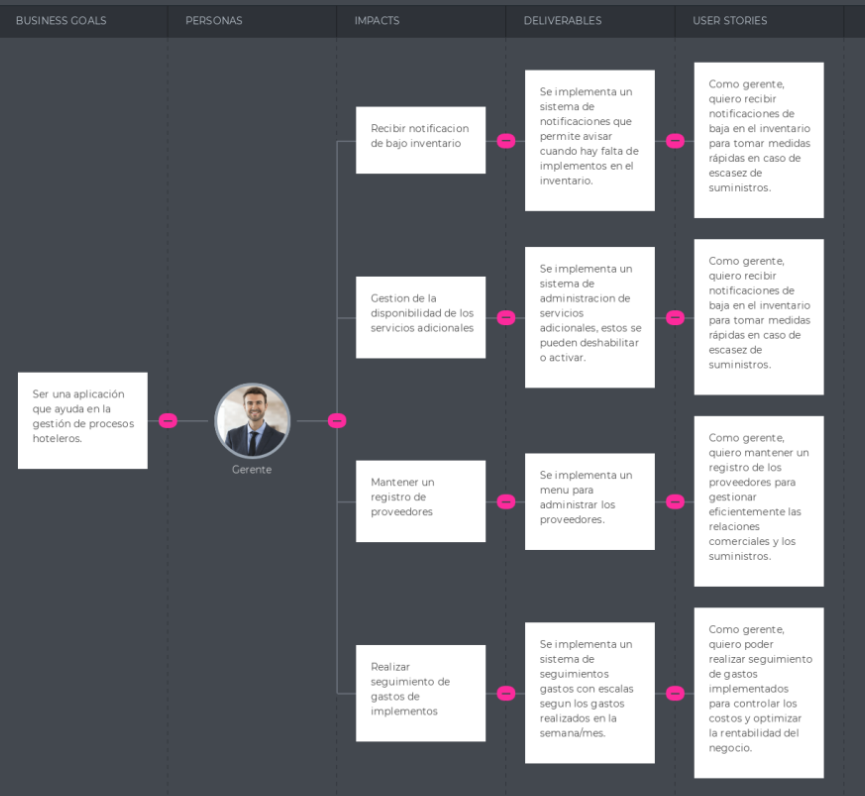

<hr>

# <center>COURSE PROJECT</center>

<p align="center">
    <strong>Universidad Peruana de Ciencias Aplicadas</strong><br>
    </img><br>
    <strong>Ingeniería de Software</strong><br>
    <strong>Aplicaciones Web - WX55</strong><br>
    <strong>Profesor: Angel Augusto Velasquez Nuñez </strong><br>
    <br>INFORME
</p>


<center>

#### Startup: **Sweet Manager**

#### Product: **Sweet Manager**

</center>

# Team  Members:

<div align="center">

|               Member                |    Code    |
| :---------------------------------: | :--------: |
| Mauricio Abraham Rivo Rojas Sánchez | U202211572 |
|      Aaron Elías Acuña Alarcón      | U202211552 |
|   Piero Fernando Periche Quiroga    | U202210192 |
|    Alex Ramon Alberto Avila Asto    | u20221a322 |
| Leonardo Félix Jesús Linares Tejada | U202211168 |


</div>

# Registro de Versiones del Informe

<table>
    <thead>
    <tr>
        <th>Version</th>
        <th>Fecha</th>
        <th>Participantes</th>
        <th>Observaciones</th>
    </tr>
    </thead>
    <tbody>
    <tr>
        <td>TB1</td>
        <td>29/03/2024</td>
        <td>Mauricio Abraham Rivo Rojas Sánchez</td>
        <td>
        <ul>
        <li> Software Configuration Management </li>
        <li> Landing Page, Services & Applications Implementation  </li>
        </ul>
        </td>
    </tr>
    <tr>
        <td>TB1</td>
        <td>29/03/2024</td>
        <td>Aaron Elías Acuña Alarcón </td>
        <td>
        <ul>
        <li> Competidores</li>
        <li> Entrevistas</li>
        <li> Needfinding </li>
        <li> Ubiquitous Language</li>
        </ul>
        </td>
    </tr>
    <tr>  
    </tr>
    <tr>
        <td>TB1</td>
        <td>29/03/2024</td>
        <td>Leonardo Félix Jesús Linares Tejada</td>
        <td>
        <ul>
        <li> StartUp Profile</li>
        <li> Solution Profile </li>
        <li> Segmento Objetivo </li>
        </ul>
        </td>
    </tr>
    <tr>
        <td rowspan="1">TB1</td>
        <td rowspan="1">29/03/2024</td>
        <td>Piero Fernando Periche Quiroga</td>
        <td>
        <ul>
        <li> Style Guidelines</li>
        <li> Information Architecture </li>
        <li> Landing Page UI Design </li>
        <li> Web Applications UX/UI Design </li>
        <li> Web Application Prototyping</li>
        </ul>
        </td>
    </tr>
    <tr>
        <td rowspan="1">TB1</td>
        <td rowspan="1">29/03/2024</td>
        <td>Alex Ramon Alberto Avila Asto</td>
        <td>
        <ul>
        <li> To-be Scenario Mapping </li>
        <li> User Stories </li>
        <li> Impact Mapping </li>
        <li> Product Backlog</li>
        </ul>
        </td>
    </tr>
    <tr>
        <td rowspan="1">TP1</td>
        <td rowspan="1">27/04/2024</td>
        <td>Mauricio Abraham Rivo Rojas Sánchez</td>
        <td>
        <ul>
        <li> Sprint Backlog 2</li>
        <li> Sprint Planning 2 </li>
        </ul>
        </td>
    </tr>
    <tr>
        <td rowspan="1">TP1</td>
        <td rowspan="1">27/04/2024</td>
        <td>Aaron Elías Acuña Alarcón </td>
        <td>
        <ul>
        <li> Execution Evidence For Sprint Review</li>
        </ul>
        </td>
    </tr>
    <tr>
        <td rowspan="1">TP1</td>
        <td rowspan="1">27/04/2024</td>
        <td>Leonardo Félix Jesús Linares Tejada</td>
        <td>
        <ul>
        <li> Service Documentation Evidence for Sprint Review </li>
        </ul>
        </td>
    </tr>
    <tr>
        <td rowspan="1">TP1</td>
        <td rowspan="1">27/04/2024</td>
         <td>Piero Fernando Periche Quiroga</td>
         <td>
        <ul>
        <li> Team Collaboration Insights during Sprint </li>
        </ul>
        </td>
    </tr>
    <tr>
        <td rowspan="1">TP1</td>
        <td rowspan="1">27/04/2024</td>
        <td>Alex Ramon Alberto Avila Asto</td>
        <td>
        <ul>
        <li> Development Evidence for Sprint Review </li>
        <li> Testing Suite Evidence for Sprint Review </li>
        </ul>
        </td>
    </tr>
    <tr>
        <td rowspan="1">TB2</td>
        <td rowspan="1">29/05/2024</td>
        <td>Mauricio Abraham Rivo Rojas Sánchez</td>
        <td>
        <ul>
        <li> Sprint Backlog 3 </li>
        <li> Sprint Planning 3 </li>
        </ul>
        </td>
    </tr>
    <tr>
        <td rowspan="1">TB2</td>
        <td rowspan="1">29/05/2024</td>
        <td>Aaron Elías Acuña Alarcon</td>
        <td>
        <ul>
        <li> Execution Evidence For Sprint Review</li>
        </ul>
        </td>
    </tr>
    <tr>
        <td rowspan="1">TP1</td>
        <td rowspan="1">29/05/2024</td>
        <td> Leonardo Félix Linares Tejada</td>
        <td>
        <ul>
        <li> Service Documentation Evidence for Sprint Review </li>
        </ul>
        </td>
    </tr>
    <tr>
        <td rowspan="1">TP1</td>
        <td rowspan="1">29/05/2024</td>
        <td>Piero Fernando Periche Quiroga</td>
        <td>
        <ul>
        <li> Team Collaboration Insights during Sprint </li>
        </ul>
        </td>
    </tr>
    <tr>
        <td rowspan="1">TP1</td>
        <td rowspan="1">29/05/2024</td>
        <td>Alex Ramon Alberto Avila Asto</td>
        <td>
        <ul>
        <li> Development Evidence for Sprint Review </li>
        <li> Testing Suite Evidence for Sprint Review </li>
        </ul>
        </td>
    </tr>
    </tbody>
</table>


# Project Report Collaboration Insights
La entrega TB1 finalizó con éxito y están documentadas en el siguiente repositorio de Github perteneciente a la organización del equipo: https://github.com/Los-No-Se-Quienes-y-Los-No-Se-Cuantos/project-report
Durante el desarrollo del informe se tuvieron en cuenta los siguientes aspeectos: 
- Se redactaron y estructuraron los contenidos asignados a cada miembro utilizando el formato Markdown. Luego, se realizaron commits para garantizar el avance en el repositorio.
- Se crearon los artefactos necesarios utilizando las herramientas recomendadas y se obtuvieron el link de las imagenes a través de la carpeta assets o de una publicación desde Imgur (https://imgur.com/).
- Se llevaron a cabo reuniones para coordinar el avance de los elementos del informe y para informar sobre los progresos del Sprint 1, centrado en la página de inicio (Landing Page).


# Contenido

[Registro de Versiones del Informe](#registro-de-versiones-del-informe)

[Project Report Collaboration Insights](#project-report-collaboration-insights)

[Student Outcome](#student-outcome)

[Capítulo I: Introducción](#capítulo-i-introducción)

[1.1 Startup Profile](#11-startup-profile)  
[1.1.1. Descripción de la Startup](#111-descripción-de-la-startup)  
[1.1.2. Perfiles de integrantes del equipo](#112-perfiles-de-integrantes-del-equipo)

[1.2. Solution Profile](#12-solution-profile)  
[1.2.1 Antecedentes y problemática](#121-antecedentes-y-problemática)  
[1.2.2 Lean UX Process.](#122-lean-ux-process)  
[1.2.2.1. Lean UX Problem Statements.](#1221-lean-ux-problem-statements)  
[1.2.2.2. Lean UX Assumptions.](#1222-lean-ux-assumptions)  
[1.2.2.3. Lean UX Hypothesis Statements.](#1223-lean-ux-hypothesis-statements)  
[1.2.2.4. Lean UX Canvas.](#1224-lean-ux-canvas)

[1.3. Segmentos objetivo.](#13-segmentos-objetivo)

[Capítulo II: Requirements Elicitation & Analysis](#capítulo-ii-requirements-elicitation--analysis)

[2.1. Competidores](#21-competidores)  
[2.1.1. Análisis competitivo]()  
[2.1.2. Estrategias y tácticas frente a competidores](#211-análisis-competitivo)

[2.2. Entrevistas](#22-entrevistas)  
[2.2.1. Diseño de entrevistas](#221-diseño-de-entrevistas)    
[2.2.3. Análisis de entrevistas](#223-análisis-de-entrevistas)

[2.3. Needfinding](#23-needfinding)  
[2.3.1. User Personas](#231-user-personas)  
[2.3.2. User Task Matrix](#232-user-task-matrix)  
[2.3.3. User Journey Mapping](#233-user-journey-mapping)  
[2.3.4. Empathy Mapping](#234-empathy-mapping)  
[2.3.5. As-is Scenario Mapping](#235-as-is-scenario-mapping)

[2.4. Ubiquitous Language](#24-ubiquitous-language)

[Capítulo III: Requirements Specificatio](#capítulo-iii-requirements-specification)

[3.1. To-Be Scenario Mapping](#31-to-be-scenario-mapping)

[3.2. User Stories](#32-user-stories)

[3.3. Impact Mapping](#33-impact-mapping)

[3.4. Product Backlog](#34-product-backlog)

[Capítulo IV: Product Desig](#capítulo-iv-product-design)

[4.1. Style Guidelines](#41-style-guidelines)  
[4.1.1. General Style Guidelines](#411-general-style-guidelines)  
[4.1.2. Web Style Guidelines](#412-web-style-guidelines)

[4.2. Information Architecture](#42-information-architecture)  
[4.2.1. Organization Systems](#421-organization-systems)  
[4.2.2. Labeling Systems](#422-labeling-systems)  
[4.2.3. SEO Tags and Meta Tag](#423-seo-tags-and-meta-tags)  
[4.2.4. Searching Systems](#424-searching-systems)   
[4.2.5. Navigation Systems](#425-navigation-systems)

[4.3. Landing Page UI Design](#43-landing-page-ui-design)   
[4.3.1. Landing Page Wireframe](#431-landing-page-wireframe)  
[4.3.2. Landing Page Mock-up](#432-landing-page-mock-up)

[4.4. Web Applications UX/UI Design](#44-web-applications-uxui-design)  
[4.4.1. Web Applications Wireframes](#441-web-applications-wireframes)  
[4.4.2. Web Applications Wireflow Diagrams](#442-web-applications-wireflow-diagrams)  
[4.4.2. Web Applications Mock-ups](#442-web-applications-mock-ups)   
[4.4.3. Web Applications User Flow Diagrams](#443-web-applications-user-flow-diagrams)

[4.5. Web Applications Prototyping](#45-web-applications-prototyping)

[4.6. Domain-Driven Software Architecture](#46-domain-driven-software-architecture)  
[4.6.1. Software Architecture Context Diagram](#461-software-architecture-context-diagram)  
[4.6.2. Software Architecture Container Diagrams](#462-software-architecture-container-diagrams)  
[4.6.3. Software Architecture Components Diagrams](#463-software-architecture-components-diagrams)

[4.7. Software Object-Oriented Design](#47-software-object-oriented-design)  
[4.7.1. Class Diagrams](#471-class-diagrams)  
[4.7.2. Class Dictionary](#472-class-dictionary)

[4.8. Database Design](#48-database-design)  
[4.8.1. Database Diagram](#481-database-diagram)

[Capítulo V: Product Implementation, Validation & Deploymen](#capítulo-v-product-implementation-validation--deployment)

[5.1. Software Configuration Management](#51-software-configuration-management)  
[5.1.1. Software Development Environment Configuration](#511-software-development-environment-configuration)  
[5.1.2. Source Code Management](#512-source-code-management)  
[5.1.3. Source Code Style Guide & Conventions](#513-source-code-style-guide--conventions)  
[5.1.4. Software Deployment Configuration](#514-software-deployment-configuration)

[5.2. Landing Page, Services & Applications Implementation](#52-landing-page-services--applications-implementation)  
[5.2.1. Sprint 1](#521-sprint-1)  
[5.2.1.1. Sprint Planning n](#5211-sprint-planning-1)  
[5.2.1.2. Sprint Backlog n](#5212-sprint-backlog-1)  
[5.2.1.3. Development Evidence for Sprint Review](#5213-development-evidence-for-sprint-review)  
[5.2.1.4. Testing Suite Evidence for Sprint Review](#5214-testing-suite-evidence-for-sprint-review)  
[5.2.1.5. Execution Evidence for Sprint Review](#5215-execution-evidence-for-sprint-review)  
[5.2.1.6. Services Documentation Evidence for Sprint Review](#5216-services-documentation-evidence-for-sprint-review)  
[5.2.1.7. Software Deployment Evidence for Sprint Review](#5217-software-deployment-evidence-for-sprint-review)  
[5.2.1.8. Team Collaboration Insights during Sprint](#5218-team-collaboration-insights-during-sprint)

[5.2.2. Sprint 2](#522-sprint-2)
[5.2.2.1. Sprint Planning 2](#5221-sprint-planning-2)

[5.2.2.2. Sprint Backlog 2](#5222-sprint-backlog-2)

[5.2.2.3. Development Evidence for Sprint Review](#5223-development-evidence-for-sprint-review)

[5.2.2.4. Testing Suite Evidence for Sprint Review](#5224-testing-suite-evidence-for-sprint-review)

[5.2.2.5. Execution Evidence for Sprint Review](#5225-execution-evidence-for-sprint-review)

[5.2.2.6. Services Documentation Evidence for Sprint Review](#5226-services-documentation-evidence-for-sprint-review)

[5.2.2.7. Software Deployment Evidence for Sprint Review](#5226-services-documentation-evidence-for-sprint-review)

[5.2.2.8. Team Collaboration Insights during Sprint](#5228-team-collaboration-insights-during-sprint)

[5.2.3. Sprint 3](#523-sprint-3)
[5.2.3.1. Sprint Planning 3](#5231-sprint-planning-3)

[5.2.3.2. Sprint Backlog 3](#5232-sprint-backlog-3)

[5.2.3.3. Development Evidence for Sprint Review](#5233-development-evidence-for-sprint-review)

[5.2.3.4. Testing Suite Evidence for Sprint Review](#5234-testing-suite-evidence-for-sprint-review)

[5.2.3.5. Execution Evidence for Sprint Review](#5235-execution-evidence-for-sprint-review)

[5.2.3.6. Services Documentation Evidence for Sprint Review](#5236-services-documentation-evidence-for-sprint-review)

[5.2.3.7. Software Deployment Evidence for Sprint Review](#5237-software-deployment-evidence-for-sprint-review)

[5.2.3.8. Team Collaboration Insights during Sprint](#5238-team-collaboration-insights-during-sprint)


[5.3. Validation Interviews](#53-validation-interviews)  
[5.3.1. Diseño de Entrevistas](#531-diseño-de-entrevistas)  
[5.3.2. Registro de Entrevistas](#532-registro-de-entrevistas)  
[5.3.3. Evaluaciones según heurísticas](#533-evaluaciones-según-heurísticas)

[5.4. Video About-the-Product](#54-video-about-the-product)

[Conclusiones](#conclusiones)

[Conclusiones y recomendaciones](#conclusiones-y-recomendaciones)

[Video About-the-Team](#video-about-the-team)

[Bibliografía](#bibliografía)

[Anexos](#anexos)

# Student Outcome
En Ingeniería de Software, el logro de curso contribuye a alcanzar el:

ABET – EAC - Student Outcome 5
Criterio: La capacidad de funcionar efectivamente en un equipo cuyos miembros juntos proporcionan liderazgo, crean un entorno de colaboración e inclusivo, establecen objetivos, planifican tareas y cumplen objetivos
En el siguiente cuadro se describen las acciones realizadas y enunciados de conclusiones por parte del grupo, que permiten sustentar el haber alcanzado el logro del ABET - EAC - Student Outcome 5.

| Criterio Especifico                                                                                                                                  | Acciones Realizadas                                     | Conclusiones           |
| ---------------------------------------------------------------------------------------------------------------------------------------------------- | ------------------------------------------------------- | ---------------------- |
| Participa en equipos multidisciplinarios con eficacia, eficiencia y objetividad, en el marco de un proyecto en soluciones de ingeniería de software. | - Mauricio Rojas <br> <b>TB1:</b> En este entregable, he participado en las diferentes reuniones y objetivos con eficacia y eficiencia para mejorar la calidad de la solución de Ingeniería de Software. Adicionalmente, me encargué de avanzar con las convenciones, uso de software, landing page deployment Sprint Backlog y development evidence.<br><b>TP1:</b> En este entregable, he participado junto con mi equipo de trabajo en diversas partes del desarrollo de nuestro Front-End Application. De hecho, realicé commits en el repositorio de Front-End Application. Adicionalmente, colaboré en las secciones requeridas para el Sprint 2. <hr>- Aaron Alarcón <br> <b>TB1:</b> En este entregable, he participado en distintos artefactos y requisitos del proyecto de software como Segmentos Objetivos, Empathy maps, etc. <br><b>TP1:</b> En este entregable, he participado en la parte del desarrollo del Front-End Application y documenté mis avances en el repositorio github. De esta manera, participé en el equipo con eficiencia. <hr> - Piero Periche <br> <b>TB1:</b> En este entregable, he participado en distintos artefactos y requisitos del proyecto de software como MockUp, Wireflow diagrams, landing page y diagrama de clases. Adicionalmente, participé en distintas reuniones en donde participé con eficacia, eficiencia y objetividad. <br> <b>TP1:</b> En este entregable, avanzé los bounded context que se me asignaron, documenté mis avances dentro del repositorio Github de Front-End Applications. <hr>- Leonardo Linares <br><b>TB1:</b> En este entregable, he participado con equipos multidisciplinarios para completar nuestro StartUp y Solution Profile, al igual que el Task Matrix y Journey Map. <br><b>TP1:</b> En este entregable, he participado junto a mi equipo para corregir la mayoría de puntos en el documento, y asegurar el funcionamiento del front-end. Apoyando en las secciones del Sprint 2. <hr>- Alex Avila <br> <b>TB1:</b> En este entregable, he trabajado en las user stories, product backlog, As Is Scenary Mapping y landing page. También he participado constantemente con eficacia y objetividad en las reuniones de equipo. <br> <b>TP1:</b> En este entregable, he trabajado con mi equipo y apoyé en la definición de features y bounded context a utilizar dentro de nuestro Sprint. Adicionalmente, colaboré en la documentación de código y resolución de problemas. | <b>- Conclusión TB1:</b> <br> En conclusión, en este entregable hemos participado en conjunto evaluando alternativas y requisitos para mejorar con eficacia, eficiencia y objetividad nuestra solución propuesta de Ingeniería de Software. <hr> <b>- Conclusión TP1:</b> En conclusión, en este entregable en conjunto hemos trabajado en equipo en el desarrollo del Front-End Applications y hemos puesto la documentación en el repositorio Github. De esta manera, todos hemos trabajo con eficacia, eficiencia y objetividad en este Sprint.|
| Conoce al menos un sector empresarial o dominio de aplicación de soluciones de software.                                                             | - Mauricio Rojas <br><b>TB1:</b> En este entregable he dialogado con mi grupo de trabajo para intercambiar conocimiento de sectores empresariales o dominios de aplicaciones de soluciones de software; de esta manera, podemos evaluar y planificar de mejor manera nuestras ideas. <br><b>TP1:</b> En este entregable, he apoyado a mis compañeros en las complicaciones que ellos tenían al momento de organizar el código o dudas. Adicionalmente, participé de manera activa dentro del Sprint 2 y estuve brindando ideas para el código del proyecto Front-End Applications. <hr> - Aaron Alarcón<br><b>TB1:</b> En este entregable he compartido mis ideas de sectores empresariales y los dominios que tengo en algunos temas. En consecuencia, compartimos nuestros conocimientos para el proyecto. <br><b>TP1:</b>  En este entregable, he colaborado en distintos bounded context e intentando ayudar con las dudas de mis compañeros; también me enfoque en las convenciones de código que debemos mantener en conjunto. <hr> - Piero Periche <br><b>TB1:</b> En este entregable, he compartido mis conocimientos con mi equipo de trabajo en distintos requisitos del proceso de proyecto. <br> <b>TP1:</b> En este entregable, ayude a documentar los avances obtenidos en el Sprint 2 y a colocar las evidencias de los avances en los requisitos del capítulo 5.<hr> - Leonardo Linares <br> <b>TB1:</b> En este entregable, llegue a conocer un sector empresarial para completar nuestro StartUp y Solution Profile, al igual que el Task Matrix y Journey Map. <br><b>TP1:</b> En este entregable, me encargue de corregir diferentes secciones del informe, gracias a mi conocimiento sobre los puntos dados.<hr> - Alex Avila<br> <b>TB1:</b> En este entregable, colaboré a mis compañeros de equipo a introducirse a Git y Github. Adicionalmente, he compartido mis conocimientos en requisitos de software y herramientas. <br> <b>TP1:</b> En este entregable, apoye en documentar los avances dentro de los repositorios de Github y compartí mis conocimientos de Software para resolver las dudas de mis compañeros y poder presentar un mejor entregable para el Sprint 2.| <b>- Conclusión TB1:</b> <br> En conclusión, en este entregable hemos dialogado en conjunto para dar a conocer nuestros conocimientos en sectores empresariales o dominios de aplicación de soluciones de software. <hr><b>- Conclusión TP1:</b> <br> En conclusión, en este entregable nos hemos apoyado en conjunto con nuestros conocimientos para poder resolver los problemas que se presentaban durante el desarrollo del Front-End Applications. Adicionalmente, realizar retroalimentación entre nosotros. 
|

# Capítulo I: Introducción

## 1.1. Startup Profile

La gestión eficiente de un hotel es fundamental para garantizar una experiencia excepcional para los huéspedes y maximizar los ingresos. Con este fin, presentamos “Sweet Manager”, una aplicación de gestión de procesos hoteleros diseñada para simplificar y optimizar todas las operaciones relacionadas con la administración de un hotel de tal manera que se puede brindar una estancia cómoda y de calidad a los clientes que frecuentan el hotel.

### 1.1.1. Descripción de la Startup

Sweet Manager es una solución integral que abarca desde el seguimiento de ingresos y gastos hasta la gestión de proveedores, inventarios e incluso recursos humanos. Con una interfaz intuitiva y fácil de usar, nuestra aplicación permite a los gerentes y propietarios de hoteles tener un control total sobre todas las facetas de su negocio, desde cualquier lugar y en cualquier momento.

Destacamos las siguientes características:
- Gestión de Ingresos y Gastos: Sweet Manager ofrece un seguimiento detallado de todos los ingresos y gastos del hotel, proporcionando informes en tiempo real para una toma de decisiones informada.
- Control de Inventarios: Con nuestra aplicación, los hoteles pueden gestionar eficientemente sus inventarios de alimentos, bebidas, artículos de tocador y más, evitando escasez y desperdicios.
- Gestión de Proveedores: Facilitamos la comunicación y la gestión de relaciones con los proveedores, permitiendo realizar pedidos de forma rápida y eficiente.
- Gestión de Clientes: Mejoramos la organización y control de los clientes que reserven su estancia en el hotel implementando calendarios y agendas para una mejor gestión.

#### 1.1.2. Perfiles de integrantes del equipo

| Miembros del equipo                             | Codigo Estudiante | Carrera                | Conocimientos / Habilidades |
| ----------------------------------------------- | ----------------- | ---------------------- | --------------------------- |
| Mauricio Abraham Rivo Rojas Sánchez	 | U202211572            | Ingenieria de software | C++, C#, javascript y java            |
| Aaron Elías Acuña Alarcón 	 | U202211552            | Ingenieria de software | C++, C#, html, SQL server, etc.             |
| Leonardo Félix Jesús Linares Tejada 	 | U202211168            | Ingenieria de software | C++, C#, html, css, etc.             |
| Alex Ramon Alberto Avila Asto 	 | U20221A322            | Ingenieria de software | C++, java, Kotlin, Go, Spring Boot .etc             |
| Piero Fernando Periche Quiroga 	 | U202210192            | Ingenieria de software | C++, javascript, html, .etc             |

## 1.2. Solution Profile

Como se mencionó anteriormente, el objetivo de Sweet Manager es ser una aplicación que ayuda en la gestión de procesos hoteleros, específicamente, el seguimiento de ingresos, los proveedores del hotel, los insumos y los recursos disponibles.

Pero, para poder prosperar y ser exitosos, necesitamos reconocer el ambiente competitivo que rodea nuestra aplicación. Por lo tanto, reconoceremos nuestros objetivos y restricciones con las siguientes secciones.

### 1.2.1 Antecedentes y problemática

Para poder competir con nuestros competidores, debemos reconocer los antecedentes y la problemática a solucionar.

**Antecedentes**

En la industria hotelera, la gestión eficiente de procesos es crucial para asegurar la rentabilidad y la satisfacción del cliente. En los últimos años, hemos presenciado una evolución significativa en las expectativas de los huéspedes, impulsada en gran medida por los avances tecnológicos y la rápida expansión del mercado de viajes y alojamiento.

El advenimiento de plataformas de reserva en línea y la creciente demanda de experiencias personalizadas han creado un entorno altamente competitivo para los hoteles de todos los tamaños. Los huéspedes esperan no solo un servicio impecable y comodidades de alta calidad, sino también una experiencia fluida y sin contratiempos desde el momento de la reserva hasta el check-out.

Sin embargo, muchos hoteles se enfrentan a desafíos en la gestión de sus operaciones diarias. Desde el seguimiento preciso de los ingresos y gastos hasta la coordinación del personal y la gestión de inventarios, las tareas administrativas pueden ser abrumadoras y propensas a errores en un entorno dinámico como el de la hotelería. Todos estos problemas se evidencian en el análisis hecho al “Hotel Sol de Grau” de Piura, Perú (Rosas, 2021), con respecto al manejo interno de sus empleados y su incidencia en la gestión financiera.

Además, la falta de herramientas adecuadas de gestión puede llevar a pérdidas económicas, escasez de inventario y, en última instancia, a una experiencia insatisfactoria para los huéspedes (Robayo, Serna y Botera, 2022). La incapacidad para mantener un control efectivo sobre los recursos disponibles y las necesidades cambiantes de los clientes puede tener un impacto negativo en la reputación y la rentabilidad del hotel, especialmente en un mercado donde las reseñas en línea y las recomendaciones boca a boca juegan un papel crucial en la toma de decisiones de los viajeros.

En este contexto, la necesidad de soluciones innovadoras y eficientes para la gestión hotelera es más evidente que nunca. Los hoteles deben adaptarse rápidamente a las demandas del mercado y aprovechar las herramientas tecnológicas disponibles para optimizar sus operaciones y mantenerse competitivos en un entorno en constante cambio.

**Problemática**

**What:** Sweet Manager es una solución integral diseñada para abordar estas complejidades al proporcionar una plataforma única para la gestión de todos los aspectos de un hotel, desde las finanzas hasta los recursos humanos.

**Who:** Los hoteles y establecimientos de alojamiento en todo el mundo se enfrentan a desafíos constantes en la gestión de sus operaciones diarias. Desde el seguimiento de ingresos hasta la administración de inventarios y la coordinación del personal, la gestión hotelera puede ser compleja y consumir mucho tiempo.

**When:** La problemática puede surgir en cualquier momento dado, puede ser un problema diario, ya sea con problemas en la gestión del personal o administración de inventarios, o un problema que se encuentra a último segundo, como una falta de recursos de comida o agua o luz, etc.

**Where:** La necesidad de una gestión eficiente se extiende a hoteles y establecimientos de alojamiento en todas partes, desde pequeñas posadas hasta grandes cadenas hoteleras, tanto en entornos urbanos como en destinos turísticos.

**Why:** La gestión ineficiente puede llevar a pérdidas financieras, escasez de inventario, falta de coordinación del personal y, en última instancia, a una experiencia insatisfactoria para los huéspedes, lo que afecta la reputación y la rentabilidad del hotel.

**How:** Sweet Manager aborda esta problemática al proporcionar una plataforma centralizada y fácil de usar que permite a los hoteles gestionar todos los aspectos de su negocio de manera eficiente y efectiva.

**How much:** A partir de un modelo de suscripción, Sweet Manager puede llegar a ser una mera herramienta para momentos puntuales, o una herramienta que prácticamente se vuelve esencial para la sobrevivencia y prospección de un hotel.

### 1.2.2 Lean UX Process.

El proceso Lean UX aborda la visión del modelo de negocio que respalda nuestro proyecto, siendo el producto principal nuestro software. A lo largo de este documento y en este capítulo, exploramos varios elementos clave de este proceso.

Comenzamos con los "Problem Statements", que abarcan aspectos como el dominio, los segmentos de clientes, los puntos de dolor, las brechas, la visión/estrategia y el segmento inicial. Siguiendo la metodología Lean UX, también consideramos las "Assumptions Statements" y las "Hypothesis Statements".

#### 1.2.2.1. Lean UX Problem Statements.

**Problem Statement:**

La gestión eficiente de hoteles presenta desafíos significativos, incluyendo la falta de herramientas integradas que aborden todas las facetas del negocio. Los propietarios y gerentes se enfrentan a dificultades para gestionar ingresos, inventarios, proveedores y recursos humanos de manera eficaz, lo que puede resultar en pérdida de ingresos, desperdicio de recursos y experiencias insatisfactorias para los huéspedes.

**Dominio:**

Nos centramos en la industria hotelera. Reconocemos la diversidad y complejidad de este sector, que abarca desde pequeñas posadas hasta grandes cadenas hoteleras, cada una con sus propias necesidades y desafíos únicos en la gestión operativa.

**Segmentos de Clientes:**

Nos dirigimos a los propietarios y gerentes de hoteles de todos los tamaños, al igual que a los empleados y trabajadores de estos. Comprendemos que la gestión hotelera abarca una amplia gama de establecimientos, desde negocios familiares hasta corporaciones internacionales, y nuestra plataforma está diseñada para adaptarse a las necesidades de todos estos segmentos.

**Puntos de Dolor:**

- **Dificultad para realizar un seguimiento preciso de los ingresos y gastos del hotel:** La falta de herramientas adecuadas dificulta la monitorización efectiva de los flujos financieros, lo que puede conducir a decisiones erróneas y pérdida de ingresos.
- **Desafíos en la gestión de inventarios y relaciones con proveedores:** La coordinación de inventarios y la comunicación con proveedores pueden ser complicadas y consumir mucho tiempo, lo que resulta en escasez de suministros o exceso de stock.
- **Complejidades en la gestión del personal y los recursos humanos:** Programación de turnos, seguimiento de la asistencia, evaluaciones de desempeño y gestión de nóminas son solo algunas de las tareas laboriosas que enfrentan los gerentes de hoteles en la gestión de su personal.

**Visión/Estrategia:**

Nuestra visión es proporcionar una solución integral y fácil de usar que aborde todas las necesidades de gestión de un hotel, desde las finanzas hasta los recursos humanos. Nos esforzamos por mejorar la eficiencia operativa y la experiencia del cliente al ofrecer una plataforma centralizada que simplifique y optimice todas las operaciones relacionadas con la administración hotelera.

**Segmento Inicial:**

Nos enfocamos inicialmente en hoteles independientes y pequeñas cadenas hoteleras que buscan soluciones accesibles y eficientes para optimizar sus operaciones. Reconocemos la importancia de ofrecer herramientas asequibles y adaptables para estos segmentos, que a menudo carecen de los recursos de las grandes cadenas pero que tienen una necesidad urgente de mejorar su eficiencia y competitividad en el mercado.


#### 1.2.2.2. Lean UX Assumptions.

**Features:**
- **Seguimiento de Ingresos y Gastos en Tiempo Real:** Herramienta para registrar y analizar los flujos financieros del hotel, proporcionando una visión instantánea de la situación económica.
- **Gestión de Inventarios y Relaciones con Proveedores:** Funcionalidades para mantener un control preciso de los suministros del hotel y facilitar la comunicación con los proveedores para realizar pedidos de manera eficiente.
- **Módulos de Gestión de Personal:** Herramientas para gestionar horarios, nóminas y evaluaciones de desempeño del personal, optimizando así la gestión de recursos humanos.
- **Interfaz Intuitiva y Personalizable:** Una interfaz fácil de usar y adaptable a las necesidades específicas de cada hotel, garantizando una experiencia de usuario fluida y personalizada.
- **Integración con Sistemas de Gestión Hotelera Existentes:** Capacidad para integrarse sin problemas con sistemas de gestión hotelera ya implementados, asegurando una transición suave y una experiencia completa para los usuarios.

**Business Outcomes:**
- **Aumento de la Eficiencia Operativa:** Tras la implementación de Sweet Manager, se espera una reducción del 30% en el tiempo dedicado a tareas administrativas como la gestión de inventarios y recursos humanos, lo que se traducirá en una mejora tangible en la eficiencia operativa del hotel.
- **Mejora en la Rentabilidad:** Anticipamos un aumento del 15% en el margen de beneficio neto del hotel dentro de seis meses, gracias a una gestión más efectiva de ingresos y recursos que optimiza los costos operativos y maximiza los ingresos.
- **Mayor Satisfacción del Cliente:** Esperamos ver un aumento de 0.5 puntos en la calificación promedio de satisfacción del cliente en las reseñas en línea después de la implementación de Sweet Manager, lo que reflejará la mejora en la experiencia del cliente debido a una gestión más eficiente y una atención más personalizada.
- **Retención de los clientes:** Prevemos un aumento del 20% en el número de clientes que realizan reservas repetidas dentro de un año, lo que indica una mayor fidelización gracias a una gestión más efectiva y una experiencia de calidad para los huéspedes.
- **Reducción de costos:** Esperamos una disminución del 25% en los costos operativos totales del hotel, gracias a la reducción de desperdicios y la optimización de procesos facilitada por la automatización y centralización de la información.

**Users:**
- **Propietarios y Gerentes de Hoteles:** Buscan soluciones tecnológicas para optimizar la gestión de sus establecimientos y mejorar la rentabilidad.
- **Personal de Trabajo:** Encargado de tareas específicas dentro del hotel, como contabilidad, compras o recursos humanos, quienes buscan herramientas que simplifiquen y agilicen sus responsabilidades diarias.

**User Outcomes & Benefits:**
- **Acceso Conveniente a la Plataforma:** Los usuarios pueden acceder fácilmente a todas las herramientas necesarias para la gestión hotelera desde una sola plataforma.
- **Toma de Decisiones Basada en Datos en Tiempo Real:** La disponibilidad de información actualizada permite a los usuarios tomar decisiones informadas y estratégicas en el momento adecuado.
- **Reducción del estrés y la Carga de Trabajo:** Al automatizar procesos y simplificar tareas, Sweet Manager ayuda a reducir la carga de trabajo y el estrés asociado con la gestión manual de procesos.
- **Facilitación de tareas específicas:** Como la contabilidad, las compras y manejo de los recursos humanos mediante herramientas especializadas.
- **Mayor eficiencia y comunicación:** Al contar con sistemas integrados que agilizan los procesos de las tareas, y contar con un sistema de comunicación directa, se optimiza la coordinación operativa.
- **Transparencia de acciones y mayor confianza:** Generando una experiencia sin contratiempos que satisface a los huéspedes, especialmente en las transacciones y las reservas.

**Business Assumptions:**
1. Creemos que los hoteles tienen una necesidad creciente de soluciones tecnológicas que mejoren la eficiencia operativa y la rentabilidad del negocio.
2. Esta necesidad puede ser abordada con éxito mediante Sweet Manager, que ofrece una plataforma integral y fácil de usar para la gestión hotelera.
3. El valor principal que nuestros clientes buscan es una solución que simplifique la gestión diaria del hotel y mejore la experiencia del cliente.
4. Prevemos adquirir la mayoría de nuestros clientes a través de estrategias de marketing dirigidas a propietarios y gerentes de hoteles, así como mediante asociaciones con la industria hotelera.
5. Generaremos ingresos principalmente a través de modelos de suscripción y servicios premium, así como mediante la oferta de integraciones con otros sistemas y herramientas adicionales.
6. Si bien enfrentamos la competencia de otras soluciones de gestión hotelera, confiamos en que podemos destacarnos mediante la calidad del servicio, la facilidad de uso y la capacidad de adaptación a las necesidades específicas de cada hotel.
7. El principal riesgo que enfrentamos es no cumplir con las expectativas del cliente en cuanto a funcionalidad, rendimiento y soporte técnico.
8. Planeamos mitigar este riesgo manteniendo un enfoque centrado en el cliente, brindando soporte continuo y actualizaciones regulares de nuestra plataforma para satisfacer las necesidades cambiantes del mercado hotelero.

#### 1.2.2.3. Lean UX Hypothesis Statements.

- **Hipótesis 1:**

**Creemos que** al ofrecer una plataforma integral y fácil de usar para la gestión hotelera, aumentaremos la eficiencia operativa y la rentabilidad de los hoteles. **Se cumplirá si** los propietarios y gerentes **persiban** una disminución visible en el tiempo dedicado a tareas administrativas manuales y un aumento en la utilización activa de Sweet Manager.

- **Hipótesis 2:**

**Creemos que** al proporcionar herramientas de análisis en tiempo real para la toma de decisiones informadas, mejoraremos la gestión estratégica de los hoteles. **Se cumplirá si** los empleados **persiban** una mayor implementación de cambios basados en datos en la gestión hotelera y una mejora significativa en la eficiencia operativa.

- **Hipótesis 3:**

**Creemos que** al optimizar la gestión de inventarios y recursos humanos a través de Sweet Manager, mejoraremos la experiencia del cliente en los hoteles. **Se cumplirá si** los propietarios y gerentes **obtengan** un aumento en las calificaciones y comentarios positivos de los huéspedes, así como una mayor fidelización y repetición de negocios.

- **Hipótesis 4:**

**Creemos que** al facilitar la comunicación y la colaboración entre el personal del hotel mediante Sweet Manager, mejoraremos la coordinación operativa y la satisfacción laboral. **Se cumplirá si** los trabajodes del hotel **noten** una reducción en los malentendidos y errores de comunicación interna, así como un aumento en la productividad y el compromiso del personal.

- **Hipótesis 5:**

**Creemos que** al ofrecer una experiencia transparente de usuario, que mantenga un seguimiento claro de las transacciones y reservas del hotel, aumentaremos la adopción y retención de usuarios. **Se cumplirá si** los propietarios y gerentes **observen** una disminución en la tasa de abandono de la plataforma y un aumento en el número de usuarios activos que utilizan regularmente todas las características disponibles.

#### 1.2.2.4. Lean UX Canvas.

<TABLE BORDER>
	<TR>
		<TD ROWSPAN=2>

**Lean UX Canvas**

</TD>
	    	<TD ROWSPAN=2></TD> <TD>
</TD> 
	</TR>
	<TR>
	</TR>
    <TR>
		<TD ROWSPAN>
        
**1. Business Problem:**
        
La gestión eficiente de hoteles presenta desafíos significativos, incluyendo la falta de herramientas integradas que aborden todas las facetas del negocio. Los propietarios y gerentes se enfrentan a dificultades para gestionar ingresos, inventarios, proveedores y recursos humanos de manera eficaz, lo que puede resultar en pérdida de ingresos, desperdicio de recursos y experiencias insatisfactorias para los huéspedes.
</TD>
	    	<TD ROWSPAN=2>

**5. Solutions**
- **Automatización de Procesos:** Desarrollar herramientas que automatizan tareas repetitivas en la gestión hotelera, como la generación de informes financieros o la programación de mantenimiento.

- **Análisis en tiempo real:** Implementar herramientas que ofrecen a los propietarios y gerentes información clave sobre el desempeño del hotel.

- **Optimizar la gestión de inventarios y recursos humanos:** Mediante herramientas específicas en la aplicación, se logrará optimizar la gestión de los recursos hoteleros.

- **Facilitar la comunicación y colaboración interna del hotel:** Mediante un sistema de notificaciones instantáneas y en tiempo real.
</TD> <TD ROWSPAN=2>

**2. Business Outcomes:**

- **Aumento de la Eficiencia Operativa:** Tras la implementación de Sweet Manager, se espera una reducción del 30% en el tiempo dedicado a tareas administrativas como la gestión de inventarios y recursos humanos, lo que se traducirá en una mejora tangible en la eficiencia operativa del hotel.
- **Mejora en la Rentabilidad:** Anticipamos un aumento del 15% en el margen de beneficio neto del hotel dentro de seis meses, gracias a una gestión más efectiva de ingresos y recursos que optimiza los costos operativos y maximiza los ingresos.
- **Mayor Satisfacción del Cliente:** Esperamos ver un aumento de 0.5 puntos en la calificación promedio de satisfacción del cliente en las reseñas en línea después de la implementación de Sweet Manager, lo que reflejará la mejora en la experiencia del cliente debido a una gestión más eficiente y una atención más personalizada.
- **Retención de los clientes:** Prevemos un aumento del 20% en el número de clientes que realizan reservas repetidas dentro de un año, lo que indica una mayor fidelización gracias a una gestión más efectiva y una experiencia de calidad para los huéspedes.
- **Reducción de costos:** Esperamos una disminución del 25% en los costos operativos totales del hotel, gracias a la reducción de desperdicios y la optimización de procesos facilitada por la automatización y centralización de la información.
</TD> 
	</TR>
	<TR>
		<TD >
        
**3. Users:**

- **Propietarios y Gerentes de Hoteles:** Buscan soluciones tecnológicas para optimizar la gestión de sus establecimientos y mejorar la rentabilidad.
- **Personal de Trabajo:** Encargado de tareas específicas dentro del hotel, como contabilidad, compras o recursos humanos, quienes buscan herramientas que simplifiquen y agilicen sus responsabilidades diarias.
</TD> 
	</TR>
    <TR>
		<TD ROWSPAN=2>

**6. Hypotheses**
        
- **Creemos que** al ofrecer una plataforma integral y fácil de usar para la gestión hotelera, aumentaremos la eficiencia operativa y la rentabilidad de los hoteles. **Se cumplirá si** los propietarios y gerentes **persiban** una disminución visible en el tiempo dedicado a tareas administrativas manuales y un aumento en la utilización activa de Sweet Manager.

- **Creemos que** al proporcionar herramientas de análisis en tiempo real para la toma de decisiones informadas, mejoraremos la gestión estratégica de los hoteles. **Se cumplirá si** los empleados **persiban** una mayor implementación de cambios basados en datos en la gestión hotelera y una mejora significativa en la eficiencia operativa.

- **Creemos que** al optimizar la gestión de inventarios y recursos humanos a través de Sweet Manager, mejoraremos la experiencia del cliente en los hoteles. **Se cumplirá si** los propietarios y gerentes **obtengan** un aumento en las calificaciones y comentarios positivos de los huéspedes, así como una mayor fidelización y repetición de negocios.

- **Creemos que** al facilitar la comunicación y la colaboración entre el personal del hotel mediante Sweet Manager, mejoraremos la coordinación operativa y la satisfacción laboral. **Se cumplirá si** los trabajodes del hotel **noten** una reducción en los malentendidos y errores de comunicación interna, así como un aumento en la productividad y el compromiso del personal.

- **Creemos que** al ofrecer una experiencia transparente de usuario, que mantenga un seguimiento claro de las transacciones y reservas del hotel, aumentaremos la adopción y retención de usuarios. **Se cumplirá si** los propietarios y gerentes **observen** una disminución en la tasa de abandono de la plataforma y un aumento en el número de usuarios activos que utilizan regularmente todas las características disponibles.</TD>

<TD ROWSPAN=2>

**7. What’s the Most Important Thing We Need to Learn First?**

Comprender las necesidades y desafíos específicos de la gestión hotelera: Esto nos permitirá diseñar soluciones que aborden problemas reales y agreguen valor a los propietarios y gerentes de hoteles.

Analizar el panorama competitivo: Es crucial comprender las fortalezas y debilidades de nuestros competidores, así como identificar oportunidades para diferenciarnos en el mercado.

Definir claramente los objetivos y métricas de éxito: Antes de avanzar en el desarrollo, necesitamos establecer objetivos claros y medibles para la plataforma, lo que nos permitirá evaluar su efectividad y realizar ajustes según sea necesario.

</TD> 

<TD>

**4. User Outcomes & Benefits:**

- **Acceso Conveniente a la Plataforma:** Los usuarios pueden acceder fácilmente a todas las herramientas necesarias para la gestión hotelera desde una sola plataforma.
- **Toma de Decisiones Basada en Datos en Tiempo Real:** La disponibilidad de información actualizada permite a los usuarios tomar decisiones informadas y estratégicas en el momento adecuado.
- **Reducción del estrés y la Carga de Trabajo:** Al automatizar procesos y simplificar tareas, Sweet Manager ayuda a reducir la carga de trabajo y el estrés asociado con la gestión manual de procesos.
- **Facilitación de tareas específicas:** Como la contabilidad, las compras y manejo de los recursos humanos mediante herramientas especializadas.
- **Mayor eficiencia y comunicación:** Al contar con sistemas integrados que agilizan los procesos de las tareas, y contar con un sistema de comunicación directa, se optimiza la coordinación operativa.
- **Transparencia de acciones y mayor confianza:** Generando una experiencia sin contratiempos que satisface a los huéspedes, especialmente en las transacciones y las reservas.
</TD> 
	</TR>
	<TR>
		<TD>
        
**8. What's the least amount of work we need to do to learn the next most important thing?**

- **Encuestas de Satisfacción:**

    Realizar encuestas breves entre los usuarios para comprender sus necesidades y expectativas iniciales con respecto a la gestión hotelera y las soluciones tecnológicas existentes.

- **Análisis Competitivo:**

    Realizar una investigación rápida para identificar a los principales competidores en el espacio de la gestión hotelera y comprender las características clave de sus plataformas.

- **Identificación de Métricas Clave:** 

    Determinar las métricas clave que nos permitirán medir el éxito de la plataforma, como la tasa de adopción, la retención de usuarios y la satisfacción del cliente.

- **Prototipo sobre el Concepto:** 

    Crear un prototipo simple o una maqueta de la plataforma para obtener retroalimentación temprana de los usuarios y validar la viabilidad de la idea.

</TD> 
	</TR>
</TABLE>

## 1.3. Segmentos objetivo.

**Usuarios:**

- **Propietarios y Gerentes de Hoteles:** 

    Se ubican principalmente en áreas urbanas y turísticas de todo el mundo, mayormente en ciudades importantes y destinos turísticos.

    Son altamente dedicados a su negocio, priorizando la eficiencia y rentabilidad de su hotel. También tienen una necesidad de control, buscando herramientas que les permitan tener un control total sobre las facetas de su negocio. Además, mantienen un deseo continuo de mejorar, para asegurar el éxito de su hotel y satisfacer la experiencia del cliente.

    En su mayoría, son adultos de entre 30 y 60 años. El nivel educativo varía, desde propietarios con educación empresarial formal, hasta gerentes con experiencia laboral en la industria hotelera. Por último, pueden tener una amplia experiencia en la gestión hotelera o ser propietarios recientes que buscan optimizar su negocio.

- **Personal de Trabajo:** 

    Se ubican principalmente en áreas urbanas y turísticas de todo el mundo, mayormente en ciudades importantes y destinos turísticos.

    Tienen una fuerte dedicación al servicio al cliente y a proporcionar una experiencia excepcional a los huéspedes. También, son capaces de adaptarse a una variedad de tareas y situaciones en un entorno dinámico y exigente. Además, valoran la colaboración y comunicación efectiva entre ellos y sus superiores, para garantizar el buen funcionamiento del hotel.

    Mayormente son adultos jóvenes a adultos de mediana edad, con amplia experiencia laboral. También, varían en su nivel educativo, desde aquellos con educación secundaria hasta aquellos con formación específica en hospitalidad y turismo. Por último, su experiencia laboral varía, desde aquellos que recién empiezan, hasta aquellos que ya tienen experiencia personal en hoteles.

    Tienen una fuerte dedicación al servicio al cliente y a proporcionar una experiencia excepcional a los huéspedes. También, son capaces de adaptarse a una variedad de tareas y situaciones en un entorno dinámico y exigente. Además, valoran la colaboración y comunicación efectiva entre ellos y sus superiores, para garantizar el buen funcionamiento del hotel.

    Mayormente son adultos jóvenes a adultos de mediana edad, con amplia experiencia laboral. También, varían en su nivel educativo, desde aquellos con educación secundaria hasta aquellos con formación específica en hospitalidad y turismo. Por último, su experiencia laboral varía, desde aquellos que recién empiezan, hasta aquellos que ya tienen experiencia personal en hoteles.

# Capítulo II: Requirements Elicitation & Analysis

## 2.1. Competidores.

Facebook (Indirecto): <br>
En Facebook, los usuarios pueden crear perfiles personales, agregar amigos, publicar actualizaciones de estado, compartir fotos y videos, unirse a grupos y páginas, enviar mensajes privados, participar en eventos, jugar juegos y muchas otras actividades. La plataforma se ha expandido enormemente con el tiempo, integrando funciones como Facebook Marketplace (un mercado en línea), Facebook Watch (una plataforma de vídeo), y Facebook Messenger (una aplicación de mensajería instantánea). Lo cual implica que los gerentes de hoteles busquen empresas que brinden soluciones por medio de publicaciones en dicha plataforma.

Mercado Libre (Indirecto): <br>
Siendo la plataforma líder de comercio electrónico de América Latina, Mercado libre ofrece la compra y venta de artículos a precio fijo. La gestión hotelera también entra en la lista puesto que se promocionan venta de sistemas y código fuente que ayudan y facilitan a buen precio la gestión hotelera.

Xafiro (Directo): <br>
Xafiro es un software hotelero, que ahorra tiempo y optimiza la gestión de las operaciones diarias como registro de clientes, reservas, checkin y checkout de habitaciones, venta de productos, entre otros. Dicha empresa es competencia directa porque brinda la solución que ofrecemos como empresa.

Binz 360 (Directo): <br>
Binz 360 es una empresa que se encarga de la gestión de los recursos hoteleros, control de clientes y reportes de ingresos a un buen precio. Dicha empresa es competencia directa porque brinda la solución que planteamos a un precio económico.


### 2.1.1. Análisis competitivo.

| ¿Por qué llevar a cabo este análisis? | Sweet Manager |  Facebook(Indirecto) |  Mercado Libre(Indirecto) |  Xafiro(Directo) |  Binz360(Directo) |
|---------------------------------------|----------|-----------|------------|------------|------------|
| **Overview**                          | Sweet Manager es una aplicación integral de gestión hotelera diseñada para simplificar y optimizar todas las operaciones relacionadas con la administración de un hotel | Plataforma de redes sociales utilizada para la promoción y publicidad de empresas hoteleras. Ofrece una amplia gama de herramientas de marketing y publicidad para llegar a una amplia audiencia. | Plataforma líder de comercio electrónico que ofrece sistemas y códigos fuente relacionados con la gestión hotelera. Proporciona opciones para la compra de productos y servicios que pueden mejorar la eficiencia en la gestión hotelera. | Solución de software hotelero que ahorra tiempo y optimiza la gestión de operaciones diarias. Ofrece características similares a Sweet Manager, como registro de clientes, reservas y gestión de inventarios. | Empresa especializada en la gestión de recursos hoteleros y control de clientes. Ofrece una solución competitiva en términos de gestión hotelera a un precio económico. |
| **Ventaja Competitiva**               | Ofrece una solución integral para la gestión hotelera, desde seguimiento de ingresos y gastos hasta gestión de proveedores y clientes. Flexibilidad y accesibilidad, permitiendo a los administradores gestionar correctamente su negocio desde cualquier lugar y en cualquier momento. | Alcance masivo y capacidad de segmentación precisa del público objetivo. | Amplia variedad de productos y servicios disponibles. | Enfoque específico en la eficiencia de las operaciones diarias del hotel | Precio asequible para hoteles pequeños y medianos |
| **Mercado Objetivo**                  | Gerentes y propietarios de hoteles de todos los tamaños buscan una solución eficiente y completa para la gestión de su negocio. | Hoteles de todos los tamaños que buscan aumentar su visibilidad en línea. | Propietarios de hoteles y gerentes que buscan soluciones de gestión. | Hoteles de mediano a gran tamaño que buscan una solución completa y eficiente. | Hoteles independientes y pequeñas cadenas hoteleras. |
| **Estrategias de marketing**               | Campañas dirigidas en redes sociales y plataformas de anuncios digitales para llegar a la audiencia objetivo. Colaboraciones con asociaciones hoteleras y participación en eventos de la industria para aumentar la visibilidad y credibilidad de la marca. | Publicidad segmentada. Uso de contenido visual para atraer a los usuarios. | Promoción de productos relacionados con la gestión hotelera. Publicidad dirigida a profesionales de la industria hotelera. | Colaboración con asociaciones hoteleras en redes sociales. Campañas en redes sociales dirigidas a gerentes hoteleros. | Enfoque en el ahorro de costos y eficiencia operativa. Uso de marketing de contenidos para educar sobre la importancia de la gestión hotelera. |
| **Productos & Servicios**               | Sweet Manager ofrece una gama de características, incluyendo seguimiento de ingresos y gastos, control de inventarios, gestión de proveedores y clientes. | Plataforma de redes sociales con diversas opciones de publicidad y promoción. Herramientas de análisis para medir el rendimiento de las campañas | Variedad de sistemas y códigos fuente relacionados con la gestión hotelera disponibles para la compra. Opciones de precio variadas para adaptarse a diferentes presupuestos | Ofrece una variedad de características para la gestión hotelera. Precios competitivos y opciones de personalización | Solución completa para la gestión hotelera con énfasis en la relación calidad-precio. Modelo de precios simple y transparente |
| **Precios & Costos**                           | Ofrecido como servicio de suscripción mensual o anual con planes escalables según el tamaño y las necesidades del hotel. | No ofrece un costo. | No ofrece un costo. | Ofrece un precio bastante accesible y competitivo en el mercado. | Ofrece un precio cómodo para las pequeñas y medianas empresas. |
| **Canales de distribución (Web o móvil)**                           | La aplicación está disponible tanto en versiones web como móviles para una mayor accesibilidad. | Principalmente a través de la plataforma de Facebook y sus herramientas de publicidad | Principalmente a través de la plataforma de Mercado Libre. | Principalmente ventas directas y demostraciones en línea | Principalmente ventas directas y a través de socios de distribución. |
| **Fortalezas**                           | Solución eficaz, sencilla y rápida para la gestión hotelera. Interfaz intuitiva y fácil de usar. | Alcance masivo y herramientas de segmentación. | Amplia variedad de productos y servicios. | Solución especializada en operaciones diarias de hoteles. | Precio competitivo. |
| **Debilidades**                           | Posible competencia de grandes empresas en el mercado de gestión hotelera | Menos especialización en la industria hotelera. | Menos enfoque en soluciones específicas para la industria hotelera. | Menos reconocimiento de marca que competidores establecidos. | Menos funcionalidades avanzadas en comparación con competidores más establecidos. |
| **Oportunidades**                           | Crecimiento en la industria hotelera y demanda de soluciones eficientes de gestión. | Uso de datos para personalizar la publicidad. | Expansión a nuevos mercados verticales. | Expansión internacional. | Expansión a nuevos mercados. |
| **Amenazas**                           | Competencia directa de otras empresas de software de gestión hotelera | Posible cambio en algoritmos de redes sociales que afecten la visibilidad de las empresas. | Posible competencia de otros mercados en línea. | Competencia directa de otros proveedores de software. | Posible competencia de proveedores de software con precios aún más bajos |

### 2.1.2. Estrategias y tácticas frente a competidores.

Luego de realizar los análisis respectivos, las principales estrategias contra competidores son:

A) Diferenciación de Servicios:<br>
Estrategia: Identificar y desarrollar características únicas que hagan que Sweet Manager se destaque de otras soluciones en el mercado.<br>
Tácticas:<br>
Realizar investigaciones de mercado para comprender las necesidades y deseos no satisfechos de los clientes en la gestión hotelera.<br>
Desarrollar nuevas funciones o servicios innovadores que aborden estas necesidades de manera efectiva.<br>
Promover activamente estas características diferenciadoras a través de campañas de marketing y comunicación.

B) Calidad Consistente:<br>
Estrategia: Garantizar altos estándares de calidad en todos los aspectos de la aplicación y su servicio.<br>
Tácticas:<br>
Implementar rigurosos controles de calidad durante el desarrollo y la implementación de la aplicación.<br>
Ofrecer capacitación y soporte continuo a los clientes para garantizar un uso óptimo de Sweet Manager.<br>
Recopilar y analizar regularmente retroalimentación de los clientes para identificar áreas de mejora en la calidad y tomar medidas correctivas.

C) Precios Competitivos:<br>
Estrategia: Ofrecer una propuesta de valor atractiva que justifique el precio de Sweet Manager en comparación con otras soluciones en el mercado.<br>
Tácticas:<br>
Realizar análisis de precios comparativos para asegurarse de que los precios de Sweet Manager sean competitivos pero también rentables.<br>
Ofrecer opciones de precios flexibles y personalizadas para adaptarse a las necesidades y presupuestos de diferentes tipos de hoteles.<br>
Destacar el retorno de la inversión (ROI) y los beneficios adicionales que ofrece Sweet Manager para justificar su precio.

D) Atención al Cliente de Calidad:<br>
Estrategia: Priorizar la satisfacción del cliente y establecer relaciones sólidas con los usuarios de Sweet Manager.<br>
Tácticas:<br>
Ofrecer un servicio de atención al cliente receptivo y accesible, con tiempos de respuesta rápidos y soluciones efectivas.<br>
Implementar programas de fidelización y recompensas para premiar la lealtad de los clientes. Fomentar una cultura interna centrada en el cliente y capacitar al equipo para entender y satisfacer las necesidades de los usuarios.

E) Marketing y Publicidad Inteligente:<br>
Estrategia: Utilizar estratégicamente los canales de marketing y publicidad para aumentar la visibilidad y la demanda de Sweet Manager.<br>
Tácticas:<br>
Segmentar el mercado y dirigir las campañas de marketing a los segmentos de clientes más relevantes y receptivos.<br>
Utilizar tácticas de marketing digital como SEO, publicidad en redes sociales y marketing de contenidos para llegar a una audiencia más amplia.<br>
Colaborar con influencers y líderes de opinión en la industria hotelera para respaldar y promocionar Sweet Manager.

F) Alianzas Estratégicas:<br>
Estrategia: Establecer asociaciones con otras empresas o proveedores complementarios para expandir el alcance y la funcionalidad de Sweet Manager.<br>
Tácticas:<br>
Identificar y establecer relaciones con empresas que ofrezcan servicios o productos que puedan integrarse con Sweet Manager de manera sinérgica.<br>
Colaborar en eventos de la industria y programas de co-marketing para aumentar la visibilidad de la aplicación y sus socios.<br>
Negociar acuerdos mutuamente beneficiosos que agreguen valor tanto para Sweet Manager como para sus socios.

G) Innovación Continua:<br>
Estrategia: Mantenerse a la vanguardia de la innovación en tecnología y gestión hotelera para ofrecer constantemente nuevas soluciones y mejoras.<br>
Tácticas:<br>
Establecer un equipo de investigación y desarrollo dedicado a la exploración de nuevas tecnologías y tendencias en la industria hotelera.<br>
Fomentar una cultura de innovación dentro de la empresa, donde se valoren las ideas y se promueva la experimentación.<br>
Mantenerse en contacto cercano con los clientes y la retroalimentación del mercado para identificar oportunidades de mejora y áreas de necesidad no satisfechas.

H) Recopilación de Comentarios y Mejora Continua:<br>
Estrategia: Utilizar comentarios de los clientes y datos analíticos para impulsar mejoras continuas en Sweet Manager.<br>
Tácticas:<br>
Implementar sistemas de retroalimentación y encuestas para recopilar comentarios de los usuarios de manera regular.<br>
Analizar datos y métricas clave para identificar tendencias y áreas de oportunidad para la mejora.<br>
Priorizar y ejecutar cambios basados en la retroalimentación del cliente y las necesidades del mercado, manteniendo un enfoque en la evolución constante de la aplicación.

## 2.2. Entrevistas.

### 2.2.1. Diseño de entrevistas.

**Preguntas complementarias generales**
- ¿Qué navegador usas con más frecuencia?<br>
- ¿Qué dispositivo tecnológico usas con más frecuencia?<br>
- ¿Cómo describes tu personalidad?<br>
- ¿Presentas alguna frustración en el trabajo?<br>
- ¿Cuáles son los canales de interacción que usas?<br>
- ¿Qué tipo de ambiente de trabajo te resulta más motivador y productivo?<br>
- ¿Cómo se llama el distrito o lugar de tu residencia?<br>
- ¿Qué objetivos tienes tanto laboralmente como personalmente?

**Entrevistas usuario segmento 1: Gerentes**

- ¿Cuáles son los principales desafíos que enfrentan en la gestión diaria de su hotel?<br>
- ¿Qué características o funcionalidades consideraría más útiles para mejorar la eficiencia de su hotel?<br>
- ¿Cómo gestionan actualmente las reservas de habitaciones y el seguimiento de ingresos y gastos en su hotel?<br>
- ¿Qué herramientas o software utilizan actualmente para la gestión hotelera y qué aspectos les gustaría mejorar de esas herramientas?<br>
- ¿Cuál es su opinión sobre la importancia de la movilidad y la accesibilidad en las soluciones de gestión hotelera?<br>
- ¿Qué aspectos valoran más al evaluar nuevas soluciones de software para su hotel?<br>
- ¿Cómo creen que podríamos mejorar la comunicación y la colaboración entre el personal del hotel y los gerentes?<br>
- ¿Qué desafíos enfrentan al gestionar proveedores y controlar los inventarios en su hotel?<br>
- ¿Cómo gestionan actualmente la satisfacción y las preferencias de los clientes en su hotel?<br>
- ¿Cómo ve conveniente un sistema hotelero dedicado a la gestión de recursos, comunicación con proveedores, seguimiento de ganancias, etc?

**Entrevistas usuario segmento 2: Trabajdores**

- ¿Cuáles son las tareas o procesos diarios que considera más tediosos o que consumen más tiempo en su trabajo?<br>
- ¿Qué herramientas o sistemas utilizan actualmente para realizar su trabajo y qué aspectos les resultan más difíciles o menos eficientes?<br>
- ¿Cómo describiría la interacción y la comunicación entre los diferentes departamentos y miembros del personal del hotel?<br>
- ¿Qué características adicionales le gustaría ver en un sistema de gestión hotelera para facilitar su trabajo diario?<br>
- ¿Cómo se sienten acerca de la adopción de nuevas tecnologías en el lugar de trabajo y cómo creen que podría mejorar su experiencia laboral?<br>
- ¿Qué desafíos enfrenta al gestionar las solicitudes de los huéspedes y asegurarse de que se cumplan sus expectativas durante su estancia?<br>
- ¿Cómo manejan actualmente la capacitación y el desarrollo profesional en su hotel?<br>
- ¿Qué medidas tomarían para mejorar la eficiencia y la colaboración dentro del equipo de trabajo?<br>
- ¿Cómo creen que podríamos simplificar los procesos de registro de huéspedes y check-in/check-out en su hotel?<br>
- ¿Qué herramientas o recursos adicionales les ayudarán a ofrecer un mejor servicio a los huéspedes y mejorar su experiencia general en el hotel?


### 2.2.2. Registro de entrevistas.

**Entrevista 1 (Gerentes)**  
URL del Vídeo: https://upcedupe-my.sharepoint.com/:v:/g/personal/u202211572_upc_edu_pe/EWoNpMhrd09Epsgdo-svB8EBZ-qMZUkK4yBkZVo10PFfYg?e=4nV4OI&nav=eyJyZWZlcnJhbEluZm8iOnsicmVmZXJyYWxBcHAiOiJTdHJlYW1XZWJBcHAiLCJyZWZlcnJhbFZpZXciOiJTaGFyZURpYWxvZy1MaW5rIiwicmVmZXJyYWxBcHBQbGF0Zm9ybSI6IldlYiIsInJlZmVycmFsTW9kZSI6InZpZXcifX0%3D<br>
Nombre: Carlo Rebagliati<br>
Edad: 45<br>
Sexo: Masculino<br>
Ocupación: Gerente de hotel<br>
Lugar donde vive: Pueblo Libre, Lima<br>
Duración de la entrevista: 0:37 - 12:15<br>
Personalidad: Analítica<br>
<br>  
En resumen, Carlo Rebagliati es un gerente de hotel con un largo camino de experiencia. Él es una persona analítica, comunicativa, empática y profesional que le importan las estadísticas y los beneficios y consecuencias de cada decisión. Nos relata que sus canales de comunicación preferidos son Whatssap, Zoom y cara a cara; adicionalmente, su navegador más frecuente es Google Chrome y usa Smartphone Android. Los principales desafíos que tiene su hotel es el llamado a los turistas desde provincia, ya que la mayoría de la clientela que tiene son turistas. Afortunadamente, está manteniendo a sus trabajadores motivados para que las bajas ventas por temporadas no afecte su rendimiento. Adicionalmente, mencionó que tienen una plataforma web donde los clientes realizan sus reservas, también tienen un área contable y administrativa para el seguimiento de ganancia y recursos. Finalmente, cree necesario una aplicación o software que se concentre en la gestión de un hotel, tanto para la comunicación, administración, gestión y seguimiento de recursos.

**Entrevista 2 (Gerentes)**  
Url del video: https://upcedupe-my.sharepoint.com/:v:/g/personal/u202211552_upc_edu_pe/EYGaGdpG5HhHq5_z_sVx1cYBJyn-N9QEdRzCr1QU6z8xLg?e=QBNPwA&nav=eyJyZWZlcnJhbEluZm8iOnsicmVmZXJyYWxBcHAiOiJTdHJlYW1XZWJBcHAiLCJyZWZlcnJhbFZpZXciOiJTaGFyZURpYWxvZy1MaW5rIiwicmVmZXJyYWxBcHBQbGF0Zm9ybSI6IldlYiIsInJlZmVycmFsTW9kZSI6InZpZXcifX0%3D<br>
Nombre: Mathias Jave<br>
Edad: 22<br>
Sexo: Masculino<br>
Lugar donde vive: San Isidro, Lima<br>
Ocupación: Gerente de hotel<br>
Duración de la entrevista: 0:23 - 15:12<br>
Personalidad: Analítica<br>
<br>  
En resumen, Mathias Jave es un administrador de un hotel que tiene poca trayectoria en el mercado debido a que recién está iniciando con su negocio. En la presente entrevista nos comenta que ha usado software de un tercero para que le facilite la administración de áreas de su negocio. Sin embargo, dicho producto que tiene no satisface por completo las necesidades de administración para su negocio. En vista de dicha situación, se le realizó una serie de preguntas para determinar las implementaciones que necesita llegando a la conclusión que nuestro cliente necesita una aplicación que permita llevar una correcta gestión de productos, proveedores, trabajadores, ingresos y generación de reportes para llevar un control financiero del hotel.

**Entrevista 3 (Gerentes)**  
Url del video: https://upcedupe-my.sharepoint.com/:v:/g/personal/u202210192_upc_edu_pe/EQCNTkv3SF5Blq9sEItJkTIBAqCwuMH7Pb1gn3yrx8as5w?e=1fx6ZW&nav=eyJyZWZlcnJhbEluZm8iOnsicmVmZXJyYWxBcHAiOiJTdHJlYW1XZWJBcHAiLCJyZWZlcnJhbFZpZXciOiJTaGFyZURpYWxvZy1MaW5rIiwicmVmZXJyYWxBcHBQbGF0Zm9ybSI6IldlYiIsInJlZmVycmFsTW9kZSI6InZpZXcifX0%3D<br>
Nombre: Ariana Valdivia Alarcón<br>
Edad: 25<br>
Sexo: Femenino<br>
Lugar donde vive: La molina, Lima<br>
Ocupación: Gerente de hotel<br>
Duración de la entrevista: 0:15 - 11:45<br>
Personalidad: Emotiva<br>
<br>  
En resumen, Ariana Valdivia es una gerente de una cadena de hoteles Oasis con varios locales expandidos a lo largo del Perú. Ella se presenta como una persona analítica que le importa tomar buenas decisiones que mejoren su negocio. Nos cuenta que sus principales desafíos son contactar con los proveedores, es decir, tener organizada una lista de proveedores completa para poder contactarlos en el momento indicado, ya sea por falta de recursos o abastecimiento de inventarios. Adicionalmente, menciona que el inventario no lo tienen tan organizado como quisieran; por ello, afirma que sí es necesario un sistema de gestión hotelero que resuelva estas necesidades y complicaciones.

**Entrevista 1 (Empleados)**  
URL del vídeo: https://upcedupe-my.sharepoint.com/:v:/g/personal/u202211572_upc_edu_pe/ETU-GTTcCWBHu-Forxxl_qMBQVx9cQeIX8FuBhpot4CrAA?e=djbgfP&nav=eyJyZWZlcnJhbEluZm8iOnsicmVmZXJyYWxBcHAiOiJTdHJlYW1XZWJBcHAiLCJyZWZlcnJhbFZpZXciOiJTaGFyZURpYWxvZy1MaW5rIiwicmVmZXJyYWxBcHBQbGF0Zm9ybSI6IldlYiIsInJlZmVycmFsTW9kZSI6InZpZXcifX0%3D<br>
Nombre: Juan Guarnizo<br>
Edad: 22<br>
Sexo: Masculino<br>
Lugar donde Vive: Breña, Lima<br>
Ocupación: Trabajador de hotel<br>
Duración de la entrevista: 0:22 -  6:29<br>
Personalidad: Analítica<br>

<br>En resumen, Juan Guarnizo es un trabajador del Hotel Los Delfines con un amateur camino de experiencia. Se presenta como una persona analítica, empática y profesional que busca siempre salir beneficiado de las decisiones. Nos relata que sus canales de comunicación preferidos son cara a cara, WhatsApp y llamadas telefónicas. Adicionalmente, nos menciona que Google Chrome es su navegador frecuente y usa computadora Windows como dispositivo; también menciona los principales desafíos o complejidades al trabajar en los hoteles son la administración y actividades sencillas pero repetitivas. Nos cuenta que la mejor solución ante ello es la automatización de los procesos repetitivos fáciles de hacer como control  de inventario y reservas en línea. Finalmente, sí considera vital la creación de un sistema de gestión hotelero que ayude con estas tareas y organización del hotel.
**Entrevista 2 (Empleados)**  
URL del vídeo: https://upcedupe-my.sharepoint.com/:v:/g/personal/u202211168_upc_edu_pe/EY3l0wTWNupPiBuj2RA_jJMB_qWqdZjiGuhupuv2zcuPZQ?e=zdua3v&nav=eyJyZWZlcnJhbEluZm8iOnsicmVmZXJyYWxBcHAiOiJTdHJlYW1XZWJBcHAiLCJyZWZlcnJhbFZpZXciOiJTaGFyZURpYWxvZy1MaW5rIiwicmVmZXJyYWxBcHBQbGF0Zm9ybSI6IldlYiIsInJlZmVycmFsTW9kZSI6InZpZXcifX0%3D<br>
Nombre:  Maricarmen Tejada<br>
Edad: 58<br>
Sexo: Femenino<br>
Lugar donde Vive: Callao, Lima<br>
Ocupación: Trabajadora de hotel<br>
Duración de la entrevista: 0:41 - 4:07<br>
Personalidad: Emotiva<br>

<br>En resumen, Mariacarmen Tejada es una empleada del hotel con experiencia en gestión y operaciones diarias. Destaca que sus tareas más difíciles son la limpieza de los baños y la cocina, así como la dificultad para mantener el stock de utensilios de limpieza y cocina. Está abierta a la posibilidad de nuevas tecnologías para mejorar la eficiencia laboral y la experiencia del cliente, especialmente a través de sistemas de gestión hotelera más avanzados. Además, promueve una comunicación más directa con la administración para mejorar la eficiencia y la colaboración del equipo. También, la implementación de sistemas de registro en línea y dispositivos móviles para simplificar el proceso de registro y check-in/check-out de los huéspedes. Por último, destaca la necesidad de herramientas adicionales, como sistemas de seguimiento de solicitudes de huéspedes y acceso a información local para mejorar la experiencia general en el hotel.

**Entrevista 3 (Empleados)**  
URL del video: https://upcedupe-my.sharepoint.com/:v:/g/personal/u20221a322_upc_edu_pe/ETtyvJoVaNFEgKk7gvJnRYIBCWGCbQAXMMRo8FDS4rjf8g?e=kJkvkK&nav=eyJyZWZlcnJhbEluZm8iOnsicmVmZXJyYWxBcHAiOiJTdHJlYW1XZWJBcHAiLCJyZWZlcnJhbFZpZXciOiJTaGFyZURpYWxvZy1MaW5rIiwicmVmZXJyYWxBcHBQbGF0Zm9ybSI6IldlYiIsInJlZmVycmFsTW9kZSI6InZpZXcifX0%3D<br>
Nombre: Catalina Bustamante<br>
Edad: 21<br>
Sexo: Femenino<br>
Lugar donde vive: Cuzco<br>
Ocupación: Trabajadora de hotel<br>
Duración de la entrevista: 0:34 - 8:43<br>
Personalidad: Emotiva<br>

<br>En resumen, Catalina Bustamante, quien trabaja en el Hotel Royal Inca en Cuzco, menciona que las tareas más desafiantes incluyen la limpieza y mantener el orden debido a la constante afluencia de huéspedes. Destaca también la dificultad en la gestión de check-in y check-out, especialmente con horarios variados de llegada y salida. Identifica la falta de comunicación eficiente entre departamentos como un obstáculo para resolver problemas de manera efectiva.
Propone mejoras en el sistema de gestión hotelera para facilitar la comunicación y el acceso a la información entre el personal. Además comentó una capacitación continua para mejorar las habilidades del equipo. Sugiere la automatización de procesos de registro de huéspedes para ahorrar tiempo y evitar errores, así como la implementación de herramientas adicionales, como sistemas de seguimiento de solicitudes de huéspedes, para mejorar la experiencia general en el hotel.

### 2.2.3. Análisis de entrevistas.

**Preguntas complementarias generales**

<br>
<br>


**Segmento de gerentes**  
<br>
<br>
**Segmento de trabajadores**<br>
<br>


## 2.3. Needfinding.

Para tener una mejor idea de cómo será la experiencia del usuario con nuestro producto, utilizaremos las herramientas de User Persona, User Task Matrix, User Journey Mapping, Empathy Mapping y As-is Scenario Mapping.

### 2.3.1. User Personas.

Estas fichas de User Persona se basan en el análisis de entrevistas y en el estudio de la competencia, permitiéndonos crear representaciones detalladas y realistas de nuestros usuarios objetivo. Al desarrollar User Personas, estamos buscando comprender las principales características, necesidades y comportamientos de nuestros usuarios finales como sus objetivos, personalidad, tecnologías preferidas y canales de comunicación preferidos. Estas representaciones nos ayudan a humanizar y visualizar a nuestros usuarios, lo que a su vez guiará el diseño de productos y servicios que satisfagan sus demandas y expectativas.

**Segmento de gerentes:**  


**Segmento de trabajadores:**  


### 2.3.2. User Task Matrix.

| Task                                           | Carlos Rebagliati - Gerente (Frecuencia / Importancia)| Juan Guarnizo - Empleado (Frecuencia / Importancia)|
|-------------------------------------------------|-----------------------------|---------------------------|
| Supervisión del staff                           | Alta / Alta                 | Media / Alta              |
| Programación de limpieza a las habitaciones     | Media / Media               | Alta / Alta               |
| Programación de turnos del personal de limpieza | Alta / Alta                 | Baja / Media              |
| Negociación con proveedores                     | Alta / Alta                 | Baja / Baja               |
| Capacitación del staff                          | Alta / Alta                 | Media / Alta               |
| Evaluación de desempeño del staff              | Media / Alta                | Media / Alta              |
| Cumplimiento de los principios normativos                         | Alta / Alta                 | Alta / Alta               |
| Programación de mantenimientos a los recursos  | Media / Media               | Alta / Alta               |
| Distribución de recursos a las habitaciones    | Baja / Media                 | Alta / Alta               |
| Administración de recursos a las habitaciones | Alta / Alta  | Baja / Baja       |
| Verificación de calidad de los alimentos             | Media / Alta                 | Alta / Media             |
| Administración de permisos de los empleados          | Alta / Alta                 | Baja / Alta               |
| Programación de turnos de trabajo                    | Alta / Alta                 | Baja / Media               |
| Planificación de eventos o actividades en el hotel | Media / Alta             | Baja / Baja               |
| Elaboración de informes financieros y contables      | Alta / Alta                 | Media / Alta              |
| Control de check-in   | Media / Media               | Alta / Alta               |
| Control de check-out del huésped | Media / Media              | Alta / Alta             |
| Respuesta a preguntas y solicitudes de los huéspedes, tanto en persona como por teléfono. | Baja / Baja | Media / Alta |
| Establecimiento de principios normativos | Alta / Alta | Baja / Media |

Tareas con mayor frecuencia e importancia:<br>

Supervisión del staff: Esta tarea es crucial tanto para el gerente como para el trabajador, ya que garantiza que todas las funciones y roles asignados se cumplan de manera organizada, eficiente y correcta.<br>

Distribución de recursos a las habitaciones: Esta tarea es de alta importancia para el gerente, ya que implica que el cliente se sienta satisfecho y cumpla con sus expectativas que tiene sobre el hotel. Para el empleado, es tarea de alta importancia porque facilita el control de distribución para cada área del hotel.<br>

Evaluación de desempeño del staff: Tanto el gerente como el empleado realizan esta tarea con alta frecuencia e importancia, ya que asegura que el hotel tenga trabajadores y administradores que cumplan correctamente con su rol y función de manera rápida y organizada siguiendo los estándares del hotel.<br>

Cumplimiento normativo: Esta tarea es de alta importancia para el gerente, ya que garantiza tanto para el trabajador como para el gerente de hotel, el cumplimiento normativo implica seguir los procedimientos y políticas establecidos, así como garantizar que todas las actividades se realicen de acuerdo con las normativas y regulaciones aplicables en la industria hotelera.

Programacion turnos de trabajo: La programación de turnos de trabajo implica coordinar las necesidades del hotel con la disponibilidad del personal para asegurar un funcionamiento eficiente y efectivo del hotel. Tanto los trabajadores como los gerentes de hotel juegan un papel importante en este proceso, cada uno con diferentes niveles de responsabilidad y autoridad.

Capacitación del staff: La capacitación del personal es fundamental tanto para los trabajadores como para los gerentes de hotel para garantizar que el personal esté bien preparado y tenga las habilidades necesarias para brindar un servicio de calidad a los huéspedes y contribuir al éxito general del hotel.<br>

Control el check-in y el check-out del huésped: Estas tareas son cruciales para ambos segmentos, ya que permite llevar un control de los huéspedes y asignaciones de habitaciones de tal manera que se facilite la limpieza, mantenimiento en la habitación, distribución y/o asignación de nuevos recursos.

Principales diferencias y coincidencias entre lo realizado por los User Personas:<br>

Diferencias:<br>

La negociación con proveedores es una tarea de alta importancia para el gerente pero de baja importancia para el personal de trabajo. Esto refleja el nivel de responsabilidad y la naturaleza estratégica de las decisiones que el gerente toma en comparación con las tareas más operativas del empleado.<br>

La respuesta de preguntas y solicitudes es una tarea de alta importancia para el personal de trabajo, ya que son los que más interactúan con los huéspedes y tienen una mayor facilidad de atender dichas preguntas y solicitudes por parte de los huéspedes. Por otra parte, es de baja importancia para el gerente porque su función va más relacionada a la parte lógica y administrativa del negocio.<br>

Coincidencias:<br>

Tanto el gerente como el empleado participan en la evaluación del desempeño del personal, lo que destaca la importancia compartida de garantizar un equipo bien capacitado y motivado para brindar un servicio de calidad.

La elaboración de informes financieros y contables es una tarea de alta importancia para ambos roles, lo que resalta la necesidad de tomar decisiones basadas en datos para mejorar la eficiencia operativa y la experiencia del huésped.


### 2.3.3. User Journey Mapping.

User Journey Map - Carlos Rebagliati - Gerente (As-Is):<br>
Inicio del día: El gerente comienza el día revisando los informes financieros y preparando la agenda para el día. Se siente estresado por la cantidad de tareas pendientes y la presión para garantizar que todo funcione sin problemas.<br>
Gestión de inventarios: El gerente se enfrenta a la tarea de revisar el inventario y hacer pedidos a los proveedores según sea necesario. Se siente frustrado por la falta de un sistema integrado que facilite esta tarea, y aburrido por la tarea en sí.<br>
Coordinación del personal: El gerente asigna tareas al personal y revisa los horarios. Se siente abrumado por la cantidad de comunicación necesaria para coordinar a todos los empleados.<br>
Comunicación con proveedores: El gerente se comunica con los proveedores para hacer seguimiento de los pedidos y resolver cualquier problema de entrega. Se siente frustrado por la falta de eficiencia en la comunicación.<br>
Análisis de datos y toma de decisiones: El gerente revisa los informes y datos disponibles para tomar decisiones informadas para el hotel. Se siente satisfecho cuando encuentra información útil, pero también preocupado por la falta de herramientas para un análisis más profundo, terminando con una sensación de aceptación por ser la última tarea del día.


User Journey Map - Juan Guarnizo - Empleado (As-Is):<br>
Inicio del turno: El empleado comienza su turno revisando los horarios y recibiendo instrucciones del gerente. Se siente preparado para comenzar su jornada laboral.<br>
Atención al Cliente: El empleado atiende a los clientes, toma pedidos y proporciona asistencia según sea necesario. Se esfuerza por brindar un servicio amable y eficiente, pero termina sintiéndose aburrido o frustrado.<br>
Realización de tareas asignadas: El empleado completa las tareas asignadas, como limpieza de habitaciones, reposición de suministros o preparación de alimentos. Termina furioso cuando no obtiene una idea clara de los suministros y recursos faltantes.<br>
Comunicación con el Equipo: El empleado se comunica con otros miembros del equipo para coordinar actividades o resolver problemas. Se esfuerza por mantener una comunicación clara y efectiva con sus colegas, pero se frustra cuando ocurren malentendidos.<br>
Final del día: El empleado finaliza su turno, informa al gerente sobre cualquier problema o tarea pendiente, y se prepara para partir. Se siente resignado al terminar, especialmente cuando faltan tareas por completar y es a causa de la mala organización de recursos o suministros.


### 2.3.4. Empathy Mapping.

Durante este proceso, recopilamos datos a través de entrevistas, observaciones y análisis de datos existentes, identificamos temas comunes y patrones en las experiencias de los usuarios, y creamos perfiles detallados que personifican a nuestros usuarios objetivo. Luego, utilizamos esta información para diseñar un mapa de empatía visual que organiza las emociones, pensamientos y acciones de los usuarios de manera clara y concisa.

**Segmento gerente:**


En resumen, los gerentes ven a su equipo de trabajadores desmotivados y estresados por la falta de herramientas laborales; también escuchan a su equipo de trabajadores quejándose de las herramientas. Por lo tanto, se preocupan por las consecuencias negativas y por el poco rendimiento de su hotel. Sin embargo, están buscando soluciones para estos problemas de gestión. 

**Segmento trabajador:**


En resumen, los trabajadores ven a sus compañeros de trabajo cansados e incómodos de las herramientas del hotel; también escuchan a sus compañeros quejarse del ineficiente sistema del hotel. Por lo tanto, se sienten desmotivados y pierden rendimiento en su hora laboral. Sin embargo, tienen las esperanzas de tener a la mano un sistema hotelero robusto que los ayude a cumplir sus tareas laborales y recibir buenos comentarios.

### 2.3.5. As-is Scenario Mapping.
En esta sección presentamos los 2 As-Is Scenario Mapping, 1 para cada segmento.<br>

El link para ambos Scenario Mapping es: https://lucid.app/lucidspark/6d541f3f-440a-40fc-b3a7-1461742dc65e/edit?viewport_loc=2162%2C964%2C2846%2C1413%2C0_0&invitationId=inv_0e4e4622-20f9-43c4-ac8a-c034737fb585

**Segmento gerente:**


En resumen, Carlos Rebagliati (User Persona) del segmento gerentes, realiza los escenarios mostrados anteriormente. Entre ellos, identificar tareas administrativas de mayor importancia, asignar personal a cada tarea de trabajo, presentar problemas, organizar y asignar eficientemente recursos y resolución de procesos y soluciones. 

**Segmento trabajador:**


En resumen, Juan Perez (User Persona) del segmento trabajadores, realiza los escenarios mostrados anteriormente. Entre ellos, ser asignado a un rol de trabajador por un determinado tiempo, recibir instrucciones sobre sus tareas diarias como limpieza, presentar problemas, identificación de solución y ejecución de soluciones. 

## 2.4. Ubiquitous Language.

Check - In :
Definition: Process by which a guest registers their arrival at the hotel, provides the necessary information and receives the key to their room.<br>

Check - Out:
Definition: Process by which a guest completes their stay at the hotel, makes final payment, and returns the room key.<br>

Role:
Definition: Worker role to a specific area.<br>

Staff:
Definition: They represent all hotel workers. They perform various tasks and responsibilities needed for the organization to operate.<br>

Reservation:
Definition: Booking of a room by a guest.<br>

Occupancy:
Definition: The percentage of rooms occupied in the hotel over a specified period of time.<br>

Rate:
Definition: The price per night for a room.<br>

House Rules:
Definition: Policies and regulations of the hotel that guests are required to follow.<br>

Housekeeping:
Definition: The department responsible for cleaning and maintaining the rooms.<br>

Inventory management:
Definition: The process of overseeing and controlling the hotel's supply of goods and materials, ensuring that adequate stock levels are maintained while minimizing costs and waste.<br>

Asset tracking:
Definition: The practice of monitoring and managing the hotel's physical assets, such as furniture, equipment, and fixtures, to ensure they are utilized efficiently and maintained properly.<br>

Task management:
Definition: The organization and tracking of tasks and responsibilities within the hotel, ensuring that deadlines are met and workflows are optimized.

Check - Out:
Definition: Process by which a guest completes their stay at the hotel, makes final payment, and returns the room key.<br>

Role:
Definition: Worker role to a specific area.<br>

Staff:
Definition: They represent all hotel workers. They perform various tasks and responsibilities needed for the organization to operate.<br>

Reservation:
Definition: Booking of a room by a guest.<br>

Occupancy:
Definition: The percentage of rooms occupied in the hotel over a specified period of time.<br>

Rate:
Definition: The price per night for a room.<br>

House Rules:
Definition: Policies and regulations of the hotel that guests are required to follow.<br>

Type of Reservation:
Definition: List of types of reservations.<br>

Housekeeping:
Definition: The department responsible for cleaning and maintaining the rooms.<br>

Inventory management:
Definition: The process of overseeing and controlling the hotel's supply of goods and materials, ensuring that adequate stock levels are maintained while minimizing costs and waste.<br>

Asset tracking:
Definition: The practice of monitoring and managing the hotel's physical assets, such as furniture, equipment, and fixtures, to ensure they are utilized efficiently and maintained properly.<br>

Staff scheduling:
Definition: The process of creating and managing work schedules for hotel employees, taking into account factors such as shift rotations, staffing levels, and employee availability.<br>

Task management:
Definition: The organization and tracking of tasks and responsibilities within the hotel, ensuring that deadlines are met and workflows are optimized.<br>

Resource allocation:
Definition: The allocation and distribution of resources, such as staff, equipment, and funds, to different areas of the hotel based on operational needs and priorities.<br>

Vendor management:
Definition: The coordination and oversight of relationships with external suppliers and vendors, including negotiating contracts, monitoring performance, and ensuring timely delivery of goods and services.<br>

Quality control:
Definition: The process of monitoring and evaluating the quality of products and services offered by the hotel, identifying areas for improvement, and implementing measures to maintain or enhance quality standards.<br>

Cost management:
Definition: The control and optimization of expenses within the hotel, including labor costs, operating expenses, and capital expenditures, to maximize profitability and efficiency.<br>

Data analytics:
Definition: The use of data analysis techniques to extract insights and patterns from hotel operations data, enabling informed decision-making and strategic planning.<br>

Risk management:
Definition: The identification, assessment, and mitigation of risks when resources are limited at any moment.

# Capítulo III: Requirements Specification

## 3.1. To-Be Scenario Mapping.

Segmento 1:


El To-Be Scenario Mapping para el segmento Gerentes.

Segmento 2:


El To-Be Scenario Mapping para el segmento Trabajadores.

## 3.2. User Stories.

| Story ID | Título | Descripción | Criterios de Aceptación | Epic ID |
|----------|--------|-------------|--------------------------|---------|
| HU01 | Actualización de las habitaciones disponibles | Como gerente deseo un sistema que automáticamente cambie el estado de los dormitorios dependiendo si alguien la reservó o no para mantener actualizado su estado. | **Given:** el sistema tiene información sobre las habitaciones <br> **When:** un usuario ingresa la información de una nueva habitación o modifica el estado de una habitación existente. <br> **Then:** El sistema valida la información ingresada y actualiza en la base de datos. | EPIC01 |
| HU02 | Asignamiento de tareas a empleados | Como gerente, deseo asignar tareas a los empleados para distribuir eficientemente las responsabilidades y mejorar la productividad. | **Given:** el sistema tiene información sobre los empleados. <br> **When:** un gerente selecciona un empleado y le asigna una tarea. <br> **Then:** El sistema asigna la tarea al empleado y se registra en la base de datos. El sistema envía una notificación al empleado sobre la tarea. | EPIC01 |
| HU03 | Notificaciones de baja en el inventario | Como gerente, deseo recibir notificaciones de baja en el inventario para tomar medidas rápidas en caso de escasez de suministros. | **Given:** el sistema tiene información del inventario <br> **When:** el nivel de inventario de un artículo es bajo <br> **Then:** El sistema envía una notificación al gerente con la información del artículo. | EPIC01 |
| HU04 | Ocupación de habitaciones en tiempo real | Como gerente, deseo visualizar la ocupación de habitaciones en tiempo real para gestionar eficazmente la disponibilidad y asignación de habitaciones. | **Given:** el usuario quiere visualizar el estado de las habitaciones. <br> **When:** el usuario ingresa a la inversa de habitaciones <br> **Then:** El sistema muestra una vista en tiempo real de la ocupación de las habitaciones. | EPIC01 |
| HU05 | Alertas de mantenimiento programado | Como gerente, deseo recibir alertas de mantenimiento programado para garantizar que el mantenimiento se realice de manera oportuna y evitar problemas inesperados. | **Given:** dado que el sistema tiene los mantenimientos <br> **When:** se acerca la fecha programada <br> **Then:** el sistema envía la alerta del evento programado. | EPIC01 |
| HU06 | Administración de permisos de los empleados | Como gerente, deseo gestionar el acceso y permisos de los empleados para garantizar la seguridad y la privacidad de la información del negocio. | **Given:** acceso al sistema <br> **When:** un gerente accede a la interfaz de administración de permisos. <br> **Then:** El sistema muestra una lista de empleados con sus roles y permisos actuales para que estos puedan ser editados. | EPIC01 |
| HU07 | Programación de turnos de trabajo | Como gerente, deseo programar turnos de trabajo automáticamente para optimizar la asignación de personal y evitar conflictos de horarios. | **Given:** el sistema información sobre los empleados <br> **When:** un gerente accede a la interfaz de programación de turnos. <br> **Then:** El gerente puede seleccionar un empleado y asignarle un turno en un horario disponible. | EPIC01 |
| HU08 | Seguimiento de gastos | Como gerente, deseo poder realizar seguimiento de gastos implementados para controlar los costos y optimizar la rentabilidad del negocio. | **Given:** el sistema tiene información sobre los gastos realizados. <br> **When:** el usuario ingresa al panel de gastos. <br> **Then:** el sistema muestra el seguimiento de los gastos. | EPIC01 |
| HU09 | Gestión de servicios adicionales | Como gerente, deseo gestionar la disponibilidad de servicios adicionales para ofrecer una experiencia personalizada y maximizar la satisfacción del cliente. | **Given:** cuando el gerente desea gestionar los servicios adicionales. <br> **When:** cuando se ingresa a la interfaz de servicios adicionales. <br> **Then:** el sistema actualiza los servicios adicionales. | EPIC01 |
| HU10 | Notificaciones de comentarios | Como gerente, deseo recibir notificaciones de comentarios y opiniones de clientes para responder rápidamente a las necesidades y preocupaciones de los clientes. | **Given:** el gerente tiene permisos para ver y responder a los comentarios de los clientes. <br> **When:** el cliente envía un comentario a través del sistema. <br> **Then:** el sistema envía una notificación al gerente sobre el nuevo comentario. | EPIC01 |
| HU11 | Creación de promociones | Como gerente, deseo poder crear promociones y ofertas especiales para atraer a más clientes y aumentar las ventas. | **Given:** el sistema cuenta con módulo para administrar promociones. <br> **When:** El gerente accede a la interfaz de creación de promociones. <br> **Then:** El sistema guarda la promoción en la base de datos. El sistema muestra la promoción en la interfaz de usuario para los clientes. | EPIC01 |
| HU12 | Registro de proveedores | Como gerente, deseo mantener un registro de los proveedores para gestionar eficientemente las relaciones comerciales y los suministros. | **Given:** El sistema tiene un módulo para gestionar el registro de proveedores. <br> **When:** El gerente accede a la interfaz de registro de proveedores. <br> **Then:** El sistema permite al gerente ingresar la información del proveedor | EPIC01 |
| HU13 | Seguimiento del cliente | Como gerente, deseo poder realizar seguimiento de la satisfacción del cliente para identificar áreas de mejora y garantizar una experiencia de calidad. | **Given:** El sistema tiene información sobre las reservas de los clientes y sus experiencias en el hotel. <br> **When:** Un cliente se hospeda en el hotel. <br> **Then:** El sistema permite al gerente acceder a la información del cliente, incluyendo su historial de reservas, comentarios y solicitudes. | EPIC01 |
| HU14 | Administración de facturas de servicios | Como gerente, deseo poder generar facturas para los servicios adicionales para facturar los servicios adicionales proporcionados a los clientes y registrar los ingresos correspondientes. | **Given:** El sistema tiene información sobre los servicios adicionales consumidos por los huéspedes. <br> **When:** El huésped realiza el check-out. <br> **Then:** El sistema genera una factura de servicios para el huésped, incluyendo la descripción del servicio, el precio y el total. | EPIC01 |
| HU15 | Notificaciones de cambio de agenda | Como empleado, deseo recibir notificaciones de cambios en mi agenda laboral para estar al tanto de los cambios en mi horario de trabajo y planificar en consecuencia. | **Given:** El sistema tiene información sobre los turnos de trabajo de los empleados. <br> **When:** El gerente modifica un turno de trabajo asignado a un empleado. <br> **Then:** El sistema envía una notificación al empleado sobre el cambio de turno. | EPIC02 |
| HU16 | Automatización de cambio de estado de las habitaciones | Como empleado, deseo registro automático de estado de limpieza de las habitaciones para tener actualizado el estado de limpieza de todas las habitaciones. | **Given:** Los empleados de limpieza tienen permisos para registrar el estado de las habitaciones. <br> **When:** Un empleado limpia una habitación. <br> **Then:** El sistema actualiza el estado de la habitación en la base de datos. | EPIC02 |
| HU17 | Información de procedimientos según el caso | Como empleado, deseo poder acceder a manuales de procedimientos para aprender a ejecutar procedimientos según el caso. | **Given:** El sistema tiene una biblioteca de manuales de procedimientos. <br> **When:** Un empleado accede a la biblioteca de procedimientos. <br> **Then:** El sistema muestra una lista de manuales de procedimientos disponibles. | EPIC02 |
| HU18 | Registro de estado de suministros | Como empleado, deseo poder registrar el estado de los suministros para mantener un control preciso del inventario. | **Give:** El sistema tiene información sobre el nivel de inventario de los suministros. <br> **When:** Un empleado utiliza un suministro. <br> **Then:** El sistema permite al empleado registrar la cantidad de suministro utilizada. El sistema actualiza el nivel de inventario del suministro en la base de datos. | EPIC02 |
| HU19 | Reporte de problemas a la gerencia | Como empleado, deseo poder reportar problemas para comunicar a los gerentes del problema. | **Given:** El sistema tiene un módulo para reportar problemas. <br> **When:** Un empleado observa un problema en el hotel. <br> **Then:** El sistema guarda el reporte del problema en la base de datos. | EPIC02 |
| HU20 | Registro de check-in del huésped | Como empleado, deseo registrar el check-in del huésped para registrar y confirmar su estadía en el hotel. | **Given:** El sistema tiene información sobre las reservas de los huéspedes. <br> **When:** Un cliente hace check-in <br> **Then:** El sistema valida la reserva | EPIC02 |
| HU21 | Registro de check-out del huésped | Como empleado, deseo registrar el check-out del huésped para registrar y confirmar su salida del hotel. | **Given:** El sistema tiene información sobre las reservas de los huéspedes y los cargos pendientes. <br> **When:** Un huésped desea realizar el check-out del hotel. <br> **Then:** El sistema libera la habitación para que sea asignada a otro huésped. El sistema imprime una factura final para el huésped. | EPIC02 |
| HU22 | Perfil de usuario en Front-End Application | Cómo developer, deseo mostrar el perfil del usuario para informar al usuario su información personal registrada. | **Given:** El sistema tiene la información de todos los usuarios <br> **When:** Él developer requiere la información de un usuario en específico. <br> **Then:** El sistema filtra los usuarios y le regresara el usuario requerido | EPIC03 |
| HU23 | Inicio de Sesión en Front-End Application | Como developer, deseo mostrar inicio de sesión. para permitir al usuario ingresar sus credenciales e ingresar. | **Given:** El sistema tiene la información de acceso el sistema <br> **When:** Se da click en iniciar secion se envian los datos al sistema y me valida el inicio de sesión <br> **Then:** Si el inicio es correcto se permite ingresar a la aplicación | EPIC03 |
| HU24 | Registro de cuenta en Front-End Application | Como developer, deseo mostrar el registro de cuenta para permitir a la organización ingresar sus credenciales y crear cuenta. | **Given:** El sistema recibe un registro de nuevo usuario. <br> **When:** El usuario ingresa sus datos y se registra en la aplicación <br> **Then:** El sistema crea la cuenta de usuario | EPIC03 |
| HU25 | Planes de suscripción en Front-End Application | Como developer, deseo mostrar los planes de suscripción para permitir al usuario seleccionar su plan de suscripción. | **Given:** El sistema tiene almacenado todas las suscripciones disponibles <br> **When:** El usuario usa el apartado de suscripciones <br> **Then:** El sistema me dará todas las suscripciones a | EPIC03 |
| HU26 | Proceso de pago en Front-End Application. | Cómo developer, deseo mostrar el proceso de pago para permitir al usuario ingresar sus datos bancarios y confirmar el pago. | **Given:** El sistema es la conexión con el sistemas de pagos <br> **When:** El usuario debe realizar algún pago <br> **Then:** El sistema genera el link de pago, si el pago es exitoso se confirma la compra, de caso contrario se informa al usuario el error de proceso de compra | EPIC03 |
| HU27 | Dashboard en Front-End Application  | Cómo developer, deseo mostrar un dashboard en la página principal para mostrar al usuario los resúmenes de actividades y movimientos recientes. | **Given:** El sistema tiene la información de cada usuario <br> **When:** El usuario quiere saber su resumen de actividades <br> **Then:** El sistema obtendrá las actividades del usuario. En caso el usuario no tenga actividad recientes no se mostrará, de caso contrario se mostrará el resumen de las actividades. | EPIC03 |
| HU28 | Reportes Estadísticos en Front-End Application | Cómo developer, deseo mostrar reportes estadísticos para informar al usuario de manera gráfica. | **Given:** El sistema tiene la información de los reportes <br> **When:** La aplicación debe mostrar los reportes estadísticos <br> **Then:** El sistema debe responder los valores filtrados para realizar las estadísticas. | EPIC03 |
| HU29 | Control de Inventarios en Front-End Application | Cómo developer, deseo mostrar un control de inventarios para informar al usuario sobre la cantidad de productos o recursos restantes en su inventario. | **Given:** El sistema tiene información de la cantidad de productos <br> **When:** Se requiere información sobre el inventario <br> **Then:** El sistema debe responder con la información de productos restante. | EPIC03 |
| HU30 | Gestión de Proveedores en Front-End Application  | Cómo developer, deseo mostrar tabla de proveedores para permitir al usuario ver, agregar, editar y eliminar un registro. | **Given:** El sistema tiene información sobre los proveedores <br> **When:** Se agregue o elimine registros <br> **Then:** El sistema valida la información para agregar o eliminar, si el proveedor ya existe no se podrá agregar, asi mismo no se podrá eliminar si se proporciona un proveedor no valido (id). | EPIC03 |
| HU31 | Gestión de clientes en Front-End Application | Cómo developer, deseo mostrar tabla de clientes para permitir al usuario ver y manipular los registros. | **Given:** El sistema almacena el registro de los clientes <br> **When:** El usuario entre al apartado de registros. <br> **Then:** La aplicación mostrará en pantalla la tabla de clientes. | EPIC03 |
| HU32 | Solicitud de Abastecimiento en Front-End Application | Cómo developer, deseo mostrar  información de la solicitud para permitir al usuario ver y manipular su información. | **Given:** El sistema tiene la información de todas las solicitudes <br> **When:** Se requiere información de una solicitud <br> **Then:** El sistema busca la solicitud, si se encontró se responde con la información de esta, de caso contrario se responde con el error 404. | EPIC03 |
| HU33 | Lista de Productos en Front-End Application | Cómo developer, deseo mostrar tabla de productos para permitir al usuario ver y manipular los registros. | **Given:** El sistema tiene información de todos los productos <br> **When:** Se requiere todos los productos <br> **Then:** El sistema le responde con la información de todos los productos | EPIC03 |
| HU34 | Internacionalización (i18n) en Front-End Application. | Como developer deseo i18n en la aplicación para volver el software accesible a cualquier persona. | **Given:** El sistema tiene internacionalización implementada. <br> **When:** El usuario deslice el switch de idioma. <br> **Then:** La aplicación cambiará el idioma del contenido. | EPIC03 |
| HU35 | Barra de navegación en Landing Page | Como usuario, deseo navegar fácilmente en una página mediante barra de navegación para acceder a la información de la aplicación fácilmente. | **Given:**El usuario desea tener una buena experiencia con la interfaz. <br> **When:** El usuario navegue por la barra de tareas. <br> **Then:** La interfaz y su fácil lectura facilitará el acceso a la información. | EPIC04 |
| HU36 | Redes sociales en sección footer en Landing Page | Como usuario deseo visualizar el contacto y redes sociales de Sweet Manager para tener más información. | **Given:** El usuario llega al final de la página <br> **When:** Se hace scroll en la landing page <br> **Then:** Se mostrará el footer proporcionado una información extra. | EPIC04 |
| HU37 | Sección “Conoce Más” en la Landing Page | Como usuario deseo una sección “Conoce Más” para entender lo que ofrece la aplicación. | **Given:** El usuario desea conocer todo sobre el servicio. <br> **When:** Al darle click en “Conoce Más” <br> **Then:** La aplicación mostrará información importante del servicio. | EPIC04 |
| HU38 | Sección “Beneficios” en Landing Page | Como usuario, deseo una sección “beneficios” para conocer distintas características que aseguran beneficios. | **Given:** El usuario quiere saber los “pros” de la aplicación. <br> **When:** El usuario use el apartado de “beneficios” <br> **Then:** El sistema mostrará en pantalla todos los beneficios ofrecidos. | EPIC04 |
| HU39 | Sección Hero en la Landing Page  | Como usuario, deseo una sección hero para tener una idea visual del servicio que ofrece Sweet Manager. | **Given:** El usuario quiere ver lo ofrecido por el servicio. <br> **When:** Entre a la sección hero. <br> **Then:** La aplicación se redirigirá a la landing page del servicio. | EPIC04 |
| HU40 | Sección “planes” en la Landing Page | Como usuario, deseo una sección “planes” para conocer los planes que ofrece la aplicación y sus características.  | **Given:** El sistema tiene distintos planes para ofrecer. <br> **When:** El usuario entre al apartado de “planes” <br> **Then:** El sistema mostrará los distintos planes con todo lo que ofrece. | EPIC04 |
| HU41 | Web Design Responsive para Landing Page | Como usuario, deseo responsivo el diseño de la landing page para no tener complicaciones de ver la información en ningún dispositivo. | **Given:** La aplicación puede abrirse de distintos dispositivos <br> **When:** El usuario decida abrir la aplicación. <br> **Then:** El sistema ajustará la vista de acuerdo a las dimensiones de la pantalla. | EPIC04 |
| HU42 | Autenticación por Roles vía Restful  API | Como developer, deseo autenticación por roles para restringir las vistas y los recursos. | **Given:** El sistema tiene información por roles <br> **When:** El usuario se autentique en la aplicación <br> **Then:** El sistema muestra solo lo designado para el rol específico. | EPIC05 |
| HU43 | Inicio de sesión vía Restful API | Como developer, deseo iniciar sesión mediante Restful API para validar la información recibida y permitir acceso al servicio. | **Given:** El usuario deseas iniciar sesión <br> **When:** Se envía la solicitud de inicio de sesión <br> **Then:** El sistema valida el inicio de sesión si falla en alguna validación responde como solicitud inválida, de caso contrario se genera la sesión de usuario. | EPIC05 |
| HU44 | Método de pago para suscripcion via Restful  API | Como developer, deseo la funcionalidad de pago Paypal vía Api Restful para asegurar el pago en la suscripción del consumidor. | **Given:** Se ejecuta el proceso de pago <br> **When:** Se paga alguna suscripción <br> **Then:** El sistema ejecuta el proceso de pago, y espera por la confirmación de este, en caso de errores el sistema informa por medio de “response”, si la transacción es correcta se registra la información y se responde con la confirmación del pago. | EPIC06 |
| HU45 | Registro de hoteles mediante Restful API  | Como developer, deseo registrar  hoteles  para que las  organizaciones interesadas se suscriban al servicio. | **Given:** La aplicación puede almacenar distintas empresas <br> **When:** Un hotel se suscribe mediante el pago de suscripción. <br> **Then:** El sistema agrega la información del hotel y le da permisos de uso de la aplicación. | EPIC06 |
| HU46 | Pago para realizar Check-Out mediante Restful API | Como developer, deseo  funcionalidad pago con Paypal a través de Restful API para el  checkout del hotel. | **Given:** El usuario hace checkout <br> **When:** Se confirma la acción de checkout <br> **Then:** El sistema verifica algún consumo de cliente, en caso hayan consumo se debe proceder a realizar el pago de estos, de caso contrario el sistema registrar el check-out exitosos. | EPIC06 |
| HU47 | Información de Perfil mediante Restful API | Como developer, deseo obtener información de perfil mediante Restful API para devolver información de una organización en concreto.   | **Given:** Se requiere información del usuario. <br> **When:** Se hace la petición hacia el sistema. <br> **Then:** Se obtiene el usuario, y se responde con la información de este, si en caso no se encuentre el usuario responde con error de “user not found”. | EPIC06 |
| HU48 | Información de trabajadores con Restful API | Como developer deseo obtener la información de trabajadores mediante Restful API para mostrar o manipular la información en operaciones. | **Given:** El sistema guarda la información de los trabajadores <br> **When:** Se requiera manipular la información <br> **Then:** Se ejecutará una operación con la información brindada vía Restful API. | EPIC06 |
| HU49 | Notificaciones con Restful API | Como developer deseo obtener lista de notificaciones mediante Restful API para mostrar las notificaciones. | **Given:** Se desea el envío de notificaciones. <br> **When:** Se detecta el requerimiento de envío de notificación. <br> **Then:** El sistema envía la notificación al cliente, este debe contener la razón de notificación, así como información adicional. | EPIC06 |
| HU50 | Lista de Proveedores con Restful API | Como developer deseo recuperar información de proveedores mediante Restful API para devolver lista de proveedores de cierta compañía. | **Given:** El sistema almacene la información de proveedores vía Restful API. <br> **When:** El gerente acceda a la sección proveedores. <br> **Then:** El sistema mostrará una lista donde estarán los proveedores de cierta compañía. | EPIC06 |
| HU51 | Detalle de recursos con Restful API | Como developer deseo obtener detalle de recursos mediante Restful API para mostrar el detalle de recursos en pantalla. | **Given:** Se requiere la información de recursos <br> **When:** Se desee ver detalles de recursos <br> **Then:** El sistema mostrará con detalles la información solicitada vía Restful API. | EPIC06 |
| HU52 | Ganancias y pérdidas de dinero dentro de un lapso de tiempo con Restful API | Como developer deseo recibir información de ganancias y pérdidas dependiendo de cualquier lapso de tiempo para implementarlo en algún módulo. | **Given:** Se solicita información económica de la compañía. <br> **When:** Se seleccione un lapso de tiempo <br> **Then:** El sistema mostrará de acuerdo a las fechas seleccionadas las ganancias y pérdidas. | EPIC06 |
| HU53 | Lista de clientes con Restful API | Como developer deseo recibir una lista de clientes mediante Restful API para mostrar o manipular la información. | **Given:** Se requiere la lista de cliente <br> **When:** Se desea mostrar la vista de todos los clientes. <br> **Then:** El sistema responde con la lista de todos los clientes, en caso existiera algún filtro se aplica el respectivo filtro. | EPIC06 |
| HU54 | Funcionalidad para Check In con Restful API | Como developer deseo obtener información de las habitaciones mediante Restful API para procesar ocupación de habitación y actualizar estado. | **Given:** Se requiere el check-in <br> **When:** El usuario ingresa la información para el check-in <br> **Then:** El sistema le pide información al usuario de su tarjeta de crédito, el sistema valida que la tarjeta sea válida, de caso contrario se rechaza la tarjeta al usuario y se le pide una tarjeta valida. | EPIC06 |
| HU55 | Lista de Productos con Restful API | Como developer, deseo obtener lista de productos dependiendo de la organización mediante Restful API para mostrar o manipular la información. | **Given:** Se requiere la lista de productos filtrada <br> **When:** Se requiere productos específicos <br> **Then:** Se obtienen los filtros mediante la petición, si no existe filtros se responden con todos los productos, de caso contrario se aplican los filtros específicos y se responde con los productos ya filtrados. | EPIC06 |
| HU56 | Pedido de Abastecimiento mediante Restful API | Como developer, deseo realizar pedido de abastecimiento mediante Restful API para procesar correctamente el pedido en una operación. | **Given:** Se requiere abastecimiento de productos <br> **When:** Se ejecuta el proceso de abastecimientos <br> **Then:** El servidor obtiene los pedidos de abastecimientos y envía la solicitudes correspondiente a cada proveedor, en caso de algún error antes la solicitud se envía correo al manager que no se pudo solicitar el ítem especifico. | EPIC06 |

## 3.3. Impact Mapping.




## 3.4. Product Backlog.

| #Orden | User Story ID | Título | Descripción | Story Points |
| ----- | ------------- | ------ | ----------- | ------------ |
| 1 | HU01 | Actualización de las habitaciones disponibles | Como gerente deseo un sistema que automáticamente cambie el estado de los dormitorios dependiendo si alguien la reservó o no para mantener actualizado su estado. | 3 |
| 2 | HU02 | Asignamiento de tareas a empleados | Como gerente, deseo asignar tareas a los empleados para distribuir eficientemente las responsabilidades y mejorar la productividad. | 3 |
| 3 | HU03 | Notificaciones de baja en el inventario | Como gerente, deseo recibir notificaciones de baja en el inventario para tomar medidas rápidas en caso de escasez de suministros. | 5 |
| 4 | HU04 | Ocupación de habitaciones en tiempo real | Como gerente, deseo visualizar la ocupación de habitaciones en tiempo real para gestionar eficazmente la disponibilidad y asignación de habitaciones. | 5 |
| 5 | HU05 | Alertas de mantenimiento programado | Como gerente, deseo recibir alertas de mantenimiento programado para garantizar que el mantenimiento se realice de manera oportuna y evitar problemas inesperados. | 5 |
| 6 | HU06 | Administración de  permisos de los empleados | Como gerente, deseo gestionar el acceso y permisos de los empleados para garantizar la seguridad y la privacidad de la información del negocio. | 3 |
| 7 | HU07 | Programación de turnos de trabajo | Como gerente, deseo programar turnos de trabajo automáticamente para optimizar la asignación de personal y evitar conflictos de horarios. | 2 |
| 8 | HU08 | Seguimiento de gastos | Como gerente, deseo poder realizar seguimiento de gastos implementados para controlar los costos y optimizar la rentabilidad del negocio. | 3 |
| 9 | HU09 | Gestión de  servicios adicionales | Como gerente, deseo gestionar la disponibilidad de servicios adicionales para ofrecer una experiencia personalizada y maximizar la satisfacción del cliente. | 3 |
| 10 | HU10 | Notificaciones de comentarios | Como gerente, deseo recibir notificaciones de comentarios y opiniones de clientes para responder rápidamente a las necesidades y preocupaciones de los clientes. | 3 |
| 11 | HU11 | Creación de  promociones | Como gerente, deseo poder crear promociones y ofertas especiales para atraer a más clientes y aumentar las ventas. | 2 |
| 12 | HU12 | Registro de proveedores | Como gerente, deseo mantener un registro de los proveedores para gestionar eficientemente las relaciones comerciales y los suministros. | 2 |
| 13 | HU13 | Seguimiento del cliente | Como gerente, deseo poder realizar seguimiento de la satisfacción del cliente para identificar áreas de mejora y garantizar una experiencia de calidad. | 3 |
| 14 | HU14 | Administración de facturas de servicios | Como gerente, deseo poder generar facturas para los servicios adicionales para facturar los servicios adicionales proporcionados a los clientes y registrar los ingresos correspondientes. | 5 |
| 15 | HU15 | Notificaciones de cambio de agenda | Como empleado, deseo recibir notificaciones de cambios en mi agenda laboral para estar al tanto de los cambios en mi horario de trabajo y planificar en consecuencia. | 3 |
| 16 | HU16 | Automatización de cambio de estado de las habitaciones | Como empleado, deseo registro automático de estado de limpieza de las habitaciones para tener actualizado el estado de limpieza de todas las habitaciones. | 3 |
| 17 | HU17 | Información de procedimientos según el caso | Como empleado, deseo poder acceder a manuales de procedimientos para saber cómo actuar dependiendo del caso que se presente. | 2 |
| 18 | HU18 | Registro de estado de suministros | Como empleado, deseo poder registrar el estado de los suministros para mantener un control preciso del inventario. | 2 |
| 19 | HU19 | Reporte de  problemas a la gerencia | Como empleado, deseo poder reportar problemas para comunicar a los gerentes del problema. | 3 |
| 20 | HU20 | Registro de  check-in del huésped. | Como empleado deseo registrar el check-in del huésped para registrar y confirmar su estadía en el hotel. | 3 |
| 21 | HU21 | Registro de check-out del huésped. | Como empleado deseo registrar el check-out del huésped para registrar y confirmar su salida del hotel. | 3 |
| 22 | HU22 | Perfil de usuario en Front-End Application | Cómo developer,deseo mostrar el perfil del usuario para informar al usuario su información personal registrada. | 2 |
| 23 | HU23 | Inicio de Sesión en Front-End Application | Como developer, deseo mostrar inicio de sesión. para permitir al usuario ingresar sus credenciales e ingresar.  | 2 |
| 24 | HU24 | Registro de cuenta en Front-End Application | Como developer, deseo mostrar el registro de cuenta para permitir a la organización ingresar sus credenciales y crear cuenta. | 2 |
| 25 | HU25 | Planes de suscripción  en Front-End Application | Como developer, deseo mostrar los planes de suscripción para permitir al usuario seleccionar su plan de suscripción.  | 2 |
| 26 | HU26 | Proceso de pago en Front-End Application. | Cómo developer, deseo mostrar el proceso de pago para permitir al usuario ingresar sus datos bancarios y confirmar el pago. | 2 |
| 27 | HU27 | Dashboard en Front-End Application  | Cómo developer, deseo mostrar un dashboard en la página principal para mostrar al usuario los resúmenes de actividades y movimientos recientes. | 5 |
| 28 | HU28 | Reportes Estadísticos en Front-End Application | Cómo developer, deseo mostrar reportes estadísticos para informar al usuario de manera gráfica. | 3 |
| 29 | HU29 | Control de Inventarios en Front-End Application | Cómo developer, deseo mostrar un control de inventarios para informar al usuario sobre la cantidad de productos o recursos restantes en su inventario. | 2 |
| 30 | HU30 | Gestión de Proveedores en Front-End Application  | Cómo developer, deseo mostrar tabla de proveedores para permitir al usuario ver, agregar, editar y eliminar un registro. | 2 |
| 31 | HU31 | Gestion de clientes en Front-End Application | Cómo developer, deseo mostrar tabla de clientes para permitir al usuario ver y manipular los registros. | 2 |
| 32 | HU32 | Solicitud de Abastecimiento en Front-End Application | Cómo developer, deseo mostrar  información de la solicitud para permitir al usuario ver y manipular su información. | 2 |
| 33 | HU33 | Lista de Productos en Front-End Application | Cómo developer, deseo mostrar tabla de productos para permitir al usuario ver y manipular los registros.  | 2 |
| 34 | HU34 | Internacionalización (i18n) en Front-End Application. | Como developer deseo i18n en la aplicación para volver el software accesible a cualquier persona. | 3 |
| 35 | HU35 | Barra de navegación en Landing Page | Como usuario, deseo navegar fácilmente en una página mediante barra de navegación para acceder a la información de la aplicación fácilmente. | 1 |
| 36 | HU36 | Redes sociales en sección footer en Landing Page | Como usuario deseo visualizar el contacto y redes sociales de Sweet Manager para tener más información. | 1 |
| 37 | HU37 | Sección “Conoce Más” en la Landing Page | Como usuario deseo una sección “Conoce Más” para entender lo que ofrece la aplicación. | 1 |
| 38 | HU38 | Sección “Beneficios” en Landing Page | Como usuario, deseo una sección “beneficios” para conocer distintas características que aseguran beneficios.| 1 |
| 39 | HU39 | Sección Hero en la Landing Page  | Como usuario, deseo una sección hero para tener una idea visual del servicio que ofrece Sweet Manager. | 1 |
| 40 | HU40 | Sección “planes” en la Landing Page | Como usuario, deseo una sección “planes” para conocer los planes que ofrece la aplicación y sus características. | 1 |
| 41 | HU41 | Web Design Responsive para Landing Page | Como usuario, deseo responsivo el diseño de la landing page para no tener complicaciones de ver la información en ningún dispositivo. | 3 |
| 42 | HU42 | Autenticación por Roles vía Restful  API | Como developer, deseo autenticación por roles para restringir las vistas y los recursos. | 3 |
| 43 | HU43 | Inicio de sesión vía Restful API | Como developer, deseo iniciar sesión mediante Restful API para validar la información recibida y permitir acceso al servicio. | 2 |
| 44 | HU44 | Método de pago para suscripcion via Restful  API | Como developer, deseo la funcionalidad de pago Paypal vía Api Restful para asegurar el pago en la suscripción del consumidor. | 5 |
| 45 | HU45 | Registro de hoteles mediante Restful API  | Como developer, deseo registrar  hoteles  para que las  organizaciones interesadas se suscriban al servicio. | 2 |
| 46 | HU46 | Pago para realizar Check-Out mediante Restful API | Como developer, deseo  funcionalidad pago con Paypal a través de Restful API para el  checkout del hotel. | 5 |
| 47 | HU47 | Información de Perfil mediante Restful API | Como developer, deseo obtener información de perfil mediante Restful API para devolver información de una organización en concreto.   | 2 |
| 48 | HU48 | Información de trabajadores con Restful API|Como developer deseo obtener la información de trabajadores mediante Restful API para mostrar o manipular la información en operaciones. | 2 |
| 49 | HU49 | Notificaciones con Restful API | Como developer deseo obtener lista de notificaciones mediante Restful API para mostrar las notificaciones. | 2 |
| 50 | HU50 | Lista de Proveedores con Restful API | Como developer deseo recuperar información de proveedores mediante Restful API para devolver lista de proveedores de cierta compañía. | 2 |
| 51 | HU51 | Detalle de recursos con Restful API | Como developer deseo obtener detalle de recursos mediante Restful API para mostrar el detalle de recursos en pantalla. | 3 |
| 52 | HU52 | Ganancias y pérdidas de dinero dentro de un lapso de tiempo con Restful API | Como developer deseo recibir información de ganancias y pérdidas dependiendo de cualquier lapso de tiempo para implementarlo en algún módulo.  | 5 |
| 53 | HU53 | Lista de clientes con Restful API  | Como developer deseo recibir una lista de clientes mediante Restful API para mostrar o manipular la información. | 2 |
| 54 | HU54 | Funcionalidad para Check In con Restful API | Como developer deseo obtener información de las habitaciones mediante Restful API para procesar ocupación de habitación y actualizar estado. | 3 |
| 55 | HU55 | Lista de Productos con Restful API  | Como developer, deseo obtener lista de productos dependiendo de la organización mediante Restful API para mostrar o manipular la información. | 2 |
| 56 | HU56 | Pedido de Abastecimiento mediante Restful API  | Como developer, deseo realizar pedido de abastecimiento mediante Restful API para procesar correctamente el pedido en una operación. | 2 |


# Capítulo IV: Product Design

## 4.1. Style Guidelines.
|Aspecto|Directrices|
|----|----|
|Nombre de la aplicación|Sweet Manager|
|Identidad Visual|Colores suaves para representar confianza y fiabilidad en nuestra aplicación.|
|Diseño de la Interfaz|La aplicación será fácil de navegar para usuarios de todas las edades y niveles de experiencia tecnológica. Utiliza una estructura de menú lógica y una navegación clara. Se agrupan las funciones relacionadas para simplificar la experiencia del usuario.|
|Diseño de Usuario|Se prioriza la navegación clara. -Estructura lógica y concisa del menú|
|Contenido|- Información precisa y actualizad. -Control de inventario sobre los insumos y recursos utilizados en el hotel.|
|Funcionalidad|-Seguimiento de ingresos. -Control de insumos y recursos con información actualizada y precisa para evitar errores y pérdidas en la empresa.
|Comunicación|-Funciones de chat y correo electrónico. -Formulario de contacto para comentarios|
|Diseño Responsivo|-Compatibilidad con dispositivos móviles|
|Seguridad y Privacidad| -Protección de datos sensibles. -Cumplimiento de regulaciones de privacidad|
|Actualizaciones y Mantenimiento|-Actualizaciones regulares de las bases de datos principales.  -Respuestas oportunas a problemas informados|
|Promoción|-Estrategias de marketing digital (publicidades en redes sociales).  -Colaboraciones con organizaciones hoteleras|


                                                                    
### 4.1.1. General Style Guidelines.

|Aspecto|Directrices|
|----|----|
|Tipografía| Se optara por fuentes fáciles de leer y que den un aspecto profesional. Se priorizará la legibilidad del texto antes de que sea llamativo.Debería optarse por una fuente Sans Serif|
|Colores|Los colores deben ser suaves y reconfortantes. |
|Espaciado y diseño|Mantendremos un diseño limpio y agradable a la vista. Para crear una sensación de confiabilidad, se usarán espacios uniformes. Usaremos márgenes amplios para evitar un aspecto amontonado. El espaciado que se utilizará debe ser entre 1.5 y 2 veces el tamaño de la fuente.


### 4.1.2. Web Style Guidelines.

|Aspecto|Directrices|
|----|----| 
|Menú de navegación|El menú de navegación, estará desarrollado para ser adaptado a cualquier tamaño de pantalla, aprovechando cada espacio para mostrar información de manera más visible.|
|Interacción del Ratón|Consideraremos el uso del ratón al desarrollar los elementos interactivos de la web, como menús desplegables, botones, animaciones, para lograr que el usuario tenga una buena experiencia y pueda interactuar de manera agradable con la web.|
|Uso de imágenes|Se usarán imágenes con buena calidad para los distintos tamaños de pantalla, manteniendo la velocidad de carga. Esto ayudará en la experiencia visual del usuario.|
|Cumplimiento de WCAG|Cumpliremos las pautas de accesibilidad al contenido web (WCAG), así el contenido será más accesible para todas las personas, se garantizará que todos puedan entender y utilizar la información que se encuentra en nuestra web.|
|Tipo de letra|El tipo de letra seleccionado fue “Nunito” en estilos. Medium y Normal para mayor legibilidad.|


## 4.2. Information Architecture.
La arquitectura de información que se emplea en Sweet Manager, permitirá a los dueños de hoteles poder organizar los procesos dentro de su empresa. Brinda un seguimiento de ingresos, proveedores, insumos y recursos que hay en un hotel, todo esto con la finalidad de poder facilitar la gestión interna del hotel.
Estará enfocada a las personas involucradas en el sector hotelero.
Luego del registro, las empresas pagarán una suscripción para poder acceder al servicio, en el cual podrán tener un control y seguimiento de los recursos e insumos utilizados, así como también con información actualizada de los proveedores.

### 4.2.1. Organization Systems.

Organización visual de contenidos
Se desarrollará una organización visual del contenido de forma jerárquica en el Landing Page y en las secciones principales de la web para resaltar la información importante, como pueden ser la información y control de los recursos, insumos e información actualizada de los proveedores.

Categorización de contenido
Lista de proveedores: Se organiza alfabéticamente por nombre de la empresa, así se podrá ubicar a un proveedor de una manera más rápida y eficaz.
Insumos: Se creará una lista de los insumos y se hará un control de inventario para poder ver las necesidades de la empresa.
Recursos: Seguimiento de los recursos para poder llevar un mejor control de las finanzas dentro de ellos.


### 4.2.2. Labeling Systems.

Claridad y simplicidad: Se emplea términos no muy complicados, los cuales puedan ser confusos para los usuarios. Sin embargo, habrá algunos términos los cuales serán más técnicos, debido a los insumos que se puedan utilizar en el hotel.
Brevedad: Se emplea la menor cantidad de palabras para facilitar la navegación de los usuarios.
Imágenes ilustrativas: Se emplea imágenes las cuales ayudan a la ubicación de opciones.
Uso de iconos y símbolos: Se emplea iconos para ayudar a que los usuarios puedan reconocer una función. Esto se emplea principalmente en la barra de herramientas.


### 4.2.3. SEO Tags and Meta Tags


* Titulo: ```<title> El Control Que Necesitas | Software de Gestión de hoteles/hostales </title> ```
* Descripcion: ```<meta name = "description" content = "Controla tus cuartos, empleados e inventario en un solo lugar, La solucion que buscas para cualquier tamaño"/> ```
* Palabras Clave: ```<meta name = "keyword" content = "Gestion Hotel, Hotel Manager Software, software hotelero, software hoteleros mas utilizados, Controlar tu Hotel/Hostal, Gestion Hostal"/> ```

### 4.2.4. Searching Systems.

En la página principal se incluirá una opción de búsqueda general, en donde permitirá al usuario acceder a todo el contenido de la aplicación.
Como búsqueda avanzada se implementará en la parte proveedores e insumos, debido a que se permitirá hacer una búsqueda más específica por apartado.


### 4.2.5. Navigation Systems.

El usuario será bienvenido con una patnalla para registrar su empresa.
Luego que el usuario inicie sesión se mostrará en la parte inferior de la aplicación una barra de herramientas para que el usuario pueda navegar por toda la aplicación de manera satisfactoria.
Te puedes desplazar y navegar por el panel de control donde podrás ver perfil, ver empresa, ver el control del inventario, ir por la pagina de gestión de proovedores y ver la pagina de gestión de clientes, cada pagina con distintas opciones dependiendo de cada una.


## 4.3. Landing Page UI Design.

### 4.3.1. Landing Page Wireframe.

[Link en Figma]https://www.figma.com/file/ERf7rfFpjceh2VV5VSQBba/Open-Souce-TF?type=design&node-id=0%3A1&mode=design&t=13Ohu9mZPHPvS0iT-1


### 4.3.2. Landing Page Mock-up.

[Link en Figma] https://www.figma.com/file/ERf7rfFpjceh2VV5VSQBba/Open-Souce-TF?type=design&node-id=0%3A1&mode=design&t=13Ohu9mZPHPvS0iT-1


## 4.4. Web Applications UX/UI Design.

### 4.4.1. Web Applications Wireframes.

[Link en Figma] https://www.figma.com/file/ERf7rfFpjceh2VV5VSQBba/Open-Souce-TF?type=design&node-id=0%3A1&mode=design&t=13Ohu9mZPHPvS0iT-1


### 4.4.2. Web Applications Wireflow Diagrams.

[Link en Figma] https://lucid.app/lucidchart/ed4de18f-9ca6-42e9-9013-44066a70608f/edit?viewport_loc=-52639%2C-16147%2C6817%2C3453%2C0_0&invitationId=inv_0619e526-a49e-4732-8a91-a1af4008eb73


### 4.4.2. Web Applications Mock-ups.


### 4.4.3. Web Applications User Flow Diagrams.

[Link en Figma] https://www.figma.com/file/ERf7rfFpjceh2VV5VSQBba/Open-Souce-TF?type=design&node-id=0%3A1&mode=design&t=13Ohu9mZPHPvS0iT-1


### 4.4.4. Web Applications User Flow Diagrams


## 4.5. Web Applications Prototyping.

Para crear los modelos de la interfaz de usuario, se aplicaron una serie de principios importante:
Consistencia en el Diseño: Se mantuvo una coherencia visual en todo el diseño de la interfaz de usuario, utilizando un estilo y una paleta de colores uniformes. Esto ayuda a crear una experiencia unificada y familiar para los usuarios, facilitando la navegación y la comprensión de la aplicación.
Destacar la Información Importante: Se enfocó en mostrar únicamente la información más relevante para los usuarios del segmento objetivo, evitando la saturación de información innecesaria.
Facilidad de Uso y Claridad: Se buscó que la navegación en la aplicación fuera intuitiva y comprensible, de manera que los usuarios puedan entender completamente cómo utilizar las funciones de la aplicación, como en la visualización de reportes estadísticos.


[Link en Figma] (https://www.figma.com/proto/ERf7rfFpjceh2VV5VSQBba/Open-Souce-TF?type=design&node-id=64-3152&t=mjbZzkRUwrqCJRNJ-1&scaling=contain&page-id=64%3A1061&mode=design)


## 4.6. Domain-Driven Software Architecture.

### 4.6.1. Software Architecture Context Diagram.

1.  


### 4.6.2. Software Architecture Container Diagrams.

   

### 4.6.3. Software Architecture Components Diagrams.


   
   
   
   
   
   
   
   
 
 

## 4.7. Software Object-Oriented Design.

### 4.7.1. Class Diagrams.


<br>

<br>

<br>

<br>

<br>

<br>

<br>

<br>

[Link en LucidChart] https://lucid.app/lucidchart/508e0d8a-92a2-4de3-8626-6b782938b13e/edit?beaconFlowId=47FEEC1E8EBED814&page=0_0&invitationId=inv_fc67e0b3-63d7-49e2-bbf1-50acd5491bd9


### 4.7.2. Class Dictionary.

### Class purchase_request_providers

| Atributo                              | Tipo   | Descripción                                 |
|---------------------------------------|--------|---------------------------------------------|
| id_purchase_request_provider          | int    | ID de la solicitud de compra proveedor      |
| workers_id_worker                     | int    | ID del trabajador asociado                 |
| providers_id_provider                 | int    | ID del proveedor asociado                  |
| name_product_purchase_request_provid  | varchar| Nombre del producto                        |
| price_product_purchase_request_provi  | float  | Precio unitario del producto               |
| quantity_product_purchase_request_pr  | int    | Cantidad del producto                      |
| total_price_purchase_request_provider| float  | Precio total de la solicitud de compra proveedor|

### Class support_request

| Atributo                   | Tipo    | Descripción                              |
|----------------------------|---------|------------------------------------------|
| id_support_request         | int     | ID de la solicitud de soporte            |
| providers_id_provider      | int     | ID del proveedor asociado a la solicitud |
| workers_id_worker          | int     | ID del trabajador asociado a la solicitud|
| date_support_request       | datetime| Fecha y hora de la solicitud de soporte  |
| description_support_req    | varchar | Descripción de la solicitud de soporte   |
| state_support_request      | varchar | Estado actual de la solicitud de soporte |

### Class roles

| Atributo         | Tipo | Descripción        |
|------------------|------|--------------------|
| id_role          | int  | ID único del rol   |
| workers_area_id_worker_a | int  | ID del área de trabajo del trabajador asociado |
| role             | varchar | Nombre del rol    |

### Class assignments_workers

| Atributo                   | Tipo | Descripción         |
|----------------------------|------|---------------------|
| id_assignment_worker       | int  | ID único de la asignación del trabajador |
| roles_id_role             | int  | ID del rol asociado a la asignación |
| workers_id_workers        | int  | ID del trabajador asociado a la asignación |
| start_date_assignment_wo | date | Fecha de inicio de la asignación |
| final_date_assignment_wor | date | Fecha de finalización de la asignación |
| state_assignment_worker   | varchar | Estado de la asignación del trabajador (activo/inactivo) |

### Class products

| Atributo                  | Tipo | Descripción       |
|---------------------------|------|-------------------|
| id_product                | int  | ID único del producto |
| providers_id_provider     | int  | ID del proveedor del producto |
| type_products_id_type_pro| int  | ID del tipo de producto |
| name_product              | varchar | Nombre del producto |
| registration_date_product | date | Fecha de registro del producto |
| due_date_product          | date | Fecha de vencimiento del producto |
| stock_product             | int  | Cantidad en stock del producto |
| price_product             | float | Precio del producto |
| state_product             | varchar | Estado del producto (activo/inactivo) |

### Class type_products

| Atributo           | Tipo | Descripción          |
|--------------------|------|----------------------|
| id_type_produ      | int  | ID único del tipo de producto |
| type_product       | varchar | Tipo de producto    |

### Class providers

| Atributo              | Tipo | Descripción      |
|-----------------------|------|------------------|
| id_provider           | int  | ID único del proveedor |
| companies_id_company | int  | ID de la empresa del proveedor |
| name_provider         | varchar | Nombre del proveedor |
| surname_provider      | varchar | Apellido del proveedor |
| age_provider          | int  | Edad del proveedor |
| genre_provider        | varchar | Género del proveedor |
| phone_provider        | int  | Teléfono del proveedor |
| email_provider        | varchar | Correo electrónico del proveedor |
| state_provider        | varchar | Estado del proveedor |
| type_providers_id_type_prov | int | ID del tipo de proveedor |

### Class type_providers

| Atributo           | Tipo | Descripción         |
|--------------------|------|---------------------|
| id_type_provid     | int  | ID único del tipo de proveedor |
| type_provider      | varchar | Tipo de proveedor  |

### Class workers_area

| Atributo          | Tipo | Descripción          |
|-------------------|------|----------------------|
| id_worker_area    | int  | ID único del área de trabajo del trabajador |
| worker_area       | varchar | Área de trabajo del trabajador |
| state_worker_a    | varchar | Estado del área de trabajo |

### Class workers_access

| Atributo            | Tipo | Descripción          |
|---------------------|------|----------------------|
| workers_id_worker  | int  | ID del trabajador    |
| code_worker_acce   | varchar | Código de acceso del trabajador |
| state_worker_acce  | varchar | Estado del acceso del trabajador |

### Class workers

| Atributo          | Tipo | Descripción         |
|-------------------|------|---------------------|
| id_worker         | int  | ID único del trabajador |
| name_worker       | varchar | Nombre del trabajador |
| surname_work      | varchar | Apellido del trabajador |
| age_worker        | int  | Edad del trabajador |
| genre_worker      | varchar | Género del trabajador |
| address_worker   | varchar | Dirección del trabajador |
| phone_worker      | int  | Teléfono del trabajador |
| email_worker      | varchar | Correo electrónico del trabajador |
| state_worker      | varchar | Estado del trabajador |

### Class workers_contracts

| Atributo                     | Tipo | Descripción          |
|------------------------------|------|----------------------|
| id_worker_contract           | int  | ID único del contrato del trabajador |
| workers_id_worker           | int  | ID del trabajador    |
| start_date_worker_contract  | date | Fecha de inicio del contrato |
| final_date_worker_contract  | date | Fecha de finalización del contrato |
| salary_worker_contract      | float | Salario del trabajador |
| state_worker_contract       | varchar | Estado del contrato del trabajador |

### Class companies

| Atributo                | Tipo | Descripción          |
|-------------------------|------|----------------------|
| id_company              | int  | ID único de la empresa |
| ruc_company             | varchar | RUC de la empresa   |
| commercial_name_compa  | varchar | Nombre comercial de la empresa |
| date_origin_company     | date | Fecha de origen de la empresa |
| address_company         | varchar | Dirección de la empresa |
| state_company           | varchar | Estado de la empresa |

### Class resources

| Atributo                 | Tipo | Descripción          |
|--------------------------|------|----------------------|
| id_resource              | int  | ID único del recurso |
| type_resources_id_type_resou | int | ID del tipo de recurso |
| workers_id_worker        | int  | ID del trabajador responsable |
| name_resource            | varchar | Nombre del recurso  |
| registration_date_resource | date | Fecha de registro del recurso |
| due_date_resource        | date | Fecha de vencimiento del recurso |
| stock_resource           | int  | Cantidad en stock del recurso |
| price_resource           | float | Precio del recurso   |
| state_resource           | varchar | Estado del recurso  |

### Class type_resources

| Atributo               | Tipo | Descripción         |
|------------------------|------|---------------------|
| id_type_resour         | int  | ID único del tipo de recurso |
| type_resource          | varchar | Tipo de recurso    |

### Class bedrooms

| Atributo                  | Tipo | Descripción       |
|---------------------------|------|-------------------|
| id_bedroom                | int  | ID único de la habitación |
| workers_id_worker         | int  | ID del trabajador responsable |
| type_bedreooms_id_type_bedr | int | ID del tipo de habitación |
| total_double_bed_bedrooms | int  | Cantidad total de camas dobles |
| total_beds                | int  | Cantidad total de camas |
| total_bathroom_bedrooms   | int  | Cantidad total de baños en la habitación |
| total_television_bedrooms | int  | Cantidad total de televisores en la habitación |
| state_bedrooms            | varchar | Estado de la habitación |

### Class type_bedrooms

| Atributo              | Tipo | Descripción          |
|-----------------------|------|----------------------|
| id_type_bedroom       | int  | ID único del tipo de habitación |
| type_bedroom          | varchar | Tipo de habitación  |
| description_type_bedro| varchar | Descripción del tipo de habitación |
| price_type_bedroom    | float | Precio del tipo de habitación |
| state_type_bedroom    | varchar | Estado del tipo de habitación |

### Class type_memberships

| Atributo               | Tipo | Descripción          |
|------------------------|------|----------------------|
| id_type_membership     | int  | ID único del tipo de membresía |
| type_membership        | varchar | Tipo de membresía    |
| description_type_members | varchar | Descripción del tipo de membresía |
| price_type_membership | float | Precio del tipo de membresía |

### Class admins_access

| Atributo           | Tipo | Descripción           |
|--------------------|------|-----------------------|
| admins_id_admin    | int  | ID del administrador  |
| code_admin_acce    | varchar | Código de acceso del administrador |
| state_admin_acce   | varchar | Estado del acceso del administrador |

### Class repository_services

| Atributo                   | Tipo | Descripción            |
|----------------------------|------|------------------------|
| id_repository_service      | int  | ID único del servicio de repositorio |
| title_respository_serv     | varchar | Título del servicio de repositorio |
| value_repository_ser       | varchar | Valor del servicio de repositorio |

### Class bookings

| Atributo                | Tipo | Descripción             |
|-------------------------|------|-------------------------|
| id_booking              | int  | ID único de la reserva  |
| clients_id_client       | int  | ID del cliente          |
| bedrooms_id_bedro       | int  | ID de la habitación     |
| start_date_booking      | date | Fecha de inicio de la reserva |
| final_date_booking      | date | Fecha de finalización de la reserva |
| total_price_booking     | float| Precio total de la reserva |
| state_booking           | varchar | Estado de la reserva  |

### Class clients

| Atributo                | Tipo | Descripción             |
|-------------------------|------|-------------------------|
| id_client               | int  | ID único del cliente    |
| name_client             | varchar | Nombre del cliente    |
| surname_clie            | varchar | Apellido del cliente  |
| age_client              | int  | Edad del cliente       |
| genre_client            | varchar | Género del cliente     |
| phone_client            | int  | Teléfono del cliente   |
| email_client            | varchar | Correo electrónico del cliente |
| state_client            | varchar | Estado del cliente     |

### Class memberships_contracts

| Atributo                       | Tipo | Descripción             |
|--------------------------------|------|-------------------------|
| id_membership contract        | int  | ID único del contrato de membresía |
| type_membership_id_type_membe | int  | ID del tipo de membresía |
| admins_id_admin               | int  | ID del administrador    |
| start_date_membership_contract | date | Fecha de inicio del contrato de membresía |
| final_date_membership_contract | date | Fecha de finalización del contrato de membresía |
| state_membership_contract     | varchar | Estado del contrato de membresía |

### Class admins

| Atributo                  | Tipo | Descripción             |
|---------------------------|------|-------------------------|
| id_admin                  | int  | ID único del administrador |
| companies_id_comp         | varchar | ID de la empresa      |
| dni_admin                 | varchar | DNI del administrador |
| document_admin            | float| Documento del administrador |
| name_admin                | varchar | Nombre del administrador |
| surname_admin             | varchar | Apellido del administrador |
| age_admin                 | int  | Edad del administrador |
| genre_admin               | varchar | Género del administrador |
| phone_admin               | int  | Teléfono del administrador |
| email_admin               | varchar | Correo electrónico del administrador |
| state_admin               | varchar | Estado del administrador |

## 4.8. Database Design.

### 4.8.1. Database Diagram.


[Link en vertabelo] (https://my.vertabelo.com/public-model-view/y5cEtJOUeF1ZM1f5dcRPEs18CAgraR1tSS5dKVobixiEcaZPlqGyj7D1GBAxQo6L?x=1371&y=1603&zoom=0.2637)


<br>

<br>

<br>

<br>

<br>

<br>

<br>


# Capítulo V: Product Implementation, Validation & Deployment

## 5.1. Software Configuration Management.

Durante el desarrollo del proyecto utilizaremos las siguientes convenciones o reglas para mantener consistencia en todo momento:
| Contexto | Convencion |
|-----------|-----------|
| El nombre de archivos creados en el proyecto | El nombre de los archivos serán en minúscula y también le pondremos el tipo de archivo con un”.”. |
| Convenciones de Nomenclatura | Las propiedades de un objeto se trabajará en PascalCase, el nombre de las funciones será en lowerCamelCase, el nombre de las clases es en PascalCase, el nombre de las variables será en lowerCamelCase. 0 |
| Convenciones de estructura de código  | Agregar distintas carpetas para separar módulos de la aplicación de manera consistente.  |
| Convenciones de estilos de codificación| Seguir las convenciones de codificación de Microsoft C#, es decir usar espacios en blanco para mejorar legibilidad, convenciones de nombre para clases, funciones, constantes; y también usar nombres claros o lógicos para variables.|
|Convenciones de documentación| Utilizar comentarios claros y concisos para explicar el propósito del código, tanto en códigos complejos como en la creación de clases, etc. Adicionalmente, mantener los comentarios actualizados para documentar la evolución del código.|
| Convenciones de control de versiones| Utilizar mensajes de commits muy descriptivos y significativos que expliquen claramente los cambios realizados en cada confirmación. Utilizar un formato consistente para los mensajes de commits como: verbo en presente seguido de frase corta. Utilizar ramas separadas para desarrollar nuevas características, corregir errores y realizar cambios de mantenimiento. Finalmente usar flujo de trabajo Github Flow. |
| Convenciones de gestión de dependencia | En el caso de C# usaremos el administrador de paquetes NuGet. Para el caso de Javascript usaremos Node.JS.|
| Convenciones de prueba | Utilizar comentarios descriptivos y claros para explicar el propósito del test y codigo.|
| Convenciones de seguridad | Encriptar las contraseñas de los usuarios con distintos algoritmos. Implementar sistema de autenticación seguro para proteger el acceso al sistema. Instalar librerías para validar la información ingresada por el usuario en los formularios. |
| Convenciones de colaboración y comunicación | Utilizar Discord como herramienta de colaboración en conjunto para llamadas o reuniones. Reunirnos seguido para mantenernos actualizados de las versiones y del proyecto. Apoyarnos en conjunto, aprender de nuestros errores y dar feedbacks mutuamente. |

### 5.1.1. Software Development Environment Configuration.

| Nombre de Producto | Descripcion | Propósito de Uso | Ruta Descarga o Link |
|-----------|-----------|-----------|-----------|
| Rider JetBrains |Rider es un entorno de desarrollo integrado (IDE) desarrollado por JetBrains, conocido por su enfoque en la productividad y la eficiencia en el desarrollo de software. Está diseñado específicamente para el desarrollo de aplicaciones .NET y .NET Core, incluyendo aplicaciones de escritorio, web y móviles. | Nuestro propósito de uso de Rider gira en torno al desarrollo  de aplicaciones web, específicamente de WebServices, a base de código C#, tecnología .NET. Puesto que .NET es recomendado para el desarrollo de servicios web o backend debido a su rendimiento, escalabilidad, seguridad, productividad y compatibilidad multiplataforma, así como su amplio soporte para diversos tipos de servicios. | Link de descarga: https://www.jetbrains.com/es-es/toolbox-app/. Se descarga Toolbox JetBrains donde se encuentran distintos frameworks de muchos lenguajes, entre ellos Rider.|
| MySql | MySQL es un sistema de gestión de bases de datos relacional (RDBMS) de código abierto y ampliamente utilizado. Desarrollado originalmente por MySQL AB (adquirido por Sun Microsystems y luego por Oracle Corporation), MySQL está disponible bajo una licencia de código abierto dual, lo que significa que se puede utilizar tanto en aplicaciones de código abierto como en aplicaciones comerciales. | Nuestro propósito de uso de MySql es proporcionar una plataforma robusta y confiable para el almacenamiento, gestión y recuperación de datos en aplicaciones de software.| Link de Servicio: https://www.mysql.com/ Link de Descarga: https://dev.mysql.com/downloads/installer/ . MySql se puede descargar o también se puede usar su servicio en la nube, por lo tanto se puede usar de ambas maneras.|
| WebStorm JetBrains | WebStorm es un entorno de desarrollo integrado (IDE) creado por JetBrains, diseñado específicamente para el desarrollo web front-end y back-end. Es conocido por su robustez, eficiencia y amplia gama de características orientadas al desarrollo web. | Nuestro propósito de uso de WebStorm es porque tiene características o herramientas avanzadas, un entorno eficiente y completo para el desarrollo Web, desde la edición de código hasta la depuración y la gestión de proyectos. | Link de descarga: https://www.jetbrains.com/es-es/toolbox-app/ Se descarga Toolbox JetBrains donde se encuentran distintos frameworks de muchos lenguajes, entre ellos WebStorm.|
| Postman | Postman es una plataforma de colaboración para el desarrollo de API (Interfaz de Programación de Aplicaciones) que permite diseñar, probar, documentar y compartir API de manera eficiente.| Nuestro propósito de uso de Postman es simplificar y mejorar el proceso de desarrollo, prueba y documentación de las API. Consideramos que es una herramienta esencial para  desarrollar, probar y colaborar en torno a las APIs. | Link de Descarga: https://www.postman.com/downloads/ Link de Servicio: https://identity.getpostman.com/login . Postman es una aplicación de escritorio y también es un Saas. Por lo tanto, se puede descargar para escritorio o se puede ingresar a su página web para su servicio.|
| Git |Git es un sistema de control de versiones distribuido ampliamente utilizado en el desarrollo de software. Fue creado por Linus Torvalds en 2005 para el desarrollo del kernel de Linux y desde entonces se ha convertido en una herramienta fundamental para el control de versiones en proyectos de software de todo tipo y tamaño. |  Nuestro propósito de uso de Git es proporcionar un sistema de control de versiones flexible, confiable y colaborativo para que facilite el desarrollo de software eficiente y la colaboración de  equipos de desarrollo, mediante sus herramientas y funcionalidades avanzadas.| Link de Descarga: https://git-scm.com/downloads. Git es un control de versiones local, se instala localmente y puedes administrar tus repositorios locales.|
| Github | GitHub es una plataforma de desarrollo colaborativo de software que utiliza el sistema de control de versiones Git. Permite a los desarrolladores trabajar juntos en proyectos, facilitando la gestión y colaboración en el código fuente. Los usuarios pueden cargar su código, realizar seguimientos de cambios, proponer modificaciones (mediante solicitudes de extracción), realizar revisiones de código, y gestionar problemas y tareas, entre otras funciones. Adicionalmente, también permite alojar documentación.  | Nuestro propósito de uso de Github (Web) es facilitar la colaboración en proyectos de desarrollo de software. Utilizaremos GitHub para mantener un control de versiones efectivo de mi código, lo que nos permite realizar un seguimiento de los cambios a lo largo del tiempo y revertirlos si es necesario. Además, aprovecharemos las funciones de GitHub para trabajar en equipo de manera eficiente, creando ramas para desarrollar nuevas características o corregir errores sin interferir con el código principal. También valoramos la capacidad de revisión de código que ofrece GitHub, ya que me permite colaborar con mis compañeros de equipo, revisar sus cambios y proporcionar retroalimentación para mejorar la calidad del código. | Link de Servicio: https://github.com/ Github es un Software de escritorio y Saas. En este caso nosotros no instalaremos el Github Desktop, por lo tanto usaremos su aplicación de la Web.|

### 5.1.2. Source Code Management.

Link Repositorio Web Services Proyecto: https://github.com/Los-No-Se-Quienes-y-Los-No-Se-CuantosSweetManager-WebServices

Link Repositorio Landing Page Proyecto: https://github.com/Los-No-Se-Quienes-y-Los-No-Se-Cuantos/SweetManager-LandingPage

Link Repositorio Front - End Web Proyecto: https://github.com/Los-No-Se-Quienes-y-Los-No-Se-Cuantos/SweetManager-FrontEndWeb


**¿Cómo implementaremos GitFlow?**
Nosotros crearemos una rama para cada capítulo, es decir una rama para Chapter 1, Chapter 2, Chapter 3, Chapter 4 y Chapter 5. Por el cual, consideraremos las siguientes convenciones para el nombre de las features branch: el nombre de las branchs serán en PascalCase. Adicionalmente, daremos una descripción sólida para todos los commits implementados durante el desarrollo de los branchs. No omitiremos la creación de una rama llamada “Development” donde haremos todos los cambios que queramos hacer al main, para posteriormente hacer ‘merg’. Cabe recalcar que también usaremos “FeatureBranches” en donde se desarrollará distintos cambios para posteriormente en el futuro implementarlo a “Development”.


### 5.1.3. Source Code Style Guide & Conventions.

**Lenguaje C#**

| Referencias Adoptadas | Explicación y Convenciones|
|-----------|-----------|
| C# Coding Conventions: https://docs.microsoft.com/en-us/dotnet/csharp/fundamentals/coding-style/coding-conventions | Consideramos en utilizar la documentación de Microsoft  para aprender buenas prácticas y sintaxis de C#, puesto que lo utilizaremos en el desarrollo del Back-end. | Microsoft ASP .NET Core Coding Guidelines: https://github.com/dotnet/aspnetcore/wiki/Engineering-guidelines#coding-guidelines | Consideramos en utilizar la documentación de la referencia especificada para estudiar y aprender buenas prácticas, convenciones y cómo integrar código C# a ASP .NET Core, ya que lo utilizaremos en el backend de nuestros productos. |


**Lenguaje Vue.JS**
| Referencias Adoptadas | Explicación y Convenciones |
|-----------|-----------|
| Html Style Guide and Coding Conventions: https://www.w3schools.com/html/html5_syntax.asp | Consideramos que será beneficioso guiarnos y aprender de la documentación de la referencia indicada, ya que contiene una gran cantidad de información sobre las etiquetas HTML. Esto es fundamental para su uso en nuestros proyectos. | Google HTML/ CSS Style Guide: https://google.github.io/styleguide/htmlcssguide.html | Consideramos guiarnos con la documentación de Google para tener una lista de recomendaciones que nos ayude a mejorar la estructura de nuestras páginas. |Vue Style Guide: https://vuejs.org/v2/style-guide/|Consideramos guiarnos de la documentación oficial de Vue.JS para estudiar la sintaxis, buenas prácticas, recomendaciones, etc. De esta manera podremos desarrollar un mejor producto de Software.|

**Lenguaje Gherkin**

| Referencias Adoptadas | Explicación y Convenciones|
|-----------|-----------|
| Gherkin Conventions for Readable Specifications: https://specflow.org/gherkin/gherkin-conventions-for-readable-specifications/ | Consideramos guiarnos y aprender de la documentación situada en la referencia indicada, porque necesitamos tener ideas de cómo trabajar bajo ese lenguaje y poder usar de manera adecuada las herramientas.| Gherkin Conventions for Readable Specifications: https://specflow.org/gherkin/gherkin-conventions-for-readable-specifications/ | Consideramos guiarnos y aprender de la documentación situada en la referencia indicada, porque necesitamos tener ideas de cómo trabajar bajo ese lenguaje y poder usar de manera adecuada las herramientas. |

**Lenguaje Md**

| Referencias Adoptadas| Explicación y Convenciones |
|-----------|-----------|
| The Markdown Guide: https://www.markdownguide.org/ | Consideramos guiarnos de la guía oficial de markdown para tener mayor noción de trabajo con el uso de esta tecnología. Usaremos el archivo .md para todo lo que es descripción o información del proyecto. |

### 5.1.4. Software Deployment Configuration.

En esta sección solamente tomaremos en cuenta el despliegue para la Landing Page porque estamos en el Sprint 1 y no implementaremos aún Web Services ni Frontend Web.

**Landing Page:**
Las configuraciones para la landing page será la siguiente:

1. Primero, para desplegar la Landing Page utilizando el servicio automatizado de Netlify, debemos crear el repositorio de Github de la Landing Page.


2. Debemos iniciar sesión en Netlify o crear una cuenta si no tenemos una.

3. Dentro de la plataforma Netlify, seleccionamos el apartado “Sites” y en “Add new site” seleccionamos “Import an existing project”.

4. Seleccionamos “Deploy with Github” y permitimos acceder a nuestros repositorios.

5. Seleccionamos la cuenta u organización y buscamos el repositorio de la Landing Page.

6. Por último asignamos el nombre del proyecto y seleccionamos la branch, en este caso el branch ‘development’.

**Web Services:**
Aún no porque estamos en el Sprint 1.

**Frontend Web:**
Aún no porque estamos en el Sprint 1.


## 5.2. Landing Page, Services & Applications Implementation.

### 5.2.1. Sprint 1

#### 5.2.1.1. Sprint Planning 1.

<table>
    <thead>
        <tr>
            <th> Sprint #</th>
            <th> Sprint 1</th>
        </tr>
    </thead>
    <tbody>
        <tr>
            <td style="font-weight: bold; text-align: center" colspan="2"> Sprint Planing Background</td>
        </tr>
        <tr>
            <td style="font-weight: bold;"> Date</td>
            <td> 4/04/2024 </td>
        </tr>
        <tr>
            <td style="font-weight: bold;"> Time</td>
            <td> 00:5 4am horas (GMT-5)</td>
        </tr>
        <tr>
            <td style="font-weight: bold;"> Location</td>
            <td> Lima, Reunion virtual por Discord
            <td>
        </tr>
        <tr>
            <td style="font-weight: bold;"> Prepared By</td>
            <td> Mauricio Abraham Rivo Rojas Sánchez
            <td>
        </tr>
        <tr>
            <td style="font-weight: bold;"> Attendees (to planning meeting)</td>
            <td> Acuña Alarcon, Aaron Elías / Periche Quiroga, Piero / Avila Asto, Alex / Linares Tejada, Leonardo Félix 
            <td>
        </tr>
        <tr>
            <td style="font-weight: bold;"> Sprint n – 1 Review Summary</td>
            <td> Sprint 1: No aplica porque estamos en el Sprint 1
            <td>
        </tr>
        <tr>
            <td style="font-weight: bold;"> Sprint n – 1 Retrospective Summary</td>
            <td>
        Sprint 1: No aplica porque estamos en el Sprint 1
            <td>
        </tr>
        <tr>
            <td style="font-weight: bold; text-align: center" colspan="2"> Sprint Goal & User Stories</td>
        </tr>
        <tr>
            <td style="font-weight: bold;"> Sprint 1 Velocity</td>
            <td> 8
            <td>
        </tr>
        <tr>
            <td style="font-weight: bold;"> Sum of Story Points</td>
            <td> 8
            <td>
        </tr>
    </tbody>
</table>

#### 5.2.1.2. Sprint Backlog 1.


#### 5.2.1.3. Development Evidence for Sprint Review.

<table>
    <thead>
    <tr>
        <th>Repository</th>
        <th>Branch</th>
        <th>Commit Id</th>
        <th>Commit Message</th>
        <th>Commit Message Body</th>
        <th>Committed on (Date)</th>
    </tr>
    </thead>
    <tbody>
    <tr>
        <td rowspan="1000">landing-page</td>
    </tr>
    <tr>
        <td rowspan="4">develop</td>
    </tr>
    <tr>
        <td>5d9f0b6b4f75610201d5eaab0441c26b473c183a</td>
        <td>Merge pull request #2 from Los-No-Se-Quienes-y-Los-No-Se-Cuantos/feature/readme</td>
        <td></td>
        <td> 13/04/2024</td>
    </tr>
    <tr>
        <td>ed08ead42eafa4514eb32d2d72562857a2b53374</td>
        <td>Merge pull request #1 from Los-No-Se-Quienes-y-Los-No-Se-Cuantos/feature/styles-footer</td>
        <td></td>
        <td> 13/04/2024 </td>
    </tr>
    <tr>
        <td>e54df82d147c8fa186d809f003f54479bd5f3b86</td>
        <td>feat: added readme file.</td>
        <td></td>
        <td>13/04/2024</td>
    </tr>
    <tr>
        <td rowspan="2">feature/navbar</td>
    </tr>
    <tr>
        <td>bd0a0486cfef2e304cb9521b3d2d8fdef3a252fe</td>
        <td>feat: added navbar</td>
        <td></td>
        <td>13/04/2024</td>
    </tr>
    <tr>
        <td rowspan="2">feature/hero</td>
    </tr>
    <tr>
        <td>0fd0453a3d783f6261d89e4bbfc6a5d05e66b342</td>
        <td>feat: added hero section</td>
        <td></td>
        <td>13/04/2024</td>
    </tr>
    <tr>
        <td rowspan="2">feature/description</td>
    </tr>
    <tr>
        <td>1cb6455915ce46a282ad4efbaa5c196fb4e57c41</td>
        <td>feat: added description sections</td>
        <td></td>
        <td>13/04/2024</td>
    </tr>
    <tr>
        <td rowspan="2">feature/benefits</td>
    </tr>
    <tr>
        <td>02709544041573fd0a6dc603815e710924eb170c</td>
        <td>feat: added benefits section</td>
        <td></td>
        <td>13/04/2024</td>
    </tr>
    <tr>
        <td rowspan="2">feature/plans</td>
    </tr>
    <tr>
        <td>c9a04d79986df5fc9e95318a073acd820f42eb75</td>
        <td>feat: added plans action</td>
        <td></td>
        <td>13/04/2024</td>
    </tr>
    <tr>
        <td rowspan="2">feature/footer</td>
    </tr>
    <tr>
        <td>c8f0254276ea2f138510253f8ee4d740b28a12b7</td>
        <td>feat: added footer</td>
        <td></td>
        <td>13/04/2024</td>
    </tr>
    <tr>
        <td rowspan="2">feature/styles-hero</td>
    </tr>
    <tr>
        <td>9238af86b34c640c754a8a1f7394b506a190dbf4</td>
        <td>feat: added styles hero</td>
        <td></td>
        <td>13/04/2024</td>
    </tr>
    <tr>
        <td rowspan="2">feature/styles-section</td>
    </tr>
    <tr>
        <td>cdb116d9042c8707c3e37f316abce1d4b23a1ea0</td>
        <td>feat: added styles for sections</td>
        <td></td>
        <td>13/04/2024</td>
    </tr>
    <tr>
        <td rowspan="2">feature/styles-footer</td>
    </tr>
    <tr>
        <td>2958d5389edd5dead1a6606e39ec92eb18099c6b</td>
        <td>feat: added footer styles</td>
        <td></td>
        <td>13/04/2024</td>
    </tr>
    </tbody>
</table>

#### 5.2.1.4. Testing Suite Evidence for Sprint Review.

Al ser un landing page, no se requiere de una suite de pruebas para su desarrollo.

#### 5.2.1.5. Execution Evidence for Sprint Review.

**Sprint 1:**
En este entregable, hemos logrado desarrollar la Landing Page para nuestra StartUp Sweet Manager.
El link de la Landing Page es el siguiente: https://sweet-manager.netlify.app/

#### 5.2.1.6. Services Documentation Evidence for Sprint Review.

En este sprint se cumplió el objetivo de desarrollar la Landing Page; sin embargo, al ser Landing Page no requiere de documentación relacionada a Web Services.

#### 5.2.1.7. Software Deployment Evidence for Sprint Review.

En este sprint, se completó el desarrollo del landing page y se utilizó un conjunto de herramientas para su despliegue:

- Git: Utilizado como sistema de control de versiones para facilitar el trabajo en equipo durante el desarrollo del landing page.
- GitFlow: Implementado como flujo de trabajo para gestionar el progreso individual de cada miembro del equipo en el desarrollo del landing page.
- GitHub: Empleado como plataforma colaborativa para almacenar las versiones del proyecto y facilitar el desarrollo conjunto del equipo.
- Netlify: Utilizado como plataforma para automatizar la hospedaje y despliegue del landing page, especialmente diseñada para sitios web estáticos.


#### 5.2.1.8. Team Collaboration Insights during Sprint.

El equipo construyó la página de aterrizaje utilizando ramas para cada característica. Esta estrategia permitió que cada integrante del equipo trabajara en una parte del proyecto sin afectar el trabajo de los demás. Una vez completada cada característica, se verificó que no hubiera conflictos con la rama principal y se creó una solicitud de extracción para integrarla con dicha rama. A continuación, se adjunta una imagen que ilustra la colaboración del equipo en GitHub.


### 5.2.2. Sprint 2
#### 5.2.2.1. Sprint Planning 2

<table>
    <thead>
        <tr>
            <th> Sprint #</th>
            <th> Sprint 2</th>
        </tr>
    </thead>
    <tbody>
        <tr>
            <td style="font-weight: bold; text-align: center" colspan="2"> Sprint Planing Background</td>
        </tr>
        <tr>
            <td style="font-weight: bold;"> Date</td>
            <td> 2/05/2024 </td>
        </tr>
        <tr>
            <td style="font-weight: bold;"> Time</td>
            <td> 14:00 horas (GMT-5)</td>
        </tr>
        <tr>
            <td style="font-weight: bold;"> Location</td>
            <td> Lima, Reunion virtual por Discord
            <td>
        </tr>
        <tr>
            <td style="font-weight: bold;"> Prepared By</td>
            <td> Mauricio Abraham Rivo Rojas Sánchez
            <td>
        </tr>
        <tr>
            <td style="font-weight: bold;"> Attendees (to planning meeting)</td>
            <td> Acuña Alarcon, Aaron Elías / Periche Quiroga, Piero / Avila Asto, Alex / Linares Tejada, Leonardo Félix 
            <td>
        </tr>
        <tr>
            <td style="font-weight: bold;"> Sprint n – 1 Review Summary</td>
            <td> Sprint 1: En el anterior sprint hemos diseñado un langing page con seccion hero, beneficios, introduccion, valores y contacto. Hemos cumplido con todas las historias de usuario formuladas.
            <td>
        </tr>
        <tr>
            <td style="font-weight: bold;"> Sprint n – 1 Retrospective Summary</td>
            <td>
                Sprint 1: En el anterior sprint hemos diseñado una landing page, tuvimos algunos problemas al incio pero luego supimos manejar y ordenar todo por branches y lograr llegar a un buen resultado con uso de html, css y js.  
            <td>
        </tr>
        <tr>
            <td style="font-weight: bold; text-align: center" colspan="2"> Sprint Goal & User Stories</td>
        </tr>
        <tr>
            <td style="font-weight: bold;"> Sprint 2 Velocity</td>
            <td> 15
            <td>
        </tr>
        <tr>
            <td style="font-weight: bold;"> Sum of Story Points</td>
            <td> 34
            <td>
        </tr>
    </tbody>
</table>

#### 5.2.2.2. Sprint Backlog 2


#### 5.2.2.3. Development Evidence for Sprint Review
<table>
    <thead>
    <tr>
        <th>Repository</th>
        <th>Branch</th>
        <th>Commit Id</th>
        <th>Commit Message</th>
        <th>Commit Message Body</th>
        <th>Committed on (Date)</th>
    </tr>
    </thead>
    <tbody>
    <tr>
        <td>front-end</td>
        <td>develop</td>
        <td>f71ac7d484c03d86a8806f4fa55321fe7bffd01f</td>
        <td>Merge branch 'feature/employee-view' into develop</td>
        <td>01/05/2024</td>
    </tr>
    <tr>
        <td>front-end</td>
        <td>develop</td>
        <td>5be352af18bc78ebdfadd8e1c98be68940d4b7d1</td>
        <td>Merge branch 'feature/login-view' into develop</td>
        <td>30/04/2024</td>
    </tr>
    <tr>
        <td>front-end</td>
        <td>feature/SubcriptionAndPayment</td>
        <td>ef1096a5fca69175e87c80e651b59ccf8599782f</td>
        <td>feat(subscription-grid): add subscription-grid to pull plans</td>
        <td>01/05/2024</td>
    </tr>
    <tr>
        <td>front-end</td>
        <td>feature/SubcriptionAndPayment</td>
        <td>0c8266541a88aa9969865d2bbf2ffd32350c59f4</td>
        <td>feat(subscription-card): add subscription-card to plans</td>
        <td>01/05/2024</td>
    </tr>
    <tr>
        <td>front-end</td>
        <td>feature/SubcriptionAndPayment</td>
        <td>24b710bc77564c2a18424f41505382cafc7e1ad0</td>
        <td>feat(payment-card): add payment-card to confirm</td>
        <td>01/05/2024</td>
    </tr>
    <tr>
        <td>front-end</td>
        <td>feature/rooms</td>
        <td>16991a04208d2a120dc9d0708a19ca6482127223</td>
        <td>feat(rooms): implemented rooms validation status.</td>
        <td>02/05/2024</td>
    </tr>
    <tr>
        <td>front-end</td>
        <td>feature/rooms</td>
        <td>8beba0722d6703b4848a0a6be9eece3c4e0bb9b3</td>
        <td>feat(rooms): implemented last component for room management.</td>
        <td>02/05/2024</td>
    </tr>
    <tr>
        <td>front-end</td>
        <td>feature/rooms</td>
        <td>11c07e11c1a3734787737107b401ba2f561efff6</td>
        <td>feat(rooms): implemented room-management components, services and model.</td>
        <td>02/05/2024</td>
    </tr>
    <tr>
        <td>front-end</td>
        <td>feature/rooms</td>
        <td>a36cf70ab53f598a71b3ac12b56f6cfd5fbb492d</td>
        <td>feat(rooms): implemented shared components.</td>
        <td>02/05/2024</td>
    </tr>
    <tr>
        <td>front-end</td>
        <td>feature/notifications</td>
        <td>d31fddb75d0ccc580afc6a5d3d6e42973babe785</td>
        <td>fix(notifications): fixed paginator not showing items.</td>
        <td>02/05/2024</td>
    </tr>
    <tr>
        <td>front-end</td>
        <td>feature/notifications</td>
        <td>09dc92e52d2d8bc860ed6ac69c20c36ef4831d88</td>
        <td>feat(notifications): implemented notification table management.</td>
        <td>01/05/2024</td>
    </tr>
    <tr>
        <td>front-end</td>
        <td>feature/notifications</td>
        <td>38ad3daf86452403eadae48d13780c3b4e312aba</td>
        <td>feat: added notification-table component.</td>
        <td>01/05/2024</td>
    </tr>
    <tr>
        <td>front-end</td>
        <td>feature/notifications</td>
        <td>24c22cdcd4c4563a93056596b3b4397bf5f9a4b6</td>
        <td>feat: added notification service.</td>
        <td>01/05/2024</td>
    </tr>
    <tr>
        <td>front-end</td>
        <td>feature/notifications</td>
        <td>ae23b68f17472048f4eac8f92fca9bce2996466f</td>
        <td>feat(notification): added notification class.</td>
        <td>01/05/2024</td>
    </tr>
    <tr>
        <td>front-end</td>
        <td>feature/login-view</td>
        <td>fb794544c1940f69e324ebbde21ace134b8f9ed6</td>
        <td>refactor(prime-vue): refactor prime vue labels.</td>
        <td>01/05/2024</td>
    </tr>
    <tr>
        <td>front-end</td>
        <td>feature/login-view</td>
        <td>10679673f361480392a4087d06fe7d33f33383a8</td>
        <td>feat(login-page): created login page.</td>
        <td>01/05/2024</td>
    </tr>
    <tr>
        <td>front-end</td>
        <td>feature/login-view</td>
        <td>e82ed3c9272c73e413d24a0228ad5931726837bf</td>
        <td>feat(access-vue): created access view.</td>
        <td>01/05/2024</td>
    </tr>
    <tr>
        <td>front-end</td>
        <td>feature/login-view</td>
        <td>f18ada8cc3fc54f72f6c47eaeeb54b91dab04d50</td>
        <td>feat(register-view): added register component</td>
        <td>01/05/2024</td>
    </tr>
    <tr>
        <td>front-end</td>
        <td>feature/page-routing</td>
        <td>2c232f7bf404cc7c9bab96ba78f40d6812b064d5</td>
        <td>feat(toolbar): added toolbar and language switcher.</td>
        <td>02/05/2024</td>
    </tr>
    <tr>
        <td>front-end</td>
        <td>feature/page-routing</td>
        <td>9fbd248281fb7888cce1fa51b0adb7e57925cd83</td>
        <td>feat(reports): done created reports.</td>
        <td>02/05/2024</td>
    </tr>
    <tr>
        <td>front-end</td>
        <td>feature/page-routing</td>
        <td>fb74ecf91c076329bc745c33472d3f771fdb1441</td>
        <td>feat(reports): created base charts</td>
        <td>02/05/2024</td>
    </tr>
    <tr>
        <td>front-end</td>
        <td>feature/page-routing</td>
        <td>2d24326cc1054bb953766e0806a576374eb19ee4</td>
        <td>feat(reports): created reports view.</td>
        <td>02/05/2024</td>
    </tr>
    <tr>
        <td>front-end</td>
        <td>feature/page-routing</td>
        <td>20bcbec0e2fc0d5a9830c2225b97fb68c97501da</td>
        <td>feat(chart): import prime chart</td>
        <td>02/05/2024</td>
    </tr>
    <tr>
        <td>front-end</td>
        <td>feature/supply</td>
        <td>4fed9ec72546aa872b9bda015f787c5170db6b89</td>
        <td>fix(supplies): fixed paginator and button, not updating information</td>
        <td>02/05/2024</td>
    </tr>
    <tr>
        <td>front-end</td>
        <td>feature/supply</td>
        <td>d9b7d7e7d091ef4bdde05cf9a647aa6e0290ae86</td>
        <td>feat: Supply management and edits corrected</td>
        <td>02/05/2024</td>
    </tr>
    <tr>
        <td>front-end</td>
        <td>feature/supply</td>
        <td>b61f501cafda11472618336d8846ab78a5741db2</td>
        <td>feat: Url added and management corrected</td>
        <td>02/05/2024</td>
    </tr>
    <tr>
        <td>front-end</td>
        <td>feature/supply</td>
        <td>6075c6095ae5f14d03c392ac93443f2fffbe6949</td>
        <td>feat: Supply reworked</td>
        <td>02/05/2024</td>
    </tr>
    <tr>
        <td>front-end</td>
        <td>feature/supply</td>
        <td>324a8c7a021f6f0a8b2e235a8dc1eff8d9a363aa</td>
        <td>feat: supply entity corrected, added create-and-edit, and data-manager components</td>
        <td>02/05/2024</td>
    </tr>
    <tr>
        <td>front-end</td>
        <td>feature/supply</td>
        <td>10bb9a2f537dc7455ba7abc945b1c48fd5e97414</td>
        <td>feat: supply item manager, create, edit and delete components created</td>
        <td>02/05/2024</td>
    </tr>
    <tr>
        <td>front-end</td>
        <td>feature/supply</td>
        <td>6b795688b13bcb3df0be33a64295f02b6b06d730</td>
        <td>feat: supply entity and api created</td>
        <td>02/05/2024</td>
    </tr>
    <tr>
        <td>front-end</td>
        <td>feature/supply</td>
        <td>aeebb63513efdaf62880801b6c868cf1d7460b62</td>
        <td>feat: entity created</td>
        <td>02/05/2024</td>
    </tr>
    </tbody>
</table>

#### 5.2.2.4. Testing Suite Evidence for Sprint Review

En el alcance del sprint 2 se ha desarrollado el frontend de la aplicación web, por lo tanto no tenemos testing.

#### 5.2.2.5. Execution Evidence for Sprint Review

**Sprint 2:**
En este entregable, hemos logrado desarrollar un Front-End Application de SweetManager.
El link del Front-End Application es el siguiente: https://sweetmanager.netlify.app/


Página de bienvenida a la aplicación


Pagina de Graficos de seguimiento de ingresos y egresos.


Pagina de notificaciones


Perfil de usuario para trabajador


Perfil de usuario para Gerente


Pagina log-in con i18n implementado.

#### 5.2.2.6. Services Documentation Evidence for Sprint Review

En este sprint se cumplió el objetivo de desarrollar la Front-End Applications; sin embargo, al ser Front-End Applications no requiere de documentación relacionada a Web Services.

#### 5.2.2.7. Software Deployment Evidence for Sprint Review

En este sprint, se completó el desarrollo del Front-End Application y se utilizó un conjunto de herramientas para su despliegue:

- Git: Utilizado como sistema de control de versiones para facilitar el trabajo en equipo durante el desarrollo del landing page.
- GitFlow: Implementado como flujo de trabajo para gestionar el progreso individual de cada miembro del equipo en el desarrollo del landing page.
- GitHub: Empleado como plataforma colaborativa para almacenar las versiones del proyecto y facilitar el desarrollo conjunto del equipo.
- Netlify: Utilizado como plataforma para automatizar la hospedaje y despliegue del landing page, especialmente diseñada para sitios web estáticos.


#### 5.2.2.8. Team Collaboration Insights during Sprint

Las siguientes capturas se sacaron del repositorio front-end de la Organización Github: https://github.com/Los-No-Se-Quienes-y-Los-No-Se-Cuantos/sweetmanager-frontend


Representa la cantidad ded commits hechos en los ultimos dias. 


Representa el network de los commits del repositorio Front-End Application.


### 5.2.3. Sprint 3

#### 5.2.3.1. Sprint Planning 3

#### 5.2.3.2. Sprint Backlog 3


#### 5.2.3.3. Development Evidence for Sprint Review

#### 5.2.3.4. Testing Suite Evidence for Sprint Review

#### 5.2.3.5. Execution Evidence for Sprint Review

#### 5.2.3.6. Services Documentation Evidence for Sprint Review

#### 5.2.3.7. Software Deployment Evidence for Sprint Review

#### 5.2.3.8. Team Collaboration Insights during Sprint

## 5.3. Validation Interviews.

### 5.3.1. Diseño de Entrevistas.

**Preguntas generales:**

1. ¿Cuál es su nombre?
2. ¿Qué edad tiene?
3. ¿A qué se dedica?
4. ¿[Opinion de idea de propuesta]?

**Entrevistas usuario segmento 2**

1. ¿Lorem?
2. ¿Lorem?
3. ¿Lorem?
4. ¿Lorem?

**Entrevistas usuario segmento 2**

1. ¿Lorem?
2. ¿Lorem?
3. ¿Lorem?
4. ¿Lorem?

### 5.3.2. Registro de Entrevistas.

**Segmento 1**  
Nombre: _____
Edad: _ años
Ocupación: _____  
  
{texto mucho}

**Segmento 2**  
Nombre: _____
Edad: _ años
Ocupación: _____  

{texto}

### 5.3.3. Evaluaciones según heurísticas.

| HEURÍSTICA                                    | EVALUACIÓN ✅❌ | NOTA    |
| --------------------------------------------- | ------------- | ------- |
| Visibilidad del estado del sistema            |               | {texto} |
| Coincidencia entre el sistema y el mundo real |               | {texto} |
| Control y libertad del usuario                |               | {texto} |
| Consistencia y estándares                     |               | {texto} |
| Prevención de errores                         |               | {texto} |
| Mostrar antes que recordar                    |               | {texto} |
| Flexibilidad y eficiencia de uso              |               | {texto} |
| Diseño estético y minimalista                 |               | {texto} |
| Comunicar errores con facilidad               |               | {texto} |
| Ayuda y documentación                         |               | {texto} |

## 5.4. Video About-the-Product.

Por el momento vacía.

# Conclusiones

Esta parte tiene 2 secciones: Conclusiones y Recomendaciones y Video Aout-the-team.

En conclusiones y recomendaciones resumiremos los avances que hemos tenido hasta el momento y como esta siendo nuestra experiencia en ello. Adicionalmente, explicando las fases de desarrollo que hemos implementado y como hemos abstraido la informacion recibida de los requisitos como entrevistas, Historias de Usuario; etc. Finalmente, evaluar los resultados en relacion con el Lean UX, validaciones y RoadMap. 

En Video About-the-Team, presentaremos un video en donde el equipo se introduce y narraremos la recopilaciuon del trabajo realizado durante todo el proceso de desarrollo del proyecto, narrando con voz de fondo y mostrando el trabajo en equipo que hemos mantenido durante todo el proceso. Adicionalmente, hablaremos de los Outcomes logrados en el proyecto, las actividades realizadas y el desarrollo de competencias alcanzados.

# Conclusiones y Recomendaciones

Nuestro proyecto de gestión hotelera esta siendo una experiencia gratificante y enriquecedora. Estamos diseñando y desarrollando una aplicación integral que aborda las necesidades de los gerentes y trabajadores de hoteles, facilitando la gestión diaria, el seguimiento de ingresos y egresos, la administración de recursos, el contacto con proveedores y la gestión de los procesos de check-in y check-out.

Durante la fase de planificación, dividimos nuestro trabajo en cuatro sprints para una mejor organización y eficiencia. El primer sprint se centró en la creación del Landing Page, seguido por el desarrollo del Front-End Application en el segundo sprint. Sólo falta los últimos dos sprints que están dedicados al desarrollo de la Web Services API, completando así los tres componentes esenciales de nuestro proyecto.

Para garantizar la calidad y la usabilidad de nuestra aplicación, hemos realizado entrevistas, lo que nos permitió recopilar comentarios valiosos acerca del negocio y realizar ajustes necesarios en cada etapa del proceso de desarrollo.

En resumen, estamos orgullosos del trabajo realizado y confiamos en que nuestra aplicación no solo cumplirá, sino que también superará las expectativas de nuestros usuarios. Este proyecto no solo nos esta permitiendo aplicar nuestros conocimientos en Ingeniería de Software, sino que también nos está brindado la oportunidad de trabajar en equipo, enfrentar desafíos y aprender de manera continua. 

# Video About-the-Team.

Link del Video: 

# Bibliografía

¿Qué es la gestión hotelera y cuál es su importancia en el sector hotelero? (2021, febrero 10). Ostelea.com. <br> https://www.ostelea.com/actualidad/blog-turismo/direccion-hotelera/que-es-la-gestion-hotelera-y-cual-es-su-importancia-en-el-sector-hotelero

<br>

Buenas prácticas para el desarrollo de grandes proyectos con Vue.js. (s/f). Solucionex. Recuperado el 29 de abril de 2024.<br>
https://www.solucionex.com/blog/buenas-practicas-para-el-desarrollo-de-grandes-proyectos-con-vuejs

<br>

Eseme, S. (2021, agosto 12). 10 cosas que debes saber sobre Vue.js Frontend Framework. Kinsta®; Kinsta. <br>
https://kinsta.com/es/blog/vue-js/

<br>

de Javier, V. M. C. (s/f). DDD y arquitectura Onion, todo lo que necesitas saber. Paradigmadigital.com. Recuperado el 29 de abril de 2024 de <br>
https://www.paradigmadigital.com/techbiz/domain-driven-design-y-arquitectura-onion/

<br>

Arquitectura DDD(Domain Driven Design). (2021, junio 21). Sergio Tapia. <br>
https://sergiotapia.net/arquitectura-ddddomain-driven-design/


# Anexos

| Contenido | URL del Vídeo |
|--------------|--------------|
| Vídeo de Exposición TB1      | Link del Vídeo: https://upcedupe-my.sharepoint.com/:v:/g/personal/u202211572_upc_edu_pe/EQteChIn4UVDlVx5Sc4PJWMBIr-9kjLxmjmIS_X4JlKSJA?e=3TsZIH&nav=eyJyZWZlcnJhbEluZm8iOnsicmVmZXJyYWxBcHAiOiJTdHJlYW1XZWJBcHAiLCJyZWZlcnJhbFZpZXciOiJTaGFyZURpYWxvZy1MaW5rIiwicmVmZXJyYWxBcHBQbGF0Zm9ybSI6IldlYiIsInJlZmVycmFsTW9kZSI6InZpZXcifX0%3D|  
| VÍdeo de Exposición TP1      | Link del Vídeo: | 

de Javier, V. M. C. (s/f). DDD y arquitectura Onion, todo lo que necesitas saber. Paradigmadigital.com. Recuperado el 29 de abril de 2024 de <br>
https://www.paradigmadigital.com/techbiz/domain-driven-design-y-arquitectura-onion/

<br>

Arquitectura DDD(Domain Driven Design). (2021, junio 21). Sergio Tapia. <br>
https://sergiotapia.net/arquitectura-ddddomain-driven-design/


# Anexos

| Contenido | URL del Vídeo |
|--------------|--------------|
| Vídeo de Exposición TB1      | Link del Vídeo: https://upcedupe-my.sharepoint.com/:v:/g/personal/u202211572_upc_edu_pe/EQteChIn4UVDlVx5Sc4PJWMBIr-9kjLxmjmIS_X4JlKSJA?e=3TsZIH&nav=eyJyZWZlcnJhbEluZm8iOnsicmVmZXJyYWxBcHAiOiJTdHJlYW1XZWJBcHAiLCJyZWZlcnJhbFZpZXciOiJTaGFyZURpYWxvZy1MaW5rIiwicmVmZXJyYWxBcHBQbGF0Zm9ybSI6IldlYiIsInJlZmVycmFsTW9kZSI6InZpZXcifX0%3D|  
| VÍdeo de Exposición TP1      | Link del Vídeo: | 


